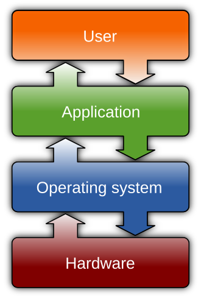

# Chapter 1: Systems, Startup, and Virtualization

*Image source: [Operating system](https://en.wikipedia.org/wiki/Operating_system). Attribution details for the local image copy are listed in [Wikipedia and Web Resources](wikipedia-and-web-resources.md#image-sources).*

This chapter establishes the machine model used by the rest of the book. The point is not to admire hardware in isolation. The point is to understand what has to happen before a general-purpose computer becomes a usable, defensible system.

A practical systems model has at least these layers:

- physical hardware,
- startup firmware,
- boot code,
- the operating system kernel,
- user-space services and applications,
- and the people or systems interacting with the machine.

If you lose track of those layers, later topics such as privilege, boot recovery, certificates, or service hardening become much harder to reason about.

## What You Should Be Able To Explain

By the end of this chapter, you should be able to explain:

- why hardware alone is not enough to create a usable computing environment,
- how CPUs, registers, cache, RAM, and long-term storage fit into one system model,
- what the operating system actually does for CPU time, memory, storage, and devices,
- the startup path from power-on through bootloader and kernel initialization,
- why RAM and storage are different even though both “hold data,”
- the difference between a host machine, a guest machine, virtualization, and emulation,
- how virtualization changes the meaning of a machine,
- and how open, closed, and hybrid operating-system ecosystems differ.

## A Computer System Is a Stack of Dependencies

It is easy to talk about “the computer” as though it were a single thing. In practice, a working system is a chain of dependencies.

At the lowest practical level, the machine is physical hardware:

- a **CPU** that executes instructions,
- **registers** that hold the CPU's immediate working values,
- an **ALU** that performs arithmetic and logic,
- **cache** that keeps recently needed data close to the CPU,
- **DRAM** that holds active programs and data,
- **persistent storage** that keeps the OS, applications, and user files when power is off,
- and supporting hardware such as buses, storage controllers, NICs, GPUs, keyboards, and displays.

That hardware is necessary, but it is not self-organizing. A CPU does not decide which program gets the next time slice. RAM does not decide which process is allowed to overwrite a page. A disk does not decide which user may open a file or which service starts first at boot.

The **operating system** provides those control decisions. It turns raw machine capability into manageable abstractions:

- **processes** instead of “whatever is using the CPU right now,”
- **files and directories** instead of unnamed blocks or sectors,
- **virtual memory** instead of every program requiring a fixed physical address,
- **drivers and system calls** instead of each application speaking to hardware directly,
- and **accounts, permissions, and services** instead of unrestricted access for every program.

That is why administrators and defenders care so much about the OS. It is not just decoration on top of hardware. It is the system component that decides how work is scheduled, how data is organized, and where control boundaries exist.

## Hardware Is a Performance Hierarchy, Not a Flat List of Parts

Component lists are only useful if you can see how the parts interact. The more useful model is a **performance hierarchy**.

The CPU is the active execution engine. It pulls instructions, works with data, and uses tiny ultra-fast storage called **registers** while doing so. Registers are where values live while the CPU is actively operating on them. When the ALU adds, compares, masks, or shifts values, it is usually working on data that has been loaded into registers first.

Outside the registers is **cache**. Cache exists because the CPU is much faster than main memory. A modern processor may have multiple cache levels:

- **L1**: smallest and fastest, closest to the core,
- **L2**: larger and slower than L1,
- **L3**: larger again and often shared across cores.

When needed data is already in cache, the CPU gets a **cache hit**. When it has to go farther out to fetch the data, that is a **cache miss**. You do not need every microarchitectural detail yet, but you do need the principle: systems are built in layers because one universal storage technology would be too slow, too expensive, or both.

Beyond cache is **DRAM**, which is the system's main working memory. DRAM is much larger than cache, but much slower than registers or cache. Beyond DRAM is **persistent storage** such as HDDs and SSDs, which retain data without power but are slower again for active execution.

This is why the common kitchen-style analogy is useful:

- registers are like what is already in your hands,
- cache is like ingredients on the counter,
- DRAM is like the kitchen or pantry area you can reach quickly,
- persistent storage is like the basement, garage, or warehouse where things are kept long term.

The analogy is imperfect, but it teaches the right systems lesson: fast storage is usually smaller and more expensive, while large durable storage is slower.

## What the Operating System Actually Does

At an introductory level, the operating system is responsible for several jobs that later chapters keep returning to.

### CPU scheduling

The CPU can only execute one instruction stream per core at any instant. The operating system decides which process runs now, which process waits, and how control returns later.

This is why you should not treat a GHz number as the whole story. Clock speed matters, but so do:

- how many cores the CPU has,
- whether the task is **CPU-bound** and limited mainly by processor speed or **I/O-bound** and spending most of its time waiting on storage, network, or user input,
- how efficiently data is reaching the CPU,
- and how the OS schedules work across the machine.

Without scheduling, “multitasking” would mostly collapse into whichever program grabbed the machine first.

### Memory management

Programs need memory for code, data, and stack state. The OS decides:

- where a program is loaded,
- how one process is kept away from another process’s memory,
- how memory pressure is handled,
- and when disk-backed memory techniques are used to extend active work.

This is why one of the most important introductory distinctions is between **logical memory** and **physical memory**. Programs should not need to know their exact physical placement. The OS and hardware collaborate so a program can use addresses in a controlled logical view while the machine maintains the real mapping.

### Storage and file abstraction

Storage devices expose physical or logical blocks. Users do not want to manage raw sectors, extents, or platter locations directly. The OS builds filesystems, directories, metadata, and mount logic on top of storage so that data can be named, organized, protected, and recovered.

That storage layer is where later topics like inodes, permissions, journaling, partitions, volumes, LVM, RAID, and backup strategy become possible. Without OS-managed abstraction, “save a file” would mean “manually place bytes on a device.”

### Device coordination

The keyboard, NIC, GPU, disk controller, USB subsystem, and display are all different hardware domains. The OS coordinates access to them through drivers and managed interfaces.

This matters because devices are not interchangeable. A NIC does not behave like a storage controller, and a USB device does not behave like main memory. The OS must mediate all of them while keeping the system stable.

### Interfaces for people and programs

The OS also provides interaction models:

- shell and terminal environments,
- graphical desktops,
- system-call interfaces for programs,
- and higher-level APIs and services.

The **kernel** is the most privileged part of that picture. It is the core system component that manages hardware access, memory, filesystems, processes, and device interaction. User-space tools depend on it even when that dependency is hidden behind shells, desktops, or service managers.

An important early correction is that “the operating system” is not identical to “the desktop” or “the shell.” Graphical environments, login managers, shells, and utilities are usually **user-space** components layered on top of the kernel and other core services.

## Startup: From Power-On to a Running System

A machine does not “start in Windows” or “start in Linux.” It starts earlier than the operating system.

The durable startup sequence looks like this:

1. The machine powers on.
2. Firmware initializes enough hardware to continue startup.
3. Firmware locates boot information.
4. A bootloader loads the operating-system kernel into **RAM**.
5. The kernel starts the early userspace environment.
6. The system reaches normal service startup, login, or desktop operation.

In older lab material this was often described in BIOS-heavy language because that was common hardware at the time. For a modern reader, the safer lesson is:

- older systems often used **BIOS** with legacy boot flows,
- newer systems commonly use **UEFI**,
- but in either case the machine still depends on low-level startup code before the OS can take control.

There are two especially important administrative lessons here.

First, the kernel is not running directly from your persistent storage in the same way it runs from memory. The boot chain has to locate it, load it, and hand off control.

Second, storage layout and boot layout are connected but not identical. A machine may have valid files on disk and still fail to boot if the wrong boot structure, firmware setting, or loader configuration is in play.

That matters for both administration and security.

- If boot code is damaged, the machine may never reach the OS.
- If boot settings can be modified casually, recovery and attack paths open up.
- If you do not know the boot sequence, later discussions of GRUB, recovery shells, and encryption will feel arbitrary.

It also matters for hands-on work. A bootable installer drive, a Debian ISO, a VM boot image, and an internal disk install are all different artifacts in the same startup chain. Once you understand that chain, installation and recovery stop looking like magic.

## Memory and Storage Are Not the Same Thing

**Memory** and **storage** are easy to blur together because both hold information. For systems work, that confusion causes immediate problems.

### RAM

RAM is where active work happens while the system is running. It is fast relative to persistent storage, and it is **volatile**. When power is removed, RAM contents disappear.

This is why active processes, open applications, temporary in-memory state, and the loaded kernel live there while the machine is running.

### Storage

Storage is where the system keeps data persistently. It is slower than RAM but survives power loss. Operating systems, programs, logs, user files, and backups all depend on persistent storage.

Two introductory storage cases matter immediately:

- **HDDs** store data on spinning magnetic platters and pay a physical penalty for seek time and rotational latency.
- **SSDs** store data in flash memory, avoid moving-head latency, and behave differently under fragmentation, caching, wear-leveling, and erase operations.

That difference explains why startup exists at all. The system cannot execute the kernel directly from persistent storage in the same way it runs from active memory. The boot path must bring code from persistent storage into RAM so the CPU can execute it efficiently.

### Speed, size, cost, and volatility

Storage and memory technologies differ by:

- speed,
- capacity,
- persistence,
- and cost per unit.

That creates a hierarchy rather than one magical universal medium. Fast storage is usually smaller or more expensive. Large persistent storage is usually slower. Administration decisions follow that hierarchy:

- active processes belong in memory,
- long-term files belong on persistent storage,
- backups belong somewhere even more durable and separate,
- and recovery plans must account for all of those layers.

### Bits, bytes, and capacity language

You do not need to memorize every binary-versus-decimal conversion, but you do need the vocabulary:

- a **bit** is a small unit of information,
- a **byte** is the common storage unit built from bits,
- and larger units such as kilobytes, megabytes, and gigabytes describe capacity and transfer size.

Those terms show up everywhere: RAM capacity, filesystem size, RAID capacity, backup media, network throughput, and cloud storage billing. Confusing MB with GB, or file size on disk with RAM consumed while running, produces bad estimates and bad troubleshooting very quickly.

## Virtualization: One Physical System, Many Logical Systems

Virtualization changes the meaning of “a machine.”

A **virtual machine** is a software-defined system that behaves like a computer with:

- its own OS,
- allocated CPU and memory,
- virtual disks,
- and virtual network interfaces.

The enabling layer is a **hypervisor**. At a high level, the hypervisor manages virtual machines and mediates their use of real hardware.

A practical distinction that helps later is:

- a **type 1** or bare-metal hypervisor runs directly on the hardware,
- a **type 2** or hosted hypervisor runs on top of an existing operating system.

At this level, the exact product names matter less than the control model. In one case the hypervisor is the main platform. In the other case the hypervisor is an application living on a host OS.

That gives you practical benefits:

- better hardware utilization,
- easy lab setup,
- snapshots and rollback,
- isolation between workloads,
- and the ability to test risky changes without dedicating a whole physical server.

### Virtualization is not emulation

These words are often used interchangeably. They should not be.

- **Virtualization** uses the underlying hardware efficiently to run guest systems in isolated environments.
- **Emulation** imitates another system more completely, often with greater overhead and less direct dependence on the real hardware’s native execution model.

That distinction matters because performance expectations, compatibility assumptions, and administrative design decisions differ.

### Host vs guest

Keep the separation clear:

- the **host** is the underlying real system,
- the **guest** is the VM running on top of it.

Logical isolation is useful, but it is not the same thing as absolute security. Every guest still depends on physical hardware, the host operating system or hypervisor, and the real storage underneath.

That is why virtualization is so useful in practice and in lab work. It gives you:

- safe operating-system installs,
- easy rollback through snapshots,
- repeatable networking experiments,
- and the freedom to break a guest without necessarily destroying the host.

But it does not repeal the dependency on real hardware. If the host storage fails, the guest is still in trouble.

## Open, Closed, and Hybrid Operating-System Ecosystems

This book spends a great deal of time in GNU/Linux, but not because commercial operating systems are irrelevant. The important question is how platforms are built, distributed, supported, and trusted.

### Closed or commercial systems

Commercial operating systems such as Microsoft Windows are the obvious baseline example. In that model:

- the vendor distributes usable software,
- the source code is generally not available for public inspection,
- redistribution and modification are restricted,
- and support is often tied to the vendor ecosystem.

This model appeals to many organizations because it can come with predictable vendor documentation, central support, long-established compatibility expectations, and commercial accountability.

### Open-source systems

In an open-source model, the source code is available for inspection and, under license terms, often for modification and redistribution.

That changes several things:

- more people can inspect the code,
- communities can build around it,
- organizations can customize it,
- and support can come from communities, vendors, or internal teams.

Open source should not be confused with “unsupported hobby software.” Large organizations use open platforms precisely because they can inspect, adapt, automate, and support them in ways that fit their own needs.

### Hybrid models

Many real systems are neither fully open nor fully closed. They are **hybrid**:

- open components in one layer,
- proprietary components in another,
- commercial support wrapped around open tooling,
- or a mix of community and vendor-managed software.

That is why “open vs commercial” is too crude. Real administrators need to reason about:

- trust,
- support,
- inspection,
- licensing,
- and operational fit.

This becomes a practical decision-making issue, not an ideology test. A platform can be technically strong and still be a poor fit if it cannot be supported by the people responsible for keeping it running.

## Why This Chapter Matters for Security

This chapter is foundational because later security decisions depend on it.

- Privilege only makes sense if you understand that the OS is a control boundary.
- Boot recovery only makes sense if you understand the startup chain.
- Filesystem permissions only make sense if you understand storage abstraction.
- Remote access only makes sense if you understand the difference between user space, services, and the kernel.
- Virtualization only helps if you remember the dependence on the real host and hardware.

Security is not a separate magical layer dropped on top of a machine. It is implemented through the same system structure you just studied.

## Worked Scenarios

### Scenario: a guest failure that starts on the host

Suppose a virtualization host stores several guest disks on the same physical SSD. One guest begins reporting I/O errors and the administrator inside the guest assumes the guest filesystem is corrupted. The real problem, however, is that the host storage is full and snapshots have consumed the remaining free space.

That is the operational meaning of **host** and **guest**:

- the guest sees a virtual disk,
- the hypervisor maps that disk to real storage,
- and a failure underneath the guest can surface as a failure inside it.

Virtualization makes systems easier to clone, isolate, and roll back. It does not remove the dependence on real hardware, real storage, or real capacity planning.

### Scenario: the machine sees the disk but still will not boot

Imagine a system where the internal drive is healthy, the operating-system files are still present, but the machine drops into firmware setup instead of loading the OS. That is not automatically a “dead disk” problem. It could be:

- the wrong boot mode,
- a missing or damaged bootloader,
- a changed firmware boot order,
- or a mismatch between the disk layout and the expected boot method.

The startup chain is easier to troubleshoot when you keep the layers separate:

- firmware starts first,
- the bootloader decides what to load,
- the kernel is loaded into memory,
- and the rest of user space comes up afterward.

That layered picture matters later when you edit GRUB, troubleshoot boot parameters, compare BIOS with UEFI, or reason about boot-time attack paths.

### Scenario: real infrastructure is usually hybrid

A real environment might run a Linux server with open-source core utilities, proprietary RAID-controller firmware, commercial endpoint tooling, and a vendor support contract. That stack is neither purely open nor purely closed. It is hybrid.

That matters because platform choices are rarely ideological. Administrators usually care about:

- whether the system can be supported,
- whether it can be inspected and automated,
- whether the licensing is acceptable,
- and whether the total platform is reliable enough for the job.

## Practice Connections

- For a practical installation follow-up, use [Linux Install](../../labs/100-linux-install/README.md).
- For cleaned repo notes that support this chapter, use [Repo Companion Material](repo-companion-material.md).

## Chapter Summary

- Hardware provides physical resources, but the operating system makes those resources usable and governable.
- The OS manages CPU scheduling, memory, storage abstraction, devices, and program/user interfaces.
- Startup is a sequence: firmware, bootloader, kernel in RAM, and then the rest of the system.
- RAM and storage are different in speed, persistence, and purpose.
- Virtualization depends on a hypervisor and should be distinguished from emulation.
- Operating-system ecosystems can be open, closed, or hybrid, and that affects trust and administration.

## Review Questions

1. Why is hardware alone not enough to create a usable computing environment?
2. Walk through the startup path from power-on to a running operating system.
3. Why are RAM and persistent storage not interchangeable?
4. What problem does a hypervisor solve, and how is virtualization different from emulation?

## Further Reading

- *Operating System Concepts* by Abraham Silberschatz, Peter B. Galvin, and Greg Gagne
- [Operating system](https://en.wikipedia.org/wiki/Operating_system)
- [Kernel (operating system)](https://en.wikipedia.org/wiki/Kernel_(operating_system))
- [Booting](https://en.wikipedia.org/wiki/Booting)
- [Virtual machine](https://en.wikipedia.org/wiki/Virtual_machine)
- [Hypervisor](https://en.wikipedia.org/wiki/Hypervisor)
- [Open-source software](https://en.wikipedia.org/wiki/Open-source_software)
