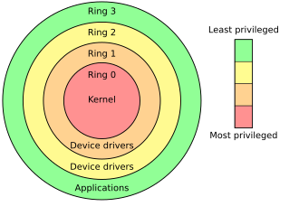

# Chapter 2: Privilege, System Calls, Processes, and Interfaces


*Image source: [Protection ring](https://en.wikipedia.org/wiki/Protection_ring). Attribution details for the local image copy are listed in [Wikipedia and Web Resources](wikipedia-and-web-resources.md#image-sources).*

The previous chapter established the machine as a layered system. This chapter explains one of the most important consequences of that design: not every program should have the same level of authority.

Modern operating systems separate privileged kernel operations from ordinary user-space activity, hardware events, and the interfaces people use to control the system. That separation supports stability, security, and multitasking. It also explains why command-line work matters: command shells are userland tools, but they are often the clearest place to see how the OS exposes its services.

## What You Should Be Able To Explain

By the end of this chapter, you should be able to explain:

- why operating systems separate privileged and non-privileged execution,
- how system calls let programs request protected services,
- how interrupts differ from system calls,
- the difference between a program and a process,
- why multitasking is partly an illusion created by scheduling,
- and how GUI and CLI environments both sit in userland.

## Privilege Exists for Stability and Security

If every application could directly manipulate hardware, rewrite arbitrary memory, or seize the CPU whenever it wanted, a general-purpose computer would be unstable almost immediately.

That is why modern systems separate execution into privilege levels. On x86 systems this is often taught using **rings**. In theory there are multiple rings. In practical administration, the model is usually simplified to:

- **Ring 3 / user mode**, where ordinary applications run,
- and **Ring 0 / kernel mode**, where the OS core runs with full privilege.

This distinction exists for two reasons.

### Stability

One buggy application should not be able to crash the whole machine by scribbling over kernel memory or bypassing process controls.

### Security

Ordinary programs should not freely access devices, other users’ files, protected memory, or other processes without mediation.

That makes the OS more than a convenience layer. It is a **boundary enforcer**.

It also explains why one of the most important security mistakes is to blur together “can do useful work” and “should be fully trusted.” Ordinary programs absolutely need access to files, memory, network connections, and user input. They do **not** need unrestricted control over the machine.

## User Mode and Kernel Mode

In **user mode**, programs run with restrictions. A text editor, browser, or scripting interpreter can do useful work, but it cannot simply decide to talk to the disk controller directly, reprogram interrupt handling, or read arbitrary kernel memory on its own.

In **kernel mode**, the OS manages memory, controls devices, schedules processes, accesses protected resources, and implements the rules that user-mode code must follow.

That leads to a practical rule of thumb:

- user programs request,
- the operating system decides.

This is why the operating system is the practical enforcement point for:

- file access,
- process creation,
- network and device access,
- scheduling,
- and memory isolation.

If you forget that rule, later topics like SSH, setUID, ACLs, or rootkits become much harder to understand.

## System Calls: How Programs Ask the OS for Help

If ordinary applications are restricted, how do they do useful work at all?

They use **system calls**.

A system call is a controlled request from user mode into the operating system. The program is not bypassing the OS. It is explicitly asking the OS to do something privileged on its behalf.

Typical categories include opening, reading, and writing files, creating or controlling processes, allocating memory, interacting with devices through OS-managed mechanisms, and requesting information about the system state.

A useful mental model is:

1. a program runs in user mode,
2. it requests a service,
3. the OS handles that request in privileged context,
4. control returns to the program.

This protects the separation between user and kernel space while still letting programs accomplish real work.

You should not think of this as a niche programming trick. It is how routine operating-system work happens:

- a word processor asks to open a file,
- a shell asks to create a child process,
- a browser asks to create network connections,
- a service asks for memory or timing facilities,
- and the OS mediates all of it.

That is also why policy is enforceable. Permissions are not checked by wishful thinking. They are checked when the OS is asked to do something protected.

### A concrete example: watching a system call happen

This becomes easier to believe when you watch the system do it. On Linux, a tool such as `strace` can show a normal command asking the kernel for help:

```bash
strace cat document.txt
```

Instead of seeing “read file” as one magical action, you see a sequence of requests such as `openat()` and `read()`. The application asks, the kernel checks, and the kernel performs the protected work on the program's behalf.

### Why this matters to administrators

System calls are not only a programming concept. They explain why administrators can apply policy centrally:

- file permissions are checked when file-related operations are requested,
- process limits are enforced when processes are created,
- and device access can be mediated rather than granted universally.

The same model also explains why some failures are dangerous. If a bug or exploit reaches privileged code, the consequences are much worse than if the same logic stays trapped in ordinary user mode.

## Interrupts: When the System Demands Attention

System calls begin with a program asking for help. **Interrupts** are different. They are signals that something needs attention now.

Interrupts are used for events such as:

- timer events,
- hardware completion,
- device activity,
- or other conditions that require immediate OS handling.

This matters because the OS is not only responding to user programs. It is also coordinating the machine in real time.

The most useful beginner example is the timer interrupt. If the OS is going to maintain the illusion that many processes are running “at once,” it needs regular opportunities to regain control and reconsider what should run next.

A useful distinction is:

- **System call**: a program asks the OS for a service.
- **Interrupt**: hardware or the system itself forces the OS to respond to an event.

Both move execution into OS-controlled behavior, but for different reasons.

Another type of event is a fault, such as a **page fault**. Even if you do not yet need to master fault handling, you should understand the broad point: some events come from ordinary program requests, while others come from exceptional conditions the OS must handle safely.

## Programs, Processes, and State

People often say “program” when they really mean “process.” The distinction matters.

- A **program** is code stored on disk.
- A **process** is a running instance of that program.

The OS does not schedule files on disk. It schedules running processes.

A process includes state such as:

- CPU register values,
- execution position,
- memory mappings,
- open resources,
- and status such as running, ready, or waiting.

That is why one executable can appear multiple times in the process table. One program file can produce many processes.

This is easier to understand when you look at real tools:

- **Task Manager** shows that the machine is full of running processes even when the desktop feels simple,
- **Process Explorer** makes parent-child relationships, handles, and loaded components much easier to see,
- and Unix-style tools such as `ps` reinforce that a process is an active system object, not just a filename on disk.

## Context Switching and the Illusion of Multitasking

Users experience a computer as if it is doing many things at once:

- playing audio,
- downloading files,
- updating a document,
- running a browser,
- and responding to background services.

On a single CPU core, that apparent simultaneity is mostly an **illusion created by rapid switching**.

The OS gives one process CPU time, saves its state, restores another process’s state, and repeats this quickly enough that the system feels concurrent.

That process is called a **context switch**.

What gets saved and restored is not magic. The OS has to preserve enough execution state that when the process resumes, it continues as though it had never been interrupted. That includes register state, execution position, and access to the process’s memory context. Operating-systems texts often describe this saved execution record as a **process control block (PCB)** or a closely related scheduling structure.

Context switching depends on several earlier ideas:

- interrupts help trigger scheduling decisions,
- process management keeps track of each process’s state,
- and privilege separation ensures that the OS, not ordinary applications, controls the machine-wide scheduling behavior.

This is why multitasking is not “applications sharing nicely by agreement.” The OS enforces order.

That also explains why a busy or broken process can affect responsiveness without “owning” the whole computer. The OS is continuously arbitrating among competing tasks.

## CLI and GUI Are Different Interfaces to the Same System

People encounter these internal OS ideas through interfaces.

Two major styles are:

- **GUI**: graphical user interface,
- **CLI**: command-line interface.

A GUI uses windows, menus, buttons, and pointing devices. A CLI uses typed commands in a shell or terminal.

They are not different operating systems. They are different ways of reaching operating-system services from userland.

That matters because:

- files, processes, and permissions still exist whether you click or type,
- many administrative actions are easier to express at a command line,
- and command-line concepts transfer well between platforms.

It is important to treat CLI and GUI as **userland** interfaces. That wording matters. A shell is not the kernel. A desktop is not the kernel. They are environments through which users interact with OS-managed services.

## Why the Command Line Matters So Much

The command line exposes system concepts more directly than a GUI usually does.

Command-line work makes you think explicitly about:

- paths,
- commands and arguments,
- standard input and output,
- current working directory,
- pipes,
- redirection,
- and exact command behavior.

Those habits transfer. Even when Windows and Linux use different command names, the conceptual model of:

- issue a command,
- pass arguments,
- inspect text output,
- redirect results,
- and combine tools

is extremely durable.

That is why the Windows command line is treated as foundational rather than as a side note. The goal is not to “memorize Windows forever.” The goal is to train you to think explicitly about how the system is being asked to do work.

## Internal and External Commands

An important shell concept is the difference between:

- **internal commands** built into the shell,
- and **external commands** that are separate executable programs launched by the shell.

This helps explain why some commands behave like shell features while others are ordinary programs the shell invokes.

The distinction becomes especially clear in environments like Windows `cmd.exe`, where some familiar commands are part of the interpreter and others are external tools found through path lookup.

For example, commands such as `dir` and `cd` are normally treated as part of the shell environment, while tools such as `ipconfig` or `tasklist` are external programs found and launched by the shell. The important point is not memorizing a giant table. The important point is understanding why shells have their own built-in behavior in addition to launching programs from disk.

## Windows Command Line as a Foundational Environment

The Windows command line trains habits that later administration depends on: directory navigation, file operations, explicit command syntax, and direct inspection of system output. The goal is not to imply that Windows and Linux use identical commands. The goal is to make operating-system behavior visible instead of mysterious.

At a shell prompt you have to ask practical questions every time you do work: What directory am I in? Which object am I operating on? Which command am I issuing? What output did the system return? Did the operation succeed or fail? That habit of explicit inspection carries directly into later Linux administration.

## Worked Examples

### Example: opening a file means asking the kernel, not "talking to the disk directly"

On Linux, `strace` makes system-call boundaries visible:

```bash
strace cat document.txt
```

You will see calls such as `openat()` and `read()`. That is the important lesson. `cat` does not directly manipulate the storage hardware. It asks the kernel to open the file, the kernel checks policy and filesystem state, and the kernel returns the result.

### Example: a process is an active system object, not just a filename

The distinction becomes clearer when you compare a file on disk with a running process:

```bash
ps -ef | head
```

On Windows, Task Manager or Process Explorer show the same idea in a different interface. The executable on disk is static. A running process has an identifier, memory mappings, open handles, a scheduling state, and a parent-child relationship with other processes. That is why incident response and administration care about processes rather than just about program files.

### Example: multitasking depends on saved state

If a browser, terminal, media player, and background service all appear active at once, the operating system is repeatedly saving one context and restoring another. The PCB is the bookkeeping concept that makes this understandable: the OS has to remember enough about each runnable process that it can stop it, run something else, and then resume the first process as though nothing happened.

## Practice Connections

- For a Windows process-oriented follow-up, use [Process Explorer](../../labs/070-lab-process-explorer/README.md).
- For command-line automation fundamentals, use [Windows Batch Files](../../labs/080-windows-batch-files/README.md).
- For a chapter-by-chapter map between the book and the companion labs, use [Repo Companion Material](repo-companion-material.md).

## Chapter Summary

- Modern systems separate user mode from kernel mode to preserve stability and security.
- System calls let programs request privileged OS services without bypassing the OS.
- Interrupts are event-driven signals that require OS attention.
- A program is code on disk; a process is a running instance with managed state.
- Multitasking depends on scheduling and context switching.
- GUI and CLI environments are different userland interfaces to the same underlying OS.

## Review Questions

1. Why do operating systems separate user mode from kernel mode?
2. How does a system call differ from an interrupt?
3. What is the difference between a program and a process?
4. Why is multitasking on a single core partly an illusion?

## Further Reading

- [Protection ring](https://en.wikipedia.org/wiki/Protection_ring)
- [System call](https://en.wikipedia.org/wiki/System_call)
- [Interrupt](https://en.wikipedia.org/wiki/Interrupt)
- [Process (computing)](https://en.wikipedia.org/wiki/Process_(computing))
- [Command-line interface](https://en.wikipedia.org/wiki/Command-line_interface)
