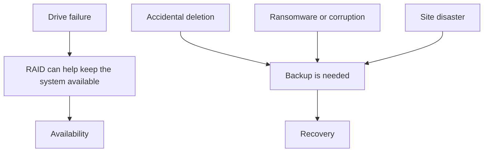

# Chapter 4: Availability, RAID, Backup, and Recovery Planning

This chapter turns storage concepts into operational resilience. The theme is not just “how disks work,” but “how systems stay usable when parts fail, data is deleted, or an entire site is disrupted.”

Several ideas that are often taught separately belong together:

- links vs duplicated copies,
- disaster recovery vs business continuity,
- fragmentation and storage efficiency,
- RAID and parity,
- and backup strategy.

The most important sentence in the whole chapter is this:

**RAID is not backup.**



## What You Should Be Able To Explain

By the end of this chapter, you should be able to explain:

- why linking can be better than copying in some file-management situations,
- the difference between disaster recovery and business continuity,
- why fragmentation must be understood in context,
- how RAID improves availability and how parity works at a high level,
- why communications parity and RAID parity are different,
- and how full, differential, and incremental backups solve problems RAID does not.

## Linking vs Copying

File linking shows up in both Windows and Unix-like administration. The problem it solves is simple: copying files to multiple places creates management drift.

If you duplicate the same content in several places:

- storage is wasted,
- versions drift apart,
- users edit one copy and forget the others,
- and applications may depend on one path while users expect another.

Links help solve that by creating another way to reach the same content without making a full independent duplicate.

At a high level:

- a **hard link** is another directory entry for the same underlying file data,
- a **symbolic link** behaves more like a pointer or reference to another location,
- and a **shortcut** is more of a user convenience than a filesystem-level sharing mechanism.

On inode-based filesystems, a hard link is another name for the same inode. That means:

- both names refer to the same file object,
- changing the file through one name changes the same underlying data,
- and deleting one name does not remove the data until the last link and any open file handles are gone.

A symbolic link behaves differently. It stores a pathname to another object. If the target disappears or moves, the symbolic link can become a dangling reference.

The administrative lesson is that good storage design is not only about capacity. It is also about keeping one authoritative copy of the right data.

This is a good example of why “just copy it” is often a weak systems answer. Copying looks simple at first, but it creates version drift and policy confusion later. Linking exists because operating systems need better answers than endless duplication.

## Availability Is Part of Security

Business continuity and disaster recovery belong in a systems and security text because security is not only about secrecy or stopping intrusions. It is also about keeping operations functioning.

### Business continuity

Business continuity is the broader organizational question: how does the organization keep operating during and after disruption?

### Disaster recovery

Disaster recovery is the narrower technical and procedural question: how are systems, services, and data restored after a failure?

State the distinction bluntly:

- **business continuity** is about the organization continuing to function,
- **disaster recovery** is about bringing systems and data back after disruption.

Real disruptions include:

- power loss,
- utility failure,
- hardware failure,
- operator error,
- natural events,
- and site-level inaccessibility.

That means “security planning” cannot stop at malware defense. Systems must also survive ordinary failure and extraordinary disruption.

A system can be technically well designed and still fail the organization if nobody knows how to keep operating when the normal environment is gone. That is why continuity planning includes alternate power, alternate sites, replacement workflows, and preplanned communication.

## Fragmentation Needs Context

Fragmentation is real, but many people overlearn outdated rules about it.

### Internal fragmentation

Internal fragmentation means wasted space **inside** an allocated unit. If the allocation unit is larger than the data stored, the remainder is stranded inside that unit.

File slack space is the simplest storage example of this. If a file only partially uses its final allocation unit, the remainder is not automatically available to another file.

### External fragmentation

External fragmentation means usable space exists, but in scattered pieces rather than one convenient contiguous region.

This matters differently depending on storage technology:

- on **HDDs**, physical scattering can cost real performance because of seek time,
- on **SSDs**, there is no moving head, so the performance story is different,
- and in both cases the filesystem and workload matter.

So the correct lesson is not “fragmentation is always catastrophic.” The correct lesson is that fragmentation depends on context and layer.

Fragmentation also applies to **memory allocation**, not just disks. The durable principle is that fragmentation means waste or inefficiency caused by how fixed-size resources get carved up over time. The exact consequences differ by layer.

## RAID Exists for Availability

RAID stands for **Redundant Array of Independent Disks**. The core idea is to combine multiple drives into one logical storage unit so the system can tolerate some forms of drive failure.

RAID is about **availability**.

Important properties:

- the OS may see one logical volume,
- the array uses multiple physical drives,
- different RAID levels trade capacity, performance, and fault tolerance differently,
- and some RAID types add redundancy while others emphasize performance.

This is the right place to correct another common misunderstanding: RAID is not a magical synonym for “safe.” RAID is a design choice about **drive-failure tolerance** and sometimes performance. That is a narrower claim than “my data is protected from every bad thing that could happen.”

### Why RAID is not backup

RAID helps when a drive fails. It does **not** solve all the ways data can be lost.

RAID does not automatically protect you from:

- accidental deletion,
- file corruption,
- malware or ransomware,
- overwrite mistakes,
- site-wide disaster,
- or an administrator pushing the wrong destructive change.

If a user deletes the wrong file, mirrored storage often preserves the deletion perfectly. That is why RAID cannot replace backup.

That sentence matters enough to repeat:

**RAID preserves state. Backup preserves recoverable history.**

## Parity in RAID

Parity in RAID is easiest to understand through **XOR** logic.

At a simplified level:

- data block A and data block B can be combined to create parity,
- and if one data block is lost, the remaining data plus parity can reconstruct the missing value.

That is the basis of parity-based RAID designs such as RAID 5.

The important beginner takeaway is not the exact binary math. It is the reason parity is worth the complexity:

- you do not need a full extra duplicate of every block,
- but you still gain the ability to recover from specific missing-drive scenarios,
- at the cost of calculation overhead, extra storage, and more complicated writes.

### A concrete XOR rebuild example

The idea becomes much clearer with an actual bit-level example.
This walkthrough is adapted from the parity discussion in Wikipedia's [Parity bit](https://en.wikipedia.org/wiki/Parity_bit) article.

Suppose two data drives contain:

```text
Drive 1:   01101101
Drive 2:   11010100
```

If the array calculates parity using XOR, the parity block becomes:

```text
           01101101   Drive 1
XOR        11010100   Drive 2
           10111001   Parity
```

So the parity drive stores:

```text
Drive 3:   10111001   Parity
```

Now imagine Drive 2 fails. The array still has:

```text
Drive 1:   01101101
Drive 3:   10111001   Parity
```

If you XOR the surviving data with the parity value, the missing block is reconstructed:

```text
           01101101   Drive 1
XOR        10111001   Drive 3 parity
           11010100   Reconstructed Drive 2
```

That recovered value is exactly what had originally been on Drive 2.

This is the key point to remember: parity gives the array enough extra information to recover from a missing drive without storing a full duplicate of every block. That is why parity RAID sits between "no redundancy at all" and "mirror everything" in both cost and complexity.

You do not need to become a mathematician here, but you do need to understand what parity buys you:

- additional recovery capability,
- storage overhead,
- more complexity,
- and write-performance tradeoffs because parity must also be updated.

When a parity-protected array loses a drive, it often continues operating in a degraded state until rebuild completes.

Software-defined RAID matters here too. RAID is not only a hardware-controller feature found in expensive servers. The same ideas can appear in operating-system storage layers and software-defined storage products.

## Communications Parity Is Not the Same Thing

It is important to keep **communications parity** and **RAID parity** separate, because the same word describes different jobs.

In communications:

- a parity bit is mainly an **error-detection** aid.

In RAID:

- parity helps reconstruct missing storage data in a drive-failure model.

Both use binary logic, but they solve different problems. Keeping those meanings separate prevents confusion later.

Hearing the same word in two domains does not mean the mechanism is the same in both places.

## Practical RAID Levels and Nested RAID

A useful way to think about RAID levels is in terms of tradeoffs.

| RAID level | Minimum drives | Main idea | Main strength | Main weakness |
| --- | --- | --- | --- | --- |
| RAID 0 | 2 | Striping with no redundancy | Good performance and full usable capacity | One drive failure destroys the array |
| RAID 1 | 2 | Mirroring | Simple redundancy and straightforward rebuilds | Roughly half the raw capacity is usable |
| RAID 5 | 3 | Striping with distributed parity | Good usable capacity with single-drive fault tolerance | Parity writes add overhead and rebuilds are stressful |
| RAID 6 | 4 | Striping with double parity | Survives two drive failures | More write overhead and less usable capacity |
| RAID 10 | 4 | Mirrored pairs striped together | Strong performance plus good resilience | High drive count and reduced usable capacity |

The point of the table is not to memorize numbers in isolation. It is to see how each level trades:

- performance,
- usable capacity,
- rebuild behavior,
- and fault tolerance.

Nested RAID exists because administrators rarely get maximum performance, maximum capacity, and maximum resilience at the same time. RAID 10 is a common compromise because it combines striping and mirroring in a way that is usually easier to reason about operationally than parity-heavy arrays under rebuild pressure.

## Backup Solves Different Problems

After RAID, the real answer for many data-loss situations is backup.

Backups are for:

- accidental deletion,
- corruption,
- bad updates,
- ransomware,
- legal or operational recovery needs,
- and restoring earlier clean states.

The standard backup models introduced here are:

### Full backup

Every selected file is backed up each time.

- simplest restore model,
- but the largest backup window and storage demand.

### Differential backup

Each differential backup contains changes since the last **full** backup.

- restore usually requires the last full plus the latest differential,
- storage use grows between full backups.

Example timeline:

- Sunday: full backup
- Monday: differential contains Monday’s changes
- Tuesday: differential contains Monday + Tuesday changes
- Wednesday: differential contains Monday + Tuesday + Wednesday changes

### Incremental backup

Each incremental backup contains changes since the **previous** backup of any kind.

- usually smaller and faster to take,
- but restoration often requires the full backup plus each incremental in sequence.

Example timeline:

- Sunday: full backup
- Monday: incremental contains Monday’s changes
- Tuesday: incremental contains only Tuesday’s changes
- Wednesday: incremental contains only Wednesday’s changes

Do not memorize these as vocabulary only. Compare them by:

- backup time,
- storage use,
- and restore complexity.

| Backup type | What it contains | Storage use over time | Restore complexity |
| --- | --- | --- | --- |
| Full | Everything selected for backup | Highest per run | Lowest |
| Differential | Changes since the last full backup | Grows between full backups | Medium |
| Incremental | Changes since the last backup of any kind | Usually lowest per run | Highest |

The historical role of the **archive bit** also matters in backup workflows. You do not need to build backup software from scratch, but you should understand why filesystems and operating systems sometimes track “has this changed since backup?” state.

## Recovery Planning Has to Be Operational, Not Wishful

Technology alone does not create recoverability. The organization also needs:

- documented procedures,
- tested restore workflows,
- replacement hardware or service plans,
- alternate power or site planning where appropriate,
- and administrators who know which mechanism solves which problem.

A system with RAID but no tested restore process is not well protected. A system with backups but no recovery plan is only half prepared.

This is where the whole chapter comes together:

- links solve duplication problems,
- continuity planning solves organizational survival problems,
- RAID solves some availability problems,
- backups solve recovery problems,
- and restore procedures determine whether any of those investments actually help when something goes wrong.

## Worked Examples

### Example: a hard link solves a different problem than a copy

Suppose two teams need the same reference dataset in different directory trees. If you copy the file, both copies now have to be maintained. If you create another link to the same file object instead, both paths lead to the same underlying data.

That distinction matters because:

- a copy creates a second independent version,
- a hard link creates another name for the same file,
- and a symbolic link creates a reference that can break if the target moves.

Those are three different administrative decisions, not three equivalent tricks.

### Example: RAID survives the drive failure and still loses the file

Imagine a mirrored array holding a shared departmental folder. One morning, an administrator accidentally deletes the wrong directory tree. The array is healthy. Every mirror is healthy. The deletion is still immediately reflected across the array because RAID preserved the current state perfectly.

That is why **RAID is not backup**. RAID helps the system stay online when hardware fails. Backup helps you restore an earlier good state when humans, malware, or applications damage data logically.

### Example: continuity planning starts before the restore

Suppose a building loses power for the day or access to the server room is blocked after a water leak. Backups may still exist, but the organization also needs:

- alternate work locations,
- alternate communications,
- replacement equipment,
- and a plan for which services must return first.

That is the difference between business continuity and disaster recovery. Recovery asks how to restore systems. Continuity asks how the organization keeps functioning while restoration is still underway.

## Practice Connections

- For hands-on storage and redundancy work, use [Storage Redundancy](../../labs/160-storage-redundancy/README.md).
- For related block-storage service work, use [iSCSI for Windows Server](../../labs/170-iscsi-for-windows-server/README.md).
- For the repo-facing chapter map, use [Repo Companion Material](repo-companion-material.md).

## Chapter Summary

- Links can preserve one maintained copy of data where repeated copying would create drift.
- Business continuity and disaster recovery are related but not identical.
- Fragmentation must be interpreted in context, especially across HDD and SSD environments.
- RAID improves availability under drive-failure conditions, but RAID is not backup.
- RAID parity and communications parity solve different problems.
- Full, differential, and incremental backups trade storage use against restore complexity.

## Review Questions

1. Why can linking be better than copying in some storage workflows?
2. What is the difference between business continuity and disaster recovery?
3. Why is RAID not a substitute for backup?
4. Compare full, differential, and incremental backup by storage use and restore complexity.

## Further Reading

- [RAID](https://en.wikipedia.org/wiki/RAID)
- [Parity bit](https://en.wikipedia.org/wiki/Parity_bit)
- [Data deduplication](https://en.wikipedia.org/wiki/Data_deduplication)
- [Business continuity planning](https://en.wikipedia.org/wiki/Business_continuity_planning)
- [Disaster recovery](https://en.wikipedia.org/wiki/Disaster_recovery)
- [Backup](https://en.wikipedia.org/wiki/Backup)
