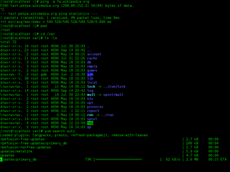

# Chapter 5: Command Lines, Batch Files, and Administrative Automation


*Image source: [Command-line interface](https://en.wikipedia.org/wiki/Command-line_interface). Attribution details for the local image copy are listed in [Wikipedia and Web Resources](wikipedia-and-web-resources.md#image-sources).*

This chapter is where operating-system theory starts becoming daily administrative habit. A command line matters because it removes ambiguity. Instead of clicking until something looks right, you have to state which shell you are using, where you are in the filesystem, which command you want, what arguments you are passing, what output you expect, and whether the result should stay on the screen, go into a file, or become input for another command.

That discipline is the real lesson. Windows batch files happen to be the first scripting vehicle in this part of the book, but the habits carry directly into Bash, package maintenance, logging, troubleshooting, and later Linux administration.

## What You Should Be Able To Explain

By the end of this chapter, you should be able to explain:

- why command-line work is still a durable administrative skill,
- how a shell finds and launches commands,
- the difference between internal and external commands,
- how standard output, standard error, redirection, and pipes change what a command does,
- how `cmd.exe` reads and executes a batch file,
- why plain-text correctness matters in automation,
- when loops and filters are appropriate,
- and why not every command-line tool is a good scripting target.

## The Command Line Is an Administrative Interface, Not a Nostalgia Piece

GUI tools are useful, but they often hide state and sequence. The command line exposes both.

When you work at a prompt, you have to notice:

- the current working directory,
- the exact file name or path,
- which executable or internal shell feature is being used,
- whether the shell found the command through `PATH`,
- whether the command succeeded or failed,
- and what happened to the output.

That makes the command line valuable for:

- troubleshooting,
- repeatable administration,
- remote work,
- automation,
- documenting procedures,
- and verifying what really happened on a system.

This is why command-line skill is durable even when GUIs improve. Buttons move. Concepts like path lookup, redirection, filtering, and repeatable procedures stay useful.

## Shell Concepts That Transfer Across Platforms

Even before looking at Windows-specific syntax, several ideas show up everywhere:

- **standard input**: what a command reads,
- **standard output**: the normal results it writes,
- **standard error**: abnormal or error output,
- **redirection**: sending output somewhere else,
- **pipes**: sending one command's output into another command,
- **arguments and switches**: telling a command what to do,
- and **PATH lookup**: how a shell finds commands without a full path.

These ideas matter more than any single command name. Anyone who understands them can move from Windows to Linux, from `cmd.exe` to Bash, or from one distribution to another much more easily than someone who only memorized menu clicks.

## Shell Resolution: Internal Commands, External Commands, and PATH

A shell does not treat every command the same way. **Internal commands** are built into the shell. **External commands** are separate executable files the shell launches. That matters because some commands behave like part of the shell itself, while others depend on file locations, executable extensions, and `PATH` search order.

A practical Windows example is the difference between `dir`, which is treated as part of the shell environment, and a utility such as `ipconfig`, which the shell has to locate and launch. `PATH` is the mechanism that makes that convenient. Instead of typing `C:\Windows\System32\ipconfig.exe` every time, the shell searches the directories listed in `PATH` until it finds a matching executable.

You can inspect that search path directly:

```bat
echo %PATH%
```

This is one reason troubleshooting "command not found" style failures starts with basic questions: Is this command internal or external? Is the executable actually present? Is it in the current directory? Is the correct directory in `PATH`? Am I in the shell I think I am?

That last point matters more than many beginners expect. A command that works in one shell may not work the same way in another if the shell built-ins differ.

## Windows Command Line Is a Good Foundation Because It Makes OS Behavior Visible

The Windows command line is worth learning because it forces practical familiarity with paths, file names, command syntax, text output, repeatable sequences, and the difference between "the system did something" and "I can prove what it did."

The real goal is not to make Windows and Linux look identical. They are not identical. The goal is to make operating systems feel inspectable instead of mystical.

## Batch Files Are Saved Procedures Executed by `cmd.exe`

A **batch file** is a plain-text file that `cmd.exe` reads line by line. That makes a batch file less magical than many beginners think. It is simply a saved procedure: commands that could have been typed manually, written down in order, and executed consistently by the shell. A script is only as good as the commands inside it. If you do not understand the manual command, automating it does not make it safer or smarter.

That is also why batch files are useful. Repeated tasks no longer depend on memory, setup steps can be documented, routine output can be logged, and the procedure can be reviewed later.

## What `cmd.exe` Actually Does with a Script

When `cmd.exe` runs a batch file, it processes the file in order. Earlier lines affect later lines, environment changes can carry forward inside the script, and a mistake near the top can break everything after it.

A minimal script such as:

```bat
@echo off
echo Hello
pause
```

is useful precisely because it makes the execution model visible:

1. `@echo off` hides the command noise,
2. `echo Hello` writes text to standard output,
3. `pause` stops so the user can read the result.

That is not a toy example. It teaches the structure that later scripts rely on.

## Plain Text Is a Requirement, Not a Preference

One warning prevents a remarkable number of beginner failures: **scripts must remain plain text**. Use the correct extension such as `.bat`, avoid editors that silently introduce rich-text formatting, avoid smart quotes, and make sure the file is really what it claims to be.

This connects directly to the earlier chapter's warning about hidden file extensions. A file that visually appears to be `script.bat` may really be something like `script.bat.txt` if the environment hides the real extension.

That kind of problem is not theoretical. It is exactly the sort of issue that wastes time during beginner scripting exercises.

## Output Control Makes Scripts Readable

Output control matters because administration is easier when a script tells the truth clearly.

### `@echo off`

The common pattern:

```bat
@echo off
```

does two useful things:

- the `@` suppresses echo for that line,
- `echo off` suppresses command echoing for the rest of the script.

Without it, the shell prints every command before the command's result, which quickly makes beginner scripts hard to read.

### `REM`

Use `REM` for comments. Comments matter because scripts are documentation as well as automation. A script that does not explain its own sections becomes harder to trust later.

### `pause`

`pause` is often dismissed as beginner syntax, but it is useful when you are still learning to read shell output carefully. It keeps the window open and makes the result inspectable before the script exits.

## Standard Output, Standard Error, and Why Streams Matter

One of the strongest conceptual lessons in the batch-file material is that "what appeared on the screen" is not a good enough mental model.

Commands produce separate streams: **standard output** for normal results and **standard error** for error conditions. That distinction matters because automation often depends on capturing, appending, or filtering output. If you do not know which stream you are dealing with, your logs may be incomplete or misleading. Output is data, errors are also data, and shells give you ways to handle them intentionally.

## Redirection: Overwrite, Append, and Basic Logging

Redirection turns a transient command result into something persistent.

### Overwrite redirection

Use `>` when you want a command's output to replace the contents of a file.

### Append redirection

Use `>>` when you want new output added to the end of an existing file.

That simple distinction matters for logging and reporting. A small administrative script may only need to run a command, collect the result, and store it in a text file for later inspection. Once that distinction is clear, scripts stop feeling like performance tricks and start feeling like documentation tools.

## Pipes and Filtering: Small Tools Combined on Purpose

A **pipe** sends one command's output into another command.

`find` is a good filtering example because it shows the pattern clearly: command one produces data, command two narrows the data, and the user sees only the part that matters.

This is an important operating-system habit. Good shell use often means chaining simple tools instead of hoping one giant program does everything elegantly.

That habit carries directly into later Linux work where pipelines become even more common.

## Loops: When a Script Stops Being a Saved Checklist

`FOR /L` is important because it introduces controlled repetition.

At that point the script is no longer just "do line 1, do line 2, do line 3." It is now expressing a repeatable pattern. That is the beginning of real automation.

Loops matter because many administrative tasks are repetitive: checking several values, creating repeated output, walking through numbered sequences, or applying the same logic more than once.

This is where scripting starts to feel meaningfully different from just saving a command history.

## Not Every Command-Line Tool Should Be Automated Naively

Some tools are interactive enough that they are a poor fit for casual scripting.

`diskpart` is the concrete example. The broader lesson is that a command being visible at the command line does not automatically make it a good batch candidate. Interactive tools deserve careful manual use first, and high-impact storage tools deserve even more caution. That is administrative judgment, not just syntax knowledge.

## Variables, Arguments, and Basic Decision-Making

Useful scripts do more than replay fixed commands. They also carry state, accept input, and make small decisions.

### Environment variables

Batch files can store values in variables:

```bat
@echo off
set LOGDIR=C:\\Temp
echo Writing report to %LOGDIR%
```

The `%LOGDIR%` syntax expands the variable's value when the line is executed. Environment variables matter because they let one script reuse the same path, hostname, or setting in many places without hard-coding it repeatedly.

### Script arguments

Batch files can also accept positional arguments:

```bat
@echo off
echo First argument: %1
echo Second argument: %2
```

If the script is launched as `report.bat server01 nightly`, then `%1` becomes `server01` and `%2` becomes `nightly`. That is the first step from a fixed script toward a reusable administrative tool.

### Basic conditionals

Even simple scripts need decision points:

```bat
@echo off
if exist report.txt (
  echo Found existing report
) else (
  echo No report yet
)
```

Conditionals let a script react to system state instead of blindly assuming the world looks the same every time it runs.

### Exit status and failure checks

Many command-line tools also communicate success or failure through an exit status:

```bat
ping -n 1 server01 >nul
if errorlevel 1 (
  echo Ping failed
) else (
  echo Ping succeeded
)
```

That pattern is worth learning early. A script should not only run commands. It should also notice when they fail.

## Worked Examples

### Example: a readable batch file shows what it is doing

```bat
@echo off
REM Basic inventory check
echo Checking Windows version...
ver
pause
```

Read the script in order:

- `@echo off` hides the command chatter so the output is readable.
- `REM` marks a comment for the human reader.
- `echo Checking Windows version...` prints an explanatory line.
- `ver` runs the command that actually reports the operating-system version.
- `pause` keeps the window open so the result is visible before the script exits.

That structure is useful because it makes the procedure inspectable instead of mysterious.

### Example: plain text failures often happen before logic failures

Suppose a file appears to be named `inventory.bat`, but File Explorer is hiding extensions and the real file is `inventory.bat.txt`. The script will not run as a batch file because the shell is honoring the real filename, not the one the interface suggested. The same class of problem appears when straight quotes are silently replaced by curly “smart quotes.” `cmd.exe` expects plain text. If the characters in the file are wrong, the script can fail before the intended logic is even tested.

### Example: standard output and standard error belong in different places

```bat
@echo off
dir C:\Windows > output.txt 2> errors.txt
dir C:\DoesNotExist >> output.txt 2>> errors.txt
```

After that script runs:

- `output.txt` contains the normal directory listing from the first `dir` command.
- `errors.txt` contains the failure message from the nonexistent path.

That distinction matters because a script can look busy on screen while still burying the real failure in the wrong place. Separate streams make later troubleshooting much easier.

### Example: filters and loops turn saved commands into automation

```bat
tasklist | find "chrome.exe"
```

That pipeline takes the larger `tasklist` output and keeps only the lines containing `chrome.exe`.

```bat
FOR /L %%A IN (1,1,5) DO echo Ping attempt %%A
```

Inside a batch file, `%%A` loops from `1` to `5` and prints a line for each pass. The three numbers in `(1,1,5)` mean:

- start at `1`
- increment by `1`
- stop at `5`

Batch files use `%%A` because `%A` is reserved for interactive use at the command prompt. The doubled percent sign tells `cmd.exe` that the loop variable is part of a saved script rather than a one-line command entered manually. This is the point where a script stops being just a saved checklist and starts expressing repeated logic.

### Example: `diskpart` is a poor casual automation target

`diskpart` is a useful boundary marker. Yes, it is a command-line tool. No, that does not make it a good beginner scripting target. Storage tools can change state quickly and destructively. The safe administrative habit is to understand such tools manually first, document the exact procedure, and automate only after the consequences are clear.

## Practice Connections

- For hands-on batch-file work, use [Windows Batch Files](../../labs/080-windows-batch-files/README.md).
- For later source modification work that builds on the same automation mindset, use [Modifying Source Code](../../labs/090-lab-modifying-source-code/README.md).
- For a chapter-by-chapter map between the book and the companion labs, use [Repo Companion Material](repo-companion-material.md).

## Chapter Summary

- Command-line work is durable because it exposes system state, path resolution, and output behavior directly.
- Shell concepts such as internal vs external commands, `PATH`, standard output, standard error, redirection, and pipes transfer across platforms.
- A batch file is a plain-text procedure executed by `cmd.exe` line by line.
- Output control with `@echo off`, `REM`, and `pause` makes scripts readable enough to troubleshoot.
- Plain-text correctness matters: smart quotes, rich-text editors, and hidden extensions can break a script before logic is even tested.
- Loops and filters move scripts beyond saved command lists into repeatable automation.
- Administrative scripting starts with commands you already understand and verify manually.

## Review Questions

1. Why is understanding `PATH` and command resolution more valuable than memorizing a handful of commands?
2. What is the practical difference between standard output and standard error?
3. Why can smart quotes or hidden extensions break a batch file even when the file looks correct to the user?
4. Why is `diskpart` a good example of a command that should not be automated casually by a beginner?

## Further Reading

- [Command-line interface](https://en.wikipedia.org/wiki/Command-line_interface)
- [Shell script](https://en.wikipedia.org/wiki/Shell_script)
- [Batch file](https://en.wikipedia.org/wiki/Batch_file)
- [Pipeline (Unix)](https://en.wikipedia.org/wiki/Pipeline_(Unix))
