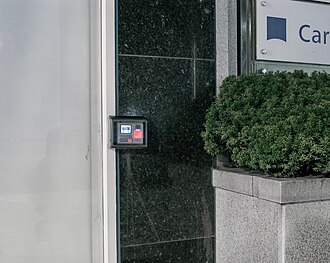

# Chapter 7: Identities, Permissions, ACLs, and Local Security


*Image source: [Access control](https://en.wikipedia.org/wiki/Access_control) on Wikipedia / Wikimedia Commons.*

This chapter turns Linux permissions into what they actually are: a local trust policy enforced by the operating system. The important question is not "what does `chmod 755` mean on a quiz?" The important questions are:

- who is this process running as,
- which group context matters,
- who should own the object,
- who should be able to read, write, execute, or traverse it,
- and whether broad permissions are hiding a design mistake.

Permissions are not decoration. They are one of the operating system's most important policy surfaces.

## What You Should Be Able To Explain

By the end of this chapter, you should be able to explain:

- how user identity, group membership, and process credentials control access checks,
- why `/etc/passwd` and shadow-password storage serve different purposes,
- how file and directory permissions differ,
- why ownership is often the first security decision,
- how `chmod`, `umask`, setUID, setGID, and sticky bit affect real behavior,
- what ACLs add to the classic owner/group/other model,
- and why direct root use should be treated as a risk rather than as a default workflow.

## Permissions Only Make Sense After Identity Is Clear

Before a kernel can decide whether an operation is allowed, it needs to know **who** is asking.

That is why Linux access control begins with identity:

- user ID,
- primary group,
- supplementary groups,
- process credentials,
- ownership,
- and authentication state.

Useful verification commands include:

```bash
whoami
id
groups
```

These commands are not trivia. They are where permission troubleshooting starts. Many access problems are really identity-context problems:

- the command is running as the wrong user,
- the process lacks the expected group membership,
- or the administrator guessed at the identity instead of checking it.

## Accounts Are More Than Usernames

A Linux account is not just a label. It includes:

- a numeric identity,
- a name,
- a home directory,
- a default shell,
- group relationships,
- and authentication material.

The course explicitly preserves the difference between general account records and **shadow password** storage.

That distinction matters because:

- account information has to be broadly readable enough for the system to function,
- password hashes do not.

This is why a secure system separates identity description from authentication secrets instead of storing everything in one casually readable place.

## Groups Are the Scalable Way to Share Access

Groups matter because they let you grant access by role instead of by endless one-off exceptions.

A common secure pattern is:

1. define the right owner,
2. define the right group,
3. grant the group what it actually needs,
4. avoid broad access for "other" whenever possible.

This scales better than trying to manage every file as a special case. It is also easier to audit later.

That is why commands like `groups` and `id` are so important. If the user's group context is wrong, the permission model may be correct while access still fails.

## Read Permission Strings as Policy Statements

A mode such as:

```text
-rw-r-----
```

is not just a pattern to decode on an exam. It is a policy statement:

- the owner may read and write,
- the group may read,
- everyone else is denied.

Linux repeats this access question three times:

- what can the **owner** do,
- what can the **group** do,
- what can **others** do.

That is why the basic permission model is simple but still powerful.

## File Permissions and Directory Permissions Are Not the Same Thing

Students get into trouble when they memorize `rwx` once and assume it means the same thing everywhere.

For a **regular file**:

- `r` means read the contents,
- `w` means modify the contents,
- `x` means execute the file as a program or script.

For a **directory**:

- `r` means list directory entries,
- `w` means create, rename, or delete entries in the directory,
- `x` means traverse or enter the directory.

That last point is one of the most important permission lessons in the whole Linux sequence. On a directory, `x` does **not** mean "execute the directory like a program." It means the user may traverse the path through that directory.

This is why directory security decisions often surprise beginners. A directory that looks "readable enough" may still be unusable without execute/traverse permission.

## File Type Indicators Matter Too

The first character in a long listing is not cosmetic.

Examples include:

- `-` for a regular file,
- `d` for a directory,
- `l` for a symbolic link.

This matters because access-control interpretation depends partly on what kind of object you are looking at. A directory, symlink, and executable program do not carry the same operational meaning.

## Ownership Is Usually the First Hardening Decision

Before changing mode bits, an administrator should ask:

- who should own this object,
- which group should control shared access,
- and whether the current ownership already explains the failure.

Commands such as:

```bash
chown user file
chgrp group file
chown user:group file
```

matter because bad ownership often leads inexperienced administrators to make the wrong fix. Instead of correcting ownership, they loosen permissions for everyone.

That usually creates a worse system.

A better sequence is:

1. correct ownership,
2. assign the appropriate group,
3. set the narrowest sensible permissions,
4. test access as the intended identity.

## `chmod` Implements Policy; It Does Not Invent It

Students absolutely need to learn `chmod`, but the command is not the real point. The real point is the policy decision behind it.

### Symbolic form

Examples:

```bash
chmod u+x file
chmod g-w file
chmod o-rwx file
```

### Numeric form

Examples:

```bash
chmod 640 file
chmod 750 directory
```

Common modes worth understanding include:

- `600`: owner read/write only,
- `640`: owner read/write, group read, others none,
- `644`: owner write, everyone can read,
- `700`: owner full access only,
- `750`: owner full, group read/execute, others none,
- `755`: owner full, group and others read/execute.

The real administrative questions are:

- should this object be executable,
- should this object be world-readable,
- should group access exist,
- and is this a private object or a shared object?

If the answer to those questions is unclear, the `chmod` syntax is not the real problem.

## `umask` Sets the Starting Point for Security

New files and directories are not normally created fully open. Linux applies a **umask** to remove permissions from the default creation mode.

That makes `umask` a default policy mechanism.

Examples:

```bash
umask
umask 027
```

The important habit is to think of `umask` as a way to bias the system toward safer defaults. It is better to create an object too restricted and widen it deliberately than to create it too open and hope somebody remembers to tighten it later.

This is one reason administrators should not only think about fixing permissions after the fact. They should think about how new objects start their lives.

## Special Permissions Change How Privilege and Collaboration Behave

The classic permission bits are not the whole story. Linux also uses three special permission cases that matter operationally.

### setUID

On an executable, **setUID** causes the program to run with the identity of the file owner rather than only the identity of the user who launched it.

That can be necessary, but it is also risky. Any setUID program deserves scrutiny because it changes the normal privilege model.

### setGID

On executables, **setGID** works similarly for group context.

On directories, setGID is often taught through collaboration: new files created inside the directory inherit the directory's group. That is a practical way to make shared project directories behave consistently.

### Sticky bit

The **sticky bit** matters on shared writable directories. It helps stop users from deleting or renaming each other's files simply because the directory is writable.

This is why a shared temporary space can be collaborative without becoming a free-for-all.

These are not obscure decorations. They meaningfully alter how access behaves.

## ACLs Add Precision Beyond Owner, Group, and Other

Classic permissions are deliberately simple. That simplicity is useful, but it does not solve every access problem elegantly.

**ACLs** become useful when:

- one additional user needs access,
- one additional group needs a different access level,
- or the traditional three-class model would force sloppy broad permissions.

ACLs should not replace good ownership and group design. They should extend it when the classic model is too coarse.

The important policy lesson is this:

- if ACLs help you avoid world-readable or world-writable shortcuts, they are probably serving a real purpose,
- if ACLs are being used to patch chaos everywhere, the underlying design is probably bad.

Classic permissions are easiest to understand when you inspect a real object:

```bash
ls -l script.sh
-rwxr-xr-- 1 alice staff 1024 May 1 09:00 script.sh
```

Read that permission string in pieces:

- the leading `-` means this is a regular file,
- `rwx` means the owner can read, write, and execute,
- `r-x` means the group can read and execute,
- `r--` means everyone else can only read.

ACLs become useful when that three-part model is still too coarse:

```bash
setfacl -m u:bob:rw report.txt
getfacl report.txt
```

That gives the user `bob` read-write access to `report.txt` without changing the file's main group ownership or broadening access for everyone else.

Account data is also split intentionally. `/etc/passwd` stores public account information such as usernames, UIDs, home directories, and login shells. `/etc/shadow` stores hashed passwords and aging data and must stay readable only to privileged processes.

## Root Is Powerful and Therefore Dangerous

The root account should not be treated as the normal daily operating context.

Reasons include:

- root can change or destroy the whole system,
- mistakes made as root are expensive,
- direct root sessions reduce accountability,
- and direct root login increases the value of credential theft.

This chapter pushes toward a healthier mental model:

- treat full privilege as exceptional,
- justify it when needed,
- and avoid normalizing it for routine work.

## `su`, `sudo`, and Accountability

The root-versus-`sudo` distinction matters because it separates operational convenience from security discipline.

- `su` changes identity into another account, often root.
- `sudo` runs a command with elevated privilege while preserving who initiated it.

That distinction matters because `sudo` supports:

- least privilege,
- narrower exposure,
- and better accountability for who ran what.

The larger point is not that root should never be used. The larger point is that **unexamined full privilege is a bad habit**.

## Worked Examples

### Example: identity checks come before permission guesses

Good permission troubleshooting starts with `whoami`, `id`, and `groups`. The commands are simple, but they stop a common administrative mistake: changing permissions blindly while assuming the wrong user or group context.

### Example: directory `x` means traverse, not "execute like a program"

A directory can be readable yet still not traversable without `x`. If you miss that point, you tend to make poor policy decisions because you apply file semantics where directory semantics actually control the result.

### Example: `umask` makes more sense when you create a file and inspect it

`umask` makes more sense when you inspect a real result. Show the current `umask`, create a file, inspect the resulting permissions, then change the `umask` and repeat. The concept sticks because you can see the mask removing permissions.

### Example: sticky bit makes shared writable space survivable

The sticky-bit example matters because it connects a weird-looking permission feature to a very practical problem: many users may need to write in a shared location, but they should not all be able to delete each other's work.

### Example: disable routine direct root use after recovery

Recovering root access is not the same thing as normalizing direct root use afterward. Recovery exists because systems break. Daily administration should still move back toward controlled `sudo`-based work where appropriate.

## Practice Connections

- For file ownership and permission practice, use [Linux Users, Groups, and Mode](../../labs/120-lecture-linux-users-groups-and-mode/README.md).
- For recovery-oriented privilege consequences, use [Linux Password Recovery and Locking Out Root](../../labs/140-linux-password-recovery-and-locking-out-root/README.md).
- For the repo-facing bridge back into the cleaned material, use [Repo Companion Material](repo-companion-material.md).

## Chapter Summary

- Linux permissions begin with identity: users, groups, ownership, and process credentials.
- Shadow-password storage exists because authentication material deserves stronger protection than ordinary account metadata.
- File permissions and directory permissions use the same letters but different semantics.
- Ownership is often the first hardening tool; broad "other" access is often a sign of bad design.
- `chmod` applies a policy, while `umask` helps set safer defaults for newly created objects.
- setUID, setGID, sticky bit, and ACLs all change real access behavior in ways administrators must understand.
- Root is powerful enough to be dangerous, which is why controlled privilege elevation is healthier than living in a permanent root session.

## Review Questions

1. Why does Linux access control begin with identity rather than with `chmod` syntax?
2. How do directory permissions differ from regular-file permissions?
3. Why is ownership often a better first fix than simply making a file more open?
4. What problem do ACLs solve that owner/group/other permissions do not always solve cleanly?

## Further Reading

- [Access control](https://en.wikipedia.org/wiki/Access_control)
- [Chmod](https://en.wikipedia.org/wiki/Chmod)
- [Filesystem permissions](https://en.wikipedia.org/wiki/File-system_permissions)
- [Access-control list](https://en.wikipedia.org/wiki/Access-control_list)
