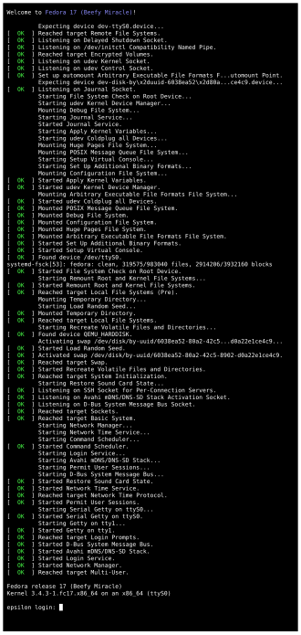
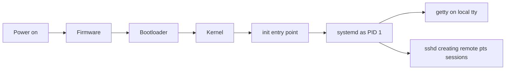

# Chapter 8: Boot, Recovery, Terminals, and Secure Remote Access


*Image source: [systemd](https://en.wikipedia.org/wiki/Systemd). Attribution details for the local image copy are listed in [Wikipedia and Web Resources](wikipedia-and-web-resources.md#image-sources).*

Boot control, recovery, terminal context, and SSH belong together because they all answer the same larger question: **who really controls the machine right now?** If you control boot behavior, recovery mode, or privileged remote access, you control an enormous amount of what the machine can become.



## What You Should Be Able To Explain

By the end of this chapter, you should be able to explain:

- why local boot control is such a powerful recovery and attack path,
- how GRUB boot edits can change startup behavior dramatically,
- the relationship among historical `init`, modern `systemd`, and local `getty` sessions,
- why the `quiet` argument matters for troubleshooting,
- the difference between `tty` and `pts`,
- how `chroot` supports recovery from a live environment,
- how SSH separates secrecy, server trust, and user authentication,
- and why host keys, user keys, passphrases, and `authorized_keys` are different pieces of the puzzle.

## Recovery Paths Are Necessary, and That Makes Them Dangerous

Keep two ideas in view at the same time:

- systems need recovery paths,
- and recovery paths become attack paths if physical or boot access is not controlled.

If someone can:

- reboot the machine,
- edit boot parameters,
- boot from removable media,
- or remove the drive entirely,

they may be able to reset privileged access rather than crack it.

That is why root recovery belongs inside security thinking, not just troubleshooting thinking.

## Single-User Mode, Runlevel 1, and Maintenance Context

Older Unix/Linux terminology often talks about **runlevels**, especially **runlevel 1** for single-user maintenance mode.

The useful historical mapping is:

- `init 0` for shutdown,
- `init 6` for reboot,
- runlevel `1` for maintenance or recovery,
- and on Debian-style systems, runlevels `2` through `5` are often treated the same for normal multi-user work.

You do not need to memorize every historical init table forever. You do need to remember the durable idea:

- a machine can boot into contexts other than normal multi-user operation,
- and those contexts may bypass ordinary login assumptions.

That matters operationally and defensively.

## GRUB Editing Can Redirect the Whole Startup Path

Boot control becomes concrete when you edit GRUB kernel arguments.

One especially important recovery example is replacing a normal boot line with something like:

```text
single init=/bin/bash
```

That change matters because it alters what userspace path the kernel takes after startup. Instead of bringing up the full ordinary system, the machine can land in a recovery-oriented shell with far fewer layers active.

That is why bootloader control is powerful. A small edit near the start of the boot chain can radically change how much of the system comes up and which protections are still in force.

## Real Recovery Work Often Means Remounting and Repairing State

Recovery work is practical rather than abstract. A system booted into a minimal recovery context often needs manual repair steps such as:

- remounting `/` read-write,
- editing authentication-related files,
- and resetting privileged credentials.

Typical actions include:

```bash
mount -o remount,rw /
passwd root
```

or, in older/manual workflows, recalculating and updating password-related data in `/etc/shadow`.

The important lesson is that recovering a broken or inaccessible machine is not just "use a magic mode." It often means understanding:

- filesystem state,
- what is mounted read-only versus read-write,
- where authentication material lives,
- and which commands are actually available in the current shell.

## Recovery from Live Media and `chroot`

The second major recovery path is booting from a separate environment and using **`chroot`**.

Conceptually the workflow is:

1. boot from a live or alternate environment,
2. mount the installed Linux root filesystem,
3. enter that installation with `chroot`,
4. perform repair or password-reset work from inside it.

That matters because it shows how security boundaries shift when the machine is no longer booted normally. If an attacker can bring their own boot environment and mount the installed system, software-only protections may not help much unless stronger storage protection is in place.

## Boot Security Must Be Layered

No single control solves this problem by itself. Several layers matter:

### GRUB password protection

If the bootloader menu is editable without restriction, an attacker at the console may be able to force a recovery-oriented startup path.

### Firmware password and boot-order controls

If firmware settings are open and alternate media is bootable casually, the installed operating system can be bypassed more easily.

### Physical access control

If someone can touch the machine freely, many software controls become much weaker.

### Full-disk encryption

This is the strongest answer to the "remove the drive and inspect it elsewhere" problem. If the filesystem contents are encrypted, possession of the hardware is much less valuable without the unlock material.

The durable lesson is that recovery abuse is mitigated through layers, not wishful thinking.

## `init` Is Historical Language; `systemd` Is Often the Real Implementation

Historically, the first userspace process started by the kernel was called `init`, with PID 1.

In modern Debian-style Linux, `/usr/sbin/init` or `/sbin/init` is often a symbolic link, and the real implementation in memory is **`systemd`**.

That is why older documentation and classroom language may still say "init" while the actual machine is running `systemd`.

This is not a contradiction. It is a compatibility story.

The practical boot chain is:

1. firmware hands off to the bootloader,
2. the bootloader starts the kernel,
3. the kernel starts the initial userspace entry point,
4. and on many modern Linux systems that means `systemd` becomes PID 1 and coordinates the rest of startup.

Commands like `ps`, `pstree`, and `lsof` reinforce that different tools reveal different slices of this process state.

Modern Linux uses **targets** where older Unix-like systems talked about **runlevels**. The mapping is not perfect, but it is close enough to be operationally useful:

| Historical idea | Typical meaning | Common systemd target |
| --- | --- | --- |
| Runlevel 1 | rescue / single-user style maintenance | `rescue.target` |
| Runlevel 3 | multi-user text mode | `multi-user.target` |
| Runlevel 5 | graphical multi-user mode | `graphical.target` |

That is why older commands like `init 3` still appear in legacy documentation even though modern systems more often use `systemctl isolate multi-user.target`.

## `quiet` Is Not a Neutral Choice

The kernel argument `quiet` suppresses much of the visible boot chatter.

That can make sense on a polished desktop where cosmetic presentation matters. On servers and troubleshooting-focused systems, it is often the wrong default.

Visible boot messages help you:

- see where startup fails,
- identify hanging services,
- observe kernel and service-manager errors,
- and debug earlier in the boot process.

This is another place where operational judgment matters more than slogans:

- on desktops, silence may be cosmetically useful,
- on servers, diagnosability is often more valuable.

Keep one more distinction clear:

- editing GRUB at boot time changes behavior **temporarily**,
- editing boot configuration files changes behavior **persistently**.

That temporary-versus-persistent distinction appears again in later networking and administration work.

## Local Consoles and Pseudo-Terminals Are Not the Same Kind of Access

Once the system has booted far enough to present a shell, the next question is what kind of shell you are actually looking at. A local console session, a rescue shell, and a remote SSH session may all look similar at first glance, but they do not have the same trust assumptions or the same incident-response meaning.

Linux uses different terminal contexts, and administrators should know which kind they are actually in.

### `tty`

A `tty` usually means a local console or virtual console tied to the machine itself.

Local login sessions created through `getty` or `agetty` are classic examples. Multiple local consoles can exist at once, and on many systems you can move among them with keyboard shortcuts such as `Alt` plus a function key, or `Ctrl+Alt` plus a function key when a graphical environment is active.

### `pts`

A `pts` is a pseudo-terminal. It is a software-mediated terminal context commonly used for remote or indirect shell access, including SSH sessions.

This distinction matters because:

- a local console and a remote session are not the same security situation,
- shell history and current commands do not tell the whole access story,
- and session context often matters during incident review and troubleshooting.

You can make this visible with a command like `who`:

```text
alice    tty1   2026-03-18 09:00
bob      pts/0  2026-03-18 09:15 (192.168.1.50)
```

That output shows one local console login and one remote pseudo-terminal session. The shell prompt alone does not always tell you which kind of access path you are looking at.

## SSH Is About Trust, Not Just Encryption

SSH is often introduced as "secure Telnet," which is true but too shallow.

SSH is used for:

- remote login,
- secure file transfer with SCP or SFTP,
- tunneling and forwarding,
- passwordless administration,
- multi-factor combinations,
- and X11 forwarding in environments that still use it.

Keep three different questions separate:

1. Is the session encrypted?
2. Do I trust the server I am talking to?
3. Does the server trust me as a user?

Those are not the same problem.

## Diffie-Hellman, Session Keys, and Perfect Forward Secrecy

**Diffie-Hellman** matters here because it explains how two parties can establish a shared secret over an untrusted network without sending that secret itself in the clear. SSH can then derive temporary symmetric session keys from that exchange, use those keys to protect the live connection, and keep that secrecy step separate from server identity and user authentication.

This is where **perfect forward secrecy** matters conceptually. If session keys are temporary and negotiated well, compromising one long-term key later does not automatically reveal every old session.

It is easy to blur all "SSH keys" together. Do not.

## Server Trust and User Authentication Are Separate Layers

An SSH connection can be encrypted and still be unsafe if you are securely talking to the wrong machine.

That is the classic **man-in-the-middle** problem.

So SSH has to solve two different trust layers:

- the client has to decide whether the server's host identity is trustworthy,
- the server has to decide whether the connecting user is authorized.

That is why files and concepts divide cleanly:

- host keys and `known_hosts` belong to **server trust**,
- user keys and `authorized_keys` belong to **user authentication**.

If you keep those two layers separate, SSH becomes much easier to reason about.

## Host Keys, `known_hosts`, and First-Connection Trust

Host trust deserves careful attention because it is easy to click past warnings without understanding what they mean.

Important points include:

- servers present host public keys,
- the client may warn on first contact because trust has not yet been established,
- and `known_hosts` records what host identity the client expects later.

That means the first-connection warning is not visual noise. It is asking whether the client is willing to trust this server identity.

Certificate-authority models can reduce the weakness of first-contact trust by shifting trust to a known signing authority instead of repeated ad hoc acceptance.

## User Key Authentication, Passphrases, and `authorized_keys`

User authentication through SSH keypairs uses:

- a **private key** that must stay private,
- a **public key** that can be installed where needed,
- and a server-side authorization file such as `authorized_keys`.

Several practical details are easy to miss:

- key comments help identify and manage keys later,
- passphrases protect the private key at rest,
- a passphrase on a private key is not automatically a true second factor,
- and a `.pub` file is not the secret half of the keypair.

Practical file locations matter too. Examples include:

- `~/.ssh/id_rsa`,
- `~/.ssh/id_rsa.pub`,
- and `~/.ssh/authorized_keys`.

That concrete path knowledge helps during troubleshooting and setup.

## SSH Can Be Strengthened Beyond Simple Passwords

SSH also extends beyond plain passwords:

- password plus keypair,
- PAM-backed extensions such as Google Authenticator,
- hardware-assisted options such as YubiKey,
- and graphical forwarding scenarios such as X11 forwarding.

These details matter because they show SSH as a flexible administration platform, not just a one-password remote shell.

## A Note on MAC in SSH

When this chapter talks about **MAC** in an SSH context, it means **Message Authentication Code**.

It does **not** mean:

- a network card's media access control address,
- or Mandatory Access Control.

That clarification matters because the acronym appears in different domains and does not mean the same thing everywhere.

In practice, SSH uses a keyed integrity check over the protected traffic. The sender computes that check from the packet contents and shared session material, and the receiver recomputes it to verify that the packet was not altered in transit. If the values differ, the packet is rejected instead of being treated as trustworthy data.

| SSH question | What is being checked | Why it matters |
| --- | --- | --- |
| Do I trust this server? | Host key / server identity | Reduces man-in-the-middle risk |
| Does the server trust this user? | Password, keypair, or another auth method | Controls login access |
| Is the session protected? | Negotiated session keys, integrity, and encryption | Protects confidentiality and integrity |

## Worked Examples

### Example: a GRUB edit can become a root-recovery path in one reboot

At the bootloader, a temporary kernel-line edit such as:

```text
single init=/bin/bash
```

can redirect the startup path into a recovery shell. Once the shell appears, the next steps are often:

```bash
mount -o remount,rw /
passwd root
sync
```

That sequence is exactly why bootloader control matters. A small change near the start of the boot chain can turn boot access into privileged recovery access.

### Example: live media plus `chroot` can repair a system that will not boot cleanly

A live-environment recovery flow often looks like this:

```bash
mount /dev/sda2 /mnt
mount --bind /dev /mnt/dev
mount --bind /proc /mnt/proc
mount --bind /sys /mnt/sys
chroot /mnt
passwd root
exit
```

The exact device names vary, but the logic does not. Boot elsewhere, mount the installed system, enter it with `chroot`, and repair it from inside its own filesystem tree.

### Example: `tty` and `pts` tell you where the shell came from

Not every shell session is operationally equivalent. A command like:

```bash
who
tty
```

might show a local console such as `tty1` or a remote session such as `pts/0`. That difference matters during troubleshooting and incident review because local and remote access paths do not imply the same trust boundary.

### Example: host trust is not the same thing as user trust

An SSH key workflow makes the distinction visible:

```bash
ssh user@server1.example.local
ssh-copy-id user@server1.example.local
ssh -i ~/.ssh/id_ed25519 user@server1.example.local
```

On first contact, the client decides whether the server's host key is trustworthy. Separately, the server decides whether the user's password or public key is authorized. `known_hosts` belongs to the first question. `authorized_keys` belongs to the second.

## Practice Connections

- For boot recovery work, use [Linux Password Recovery and Locking Out Root](../../labs/140-linux-password-recovery-and-locking-out-root/README.md).
- For remote access practice, use [SSH Keys and X11 Forwarding](../../labs/150-ssh-keys-x11-forwarding/README.md).
- For an operations-oriented SSH reference, use [SSH and MAC Operations Guide](../../labs/190-guide-ssh-and-mac-operations/README.md).
- For the chapter-by-chapter map back into companion material, use [Repo Companion Material](repo-companion-material.md).

## Chapter Summary

- Recovery mechanisms are necessary, but they become attack paths when boot and physical access are uncontrolled.
- GRUB edits can change the entire startup path, including entry into recovery-oriented shells.
- `chroot` from live media is a powerful repair technique and a reminder that physical access changes the security model.
- Modern Linux usually runs `systemd` behind the historical `init` entry point.
- `quiet` trades diagnosability for cosmetic silence and should be judged operationally.
- `tty` and `pts` represent different access contexts.
- SSH combines secrecy, integrity, host trust, and user authentication, and those layers should never be conflated.
- Host keys, `known_hosts`, user keys, passphrases, and `authorized_keys` all solve different parts of the problem.

## Review Questions

1. Why is local boot control such a powerful security concern?
2. What problem does `chroot` solve in a live-media recovery workflow?
3. Why might `quiet` be a poor default on a server that needs troubleshooting?
4. What is the difference between trusting an SSH host and authenticating an SSH user?

## Further Reading

- [systemd](https://en.wikipedia.org/wiki/Systemd)
- [GNU GRUB](https://en.wikipedia.org/wiki/GNU_GRUB)
- [Chroot](https://en.wikipedia.org/wiki/Chroot)
- [Secure Shell](https://en.wikipedia.org/wiki/Secure_Shell)
