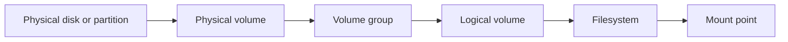

# Chapter 9: Linux Storage, LVM, and Filesystem Administration

This chapter moves from foundational storage concepts into Linux administration decisions: how Linux sees storage, how filesystems organize data, how the device-mapper and LVM layers fit together, and why real storage work is rarely solved by one command alone.



## What You Should Be Able To Explain

By the end of this chapter, you should be able to explain:

- the difference between file, block, and object storage,
- how Linux uses blocks, inodes, and metadata to organize files,
- why device mapper matters underneath LVM,
- how the chain from physical volume to mount point actually behaves in practice,
- why resizing, snapshots, and `pvmove` are multi-layer administrative tasks,
- and why persistence through `/etc/fstab` is different from making one live change right now.

## File, Block, and Object Storage

Students should learn this distinction early, because too many storage problems begin with treating all storage as “just more space.”

### File storage

File storage presents a filesystem namespace of directories and files.

That is the model students usually meet first:

- folders,
- filenames,
- pathnames,
- permissions,
- and mounted filesystems.

### Block storage

Block storage presents chunks of addressable storage to the operating system. Linux then usually builds a filesystem on top of that block device.

Typical examples include:

- local hard drives and SSDs,
- USB storage,
- SAN-style LUNs,
- iSCSI devices,
- loop devices,
- and logical volumes created through LVM.

Block storage is where Linux administrators spend much of their time. This is the layer where you partition disks, build physical volumes, create filesystems, and decide where those filesystems should mount.

### Object storage

Object storage is a different model again. Data is stored and retrieved as objects with metadata, often through a service or API rather than as a directly mounted local filesystem.

Object storage belongs in the same chapter as file and block storage, but it should not be mentally lumped together with them. It solves different operational problems.

## Blocks, Inodes, and Metadata

The Linux storage lectures did not treat inodes as decorative theory. They treated them as the reason filesystem behavior makes sense.

In Linux filesystems such as **ext4**:

- storage is organized in blocks,
- a common working example is a **4 KB block size**,
- and an **inode** stores metadata about a file.

That metadata includes things such as:

- ownership,
- permissions,
- timestamps,
- and pointers to the file’s data blocks.

This is why a file is not “just its name.” The pathname, inode, metadata, and data blocks are related, but they are not the same thing.

One useful practical habit from the course is to inspect inodes directly:

```bash
ls -ail
```

That command makes the inode model feel real. You are no longer talking about some abstract filesystem structure; you are looking at the identifiers Linux uses to track files.

## Filesystems Are Structure, Not Just Space

A filesystem is not “formatted storage” in the vague sense. It is a structure that answers real questions:

- where file data lives,
- where metadata lives,
- how names map to inodes,
- what consistency mechanisms exist after crashes,
- and how the system finds things again later.

**Ext4** is the working example here. That is a good default for teaching, but not a reason to pretend every Linux filesystem behaves exactly the same way.

## Inspect the Stack Before You Change It

Good storage administration begins with inspection, not with faith.

Before resizing, migrating, or mounting anything, students should know how to answer questions such as:

- which disks exist,
- which partitions exist,
- which logical volumes exist,
- which filesystems are mounted,
- how full those filesystems are,
- and whether persistent mount configuration already exists.

That makes tools such as these useful:

```bash
lsblk
df -h
mount
blkid
cat /etc/fstab
```

These tools answer different questions:

| Tool | Main question it answers |
| --- | --- |
| `lsblk` | What block devices, partitions, and logical volumes exist? |
| `df -h` | Which mounted filesystems are full? |
| `mount` | What is mounted right now? |
| `blkid` | What UUIDs and filesystem signatures exist on the system? |
| `/etc/fstab` | What should be mounted again at boot? |

Students should build the habit of checking more than one layer before making storage changes.

## Journaling, Deletion, and Why “Deleted” Is Not the Same as “Gone”

Two storage lessons deserve to be stated plainly.

### Journaling is not backup

With a filesystem such as **ext4**, journaling improves consistency after sudden interruption. It helps the filesystem recover more cleanly after a crash or power loss.

That does **not** mean:

- the data is backed up,
- every file survives every failure,
- or journaling replaces snapshots, archives, or backups.

### Deletion usually removes references first

Deleting a file often means the filesystem removes the references that make the file easy to find in normal use. It does not necessarily mean every byte is instantly overwritten.

That matters in two directions:

- **recovery**, because deleted content may still be recoverable,
- **security**, because “the user deleted it” is not the same as “the data is irretrievably gone.”

## Write Caching and Failure Behavior

The storage lectures were strong on a point many introductory texts blur: write caching improves apparent performance, but it changes the failure model.

Two broad ideas matter here:

- **write-through style behavior**, where writes are not treated as complete until they are committed more conservatively,
- **write caching**, where performance improves because writes may be acknowledged before they are fully committed to durable media.

That means write caching is not “good” or “bad” by itself. It is a tradeoff involving:

- performance,
- controller or disk design,
- power-loss behavior,
- and recovery expectations.

This is best treated as an operational judgment call, which is exactly the right framing.

## Device Mapper: The Layer Students Usually Do Not See at First

The later storage lectures made an important architectural point: many advanced Linux storage features sit on top of the **device mapper** layer.

That includes features such as:

- encryption,
- snapshots,
- striping,
- mirroring,
- thin provisioning,
- and caching through **dm-cache**.

This matters because students often encounter LVM or encrypted storage as if they were isolated tools. They are not. Linux storage is layered.

A storage diagram is therefore more useful than a memorized command list.

## LVM Vocabulary in the Right Order

The LVM chain should be learned in order, because each layer solves a different problem.

### Physical volume

A disk or partition prepared for use by LVM.

### Volume group

A storage pool made from one or more physical volumes.

### Logical volume

A logical storage unit carved out of the volume group.

### Filesystem

The structure created on top of the logical volume.

### Mount point

The directory where that filesystem becomes visible in the live Linux namespace.

| Layer | What it answers |
| --- | --- |
| Physical volume | Which devices are contributing capacity? |
| Volume group | What pooled storage exists? |
| Logical volume | What logical storage unit should the OS use? |
| Filesystem | How will files and directories be organized? |
| Mount point | Where does this storage appear in the running system? |

## Physical Extents and Why LVM Does Not Allocate Arbitrary Dust

The storage material repeatedly uses **4 MB physical extents** as the working LVM example.

That matters because extents explain why LVM output sometimes looks surprising. A request for one size may be rounded to the nearest extent boundary because LVM allocates in chunks, not arbitrary bytes.

So a small snapshot request such as:

```bash
sudo lvcreate -L 10MB -s -n home_snap /dev/VG/lv-home
```

may result in output showing the actual allocation rounded upward. In the lab, a `10MB` snapshot rounded to `12.00 MiB`, because LVM allocates in whole extents.

That is not an error. It is LVM behaving according to its internal allocation model.

## Resizing Storage Is a Multi-Layer Problem

One of the best storage labs starts with a realistic mistake:

- the root logical volume is nearly full,
- the home logical volume has plenty of free space,
- and the system needs more room on root.

That is exactly the kind of problem LVM is good at solving.

The lab flow matters:

1. inspect the current state with `df -h`,
2. confirm which logical volume is full,
3. unmount the filesystem that can safely be taken offline,
4. resize the logical volume and filesystem together,
5. then remount and verify the result.

The concrete commands are worth preserving:

```bash
sudo umount /home
sudo lvresize --resizefs -L 12G /dev/VG/lv-home
sudo lvresize --resizefs -l +1333 /dev/VG/lv-root
sudo mount -av
df -h
```

That workflow teaches several durable lessons at once:

- online growth is easier than online shrinking,
- shrinking requires more caution,
- the filesystem layer matters, not just the LVM layer,
- and “the system is full” often means one mount point is mis-sized rather than the entire machine being out of space.

## Migrating Data with `pvmove`

The storage sequence also shows why LVM is operationally useful, not just architecturally interesting.

In the lab, the system begins on an old SATA disk and is then migrated onto a newer NVMe disk without rebuilding everything from scratch.

The practical sequence is:

```bash
sudo fdisk /dev/nvme0n1
sudo pvcreate /dev/nvme0n1p1
sudo vgextend VG /dev/nvme0n1p1
sudo pvmove -i2 /dev/sda1 /dev/nvme0n1p1
sudo vgreduce VG /dev/sda1
```

The important lesson is not merely that these commands exist. The lesson is that storage can be migrated while preserving the logical structure students already built.

`pvmove` is memorable because it demonstrates that LVM supports live administration and maintenance, not just initial installation.

## Snapshots and Point-in-Time Recovery

Snapshots are easiest to understand when tied to a real recovery problem.

In the storage lab, the goal is not “learn snapshots because they are cool.” The goal is to recover a deleted file from a point-in-time copy of a live filesystem.

The practical workflow is:

1. confirm free space exists in the volume group,
2. create the snapshot,
3. delete the file from the live filesystem,
4. mount the snapshot separately,
5. recover the file from the snapshot view.

The commands look like this:

```bash
sudo vgdisplay
sudo lvcreate -L 10MB -s -n home_snap /dev/VG/lv-home
sudo mkdir -p /mnt/home_snap
sudo mount /dev/VG/home_snap /mnt/home_snap
```

In the lab, the target file is `quotes.txt`. The point is not the filename. The point is the concept:

- the live filesystem changes,
- the snapshot preserves the earlier view,
- and recovery becomes possible without pretending journaling was enough.

For that reason, this chapter connects snapshots directly to live-system recovery instead of describing them only as a generic advanced feature.

## Persistence: `/etc/fstab`, UUIDs, and Stable Boot-Time Mounts

Mounting a filesystem right now is not the same as designing a persistent system.

That makes `/etc/fstab` important. It answers the boot-time question:

- what should be mounted,
- where,
- with which filesystem type,
- and under what options.

Students should also understand why administrators often prefer **UUIDs** in `/etc/fstab` instead of trusting device names such as `/dev/sdb1`. Device order can change. UUIDs are usually more stable.

A typical administrative sequence is:

1. discover the filesystem with `blkid`,
2. confirm the mount point,
3. test the mount live,
4. add the persistent entry to `/etc/fstab`,
5. validate with `mount -av`.

That habit prevents a lot of avoidable boot and storage mistakes.

## Archives, Compression, Tape, and Object Storage

The later storage material broadens the picture correctly.

### Archiving is not compression

Tools such as `tar` package files together. Compression reduces size. These ideas often travel together, but they are not the same operation.

### Tape still matters conceptually

Tape belongs in storage education because long-term retention and off-site backup planning are real problems, even in environments that no longer use tape daily.

### Object storage is not “a weird filesystem”

Object storage is a different service model with different access patterns, durability assumptions, and operational workflows.

The larger lesson is that “storage” is not one problem. It is a family of different design problems.

## The Right Final Lesson: LVM Is Useful, Not Mandatory

The best closing lesson from the storage lectures is caution.

LVM is powerful. Snapshots are powerful. `pvmove` is powerful. Device-mapper features are powerful.

But good storage design still begins with:

- what problem you are solving,
- where redundancy should live,
- whether the workload is bare metal or virtualized,
- and what complexity you are willing to own afterward.

In a VM, for example, some resilience may already exist at the hypervisor or host-storage layer. That does not make guest-side LVM wrong. It means you should not stack abstractions blindly just because you can.

## Worked Examples and Teaching Moments

### Example: ext4 and inode thinking become real when you inspect them

The filesystem material gets more concrete the moment students run `ls -ail` and stop treating inodes like invisible theory.

### Example: the system is “out of space” even though the disk is not

The root-vs-home resize lab is a perfect storage lesson because it shows that the wrong layer can be full even when the machine still has capacity elsewhere.

### Example: `pvmove` makes LVM feel operational

Migrating extents from an old disk to a new disk without rebuilding the whole system is one of the strongest demonstrations in the course that LVM is an administrative tool, not only a diagram.

### Example: snapshots exist because live systems keep changing

A snapshot matters when a file has already disappeared from the live filesystem but still exists in the point-in-time copy. That is the difference between a buzzword and a recovery tool.

### Example: mounting once is not persistence

Students repeatedly need this systems lesson: the live system and the boot-time system are related, but they are not the same thing. `/etc/fstab` is where that distinction becomes real.

## Practice Connections

- For public hands-on storage work, use [Linux Storage](../../labs/130-linux-storage/README.md).
- For LVM-specific repo notes, use [LVM Setup](../../course-materials/labs/systems/lab-lvm-setup.md).
- For supporting lecture notes, use [Linux Storage](../../course-materials/lectures/systems/linux-storage.md).
- For the repo-facing chapter map, use [Repo Companion Material](repo-companion-material.md).

## Chapter Summary

- Linux storage administration starts by distinguishing file, block, and object storage.
- Ext4-style block and inode thinking explains why metadata, links, and deletion behave the way they do.
- Device mapper sits underneath many advanced storage features, including LVM.
- LVM works through a chain from physical volume to mount point, and each layer answers a different question.
- Resizing, migration, and snapshots are multi-layer tasks that require inspection before action.
- `/etc/fstab` separates one live mount from a persistent boot-time storage design.
- LVM is powerful, but it should be used because it solves a real problem, not because it exists.

## Review Questions

1. Why does the chapter distinguish file, block, and object storage so early?
2. What does an inode store, and why does `ls -ail` help make that model concrete?
3. Walk through the chain from physical volume to mount point.
4. Why is resizing storage a multi-layer problem rather than just an LVM command problem?
5. What does `pvmove` teach about LVM that a static diagram does not?
6. Why is journaling not a substitute for snapshots or backup?
7. Why might an administrator prefer a UUID over a simple device path in `/etc/fstab`?

## Further Reading

- [Logical Volume Manager (Linux)](https://en.wikipedia.org/wiki/Logical_Volume_Manager_(Linux))
- [Inode](https://en.wikipedia.org/wiki/Inode)
- [Ext4](https://en.wikipedia.org/wiki/Ext4)
- [Device mapper](https://en.wikipedia.org/wiki/Device_mapper)
