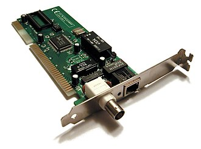

# Chapter 10: Linux Networking and Distribution-Specific Administration


*Image source: [Network interface controller](https://en.wikipedia.org/wiki/Network_interface_controller). Attribution details for the local image copy are listed in [Wikipedia and Web Resources](wikipedia-and-web-resources.md#image-sources).*

This chapter is about the part of Linux administration where people most quickly overgeneralize. Networking on Linux is powerful, but it is also distribution-specific, tool-specific, and historically layered. The goal is to teach both old and new tools without pretending that one example is a universal truth.

## What You Should Be Able To Explain

By the end of this chapter, you should be able to explain:

- why older networking tools still matter even though the modern model is different,
- how `iproute2` and `ss` replace much of the old `net-tools` mindset,
- why a command can be installed but unavailable through the current PATH,
- what `/bin`, `/sbin`, `/usr/bin`, and `/usr/sbin` imply operationally,
- why predictable interface names matter,
- and why temporary networking changes and persistent networking changes are not the same thing.

## Old Tools vs New Tools

This chapter does something useful: it does not pretend the old tools never existed.

You should recognize legacy tools such as:

- `ifconfig`,
- `route`,
- `arp`,
- and `netstat`.

At the same time, the modern Linux networking model centers on:

- `iproute2`,
- the `ip` command,
- and tools such as `ss`.

At a practical level, keep the migration map in mind:

- `ifconfig` -> `ip`
- `route` -> `ip route`
- `arp` -> `ip neigh`
- `netstat` -> `ss` and related newer inspection tools

| Older habit | Modern replacement | What the newer tool family is doing |
| --- | --- | --- |
| `ifconfig` | `ip addr` / `ip link` | Inspecting addresses and interface state |
| `route` | `ip route` | Viewing or changing routing information |
| `arp` | `ip neigh` | Inspecting neighbor or ARP table information |
| `netstat` | `ss` | Inspecting sockets and listening services |

That does not mean the old names are worthless. It means the new model should be the one you build around.

A useful side-by-side cheat sheet is:

```bash
# old habit
ifconfig
route -n
arp -a
netstat -tulpen

# modern habit
ip addr
ip route
ip neigh
ss -tulpen
```

That dual awareness matters because administrators still encounter old documentation, older systems, and muscle memory built around legacy tools. Recognition is useful. But current practice should be built around the newer model.

## Why `iproute2` Replaced `net-tools`

This tool change connects to Linux networking’s wider capabilities. The newer stack exists because Linux networking grew beyond the older `net-tools` world.

The modern model needs to support concepts associated with serious network administration, including:

- advanced routing behavior,
- filtering,
- traffic shaping,
- VPN support,
- link aggregation or bonding,
- and other enterprise-style networking features.

You do not need to master all of those features immediately. You do need to understand why the modern toolset exists.

## When a Command Is Installed but Still Does Not Run

One of the most practical Linux lessons in the networking material is the Debian PATH example.

A command may exist on the system and still fail when a normal user tries to run it. Why?

Because command availability depends on the **current PATH**, not only on whether the executable file exists somewhere on disk.

That leads directly to a useful filesystem-hierarchy lesson.

## `/bin`, `/sbin`, `/usr/bin`, and `/usr/sbin`

This chapter uses networking tools to teach the filesystem hierarchy standard in practice.

At a broad level:

- `/bin` and `/usr/bin` hold ordinary user-facing commands,
- `/sbin` and `/usr/sbin` are more associated with system administration tools.

This is not only a historical trivia lesson. It explains real behavior:

- root often has administrative directories in PATH by default,
- ordinary users may not,
- and therefore “the command exists” is not the same as “the shell can find it.”

That lesson generalizes well beyond networking.

One especially practical workflow is:

1. confirm whether a legacy tool such as `ifconfig` is installed,
2. locate it with tools such as `whereis`,
3. and then notice that a normal user may still need the absolute path if `/usr/sbin` is missing from the current PATH.

That looks like this in practice:

```bash
whereis ifconfig
/usr/sbin/ifconfig
echo "$PATH"
```

That is a far better lesson than simply telling you “type this command.”

## Shell Startup Files and Environment Context

This problem also teaches shell startup logic. Environment configuration affects:

- who sees which PATH entries,
- which commands are reachable without a full path,
- and what a login shell makes available by default.

This is another example of why administration is not just about memorizing command names. Context matters:

- which account you are using,
- which shell you are in,
- and how that shell was started.

One useful administrative exercise here is to adjust the relevant profile logic so that the intended account context receives access to administrative command paths where appropriate. That bridges shell startup knowledge and real operational friction.

This also connects naturally to `sudo`. In real administrative work, one reason a command suddenly becomes reachable under `sudo` is that the effective environment often includes administrative search paths that an ordinary user shell did not expose by default. That does not remove the need to understand PATH; it proves why PATH matters.

It also explains why “it works as root” is not a full diagnosis. Students should ask:

- did privileges change,
- did the PATH change,
- or did both change?

## Predictable Interface Naming

Linux interface names changed over time. Students still need to recognize older names such as:

- `eth0`,
- `eth1`,

but modern systems often use more descriptive names such as:

- `ens33`,
- or similar predictable interface names.

That matters because interface names show up in:

- route inspection,
- configuration files,
- firewall rules,
- and troubleshooting.

Virtualization also grounds this lesson, because VM environments often produce names that reflect virtual hardware assumptions rather than the older textbook `eth0` style.

## `ip link`, Interface Discovery, and Practical Inventory

One of the strongest practical habits here is to inspect what the system actually has instead of assuming an interface name from old documentation or memory.

Use the system to discover:

- which interfaces exist,
- which ones are up,
- which ones have addresses,
- and which naming scheme the host is using.

That habit is especially important when you work across distributions, VM platforms, and lab images.

## Runtime State vs Persistent Configuration

Live changes are not always persistent.

This is one of the core Linux administration lessons in the chapter:

- a command may change the running system right now,
- but unless the relevant configuration is stored in the right place for that distro and toolchain, the change may vanish at reboot.

Quick inspection commands show the running system right now:

```bash
ip link
ip addr
ip route
ss -tulpen
```

Those commands are for inspection and immediate changes. For example:

```bash
ip addr add 10.0.0.5/24 dev eth0
```

That takes effect immediately, but it does not survive a reboot unless you also change the persistent configuration.

`ss -tulpen` is worth reading carefully:

- `-t` shows TCP sockets,
- `-u` shows UDP sockets,
- `-l` limits the view to listening sockets,
- `-p` shows the owning process,
- `-e` shows extended details,
- `-n` keeps addresses and ports numeric instead of trying to resolve names.

Persistent configuration lives elsewhere, for example in:

- `/etc/network/interfaces`,
- `/etc/netplan/*.yaml`,
- NetworkManager profiles,
- and resolver configuration.

After editing those files, you also need to apply the change through the stack in use. Examples include:

```bash
sudo netplan apply
sudo systemctl restart NetworkManager
sudo ifdown eth0 && sudo ifup eth0
```

That is the same temporary-versus-persistent distinction already seen in GRUB and mount configuration.

It is a recurring systems principle:

- live state and startup state are related,
- but they are not the same.

## Distribution-Specific Configuration Is Real

A particular networking demonstration should never be treated as universal Linux truth.

Linux networking varies by:

- distribution,
- release era,
- whether the system is desktop- or server-oriented,
- and which management layer is active.

Modern environments may involve:

- **netplan** as a declarative front end on Ubuntu-style systems,
- `systemd-networkd`,
- `NetworkManager`,
- or another distro-specific configuration layer.

The important caution is that `netplan` is not “Linux networking itself.” It is one Ubuntu-centered configuration layer that may hand off work to `systemd-networkd` or `NetworkManager`. That makes it a useful example, not a universal law.

The durable lesson is not “memorize one config file forever.” The durable lesson is:

- identify the networking stack actually in use,
- then administer the system according to that environment.

That principle becomes clearer when you compare actual configuration styles. A small Ubuntu-style netplan example might look like this:

```yaml
network:
  version: 2
  ethernets:
    eth0:
      addresses:
        - 10.0.0.5/24
```

An older Debian-style `/etc/network/interfaces` configuration expresses the same idea differently:

```text
auto eth0
iface eth0 inet static
    address 10.0.0.5/24
```

Neither syntax is “the Linux syntax.” Each belongs to a particular administration stack.

Concrete path examples still matter, because “it depends on the distro” is only useful if it leads to inspection rather than paralysis. Typical places an administrator may need to check include:

- `/etc/network/interfaces` on older Debian-style systems,
- `/etc/netplan/*.yaml` on Ubuntu systems using netplan,
- NetworkManager-managed connection profiles,
- and resolver-related files such as `/etc/resolv.conf` or service-specific resolver configuration.

The point is not to memorize a universal path. The point is to look for the configuration layer actually in use on the current host.

## Name Resolution Is Part of Networking Administration

Networking is often reduced to interfaces and routes. In practice, **name resolution** causes a large share of “the network is broken” complaints.

That means Linux networking administration also includes questions such as:

- can the system resolve names at all,
- which resolver configuration is active,
- whether the failure is an address problem or a DNS problem,
- and whether the host can reach the intended resolver service.

This is another reason to avoid one-command thinking. A system can have a perfectly valid interface and route configuration while still failing operationally because name resolution is wrong.

Useful DNS and resolver checks include:

```bash
cat /etc/resolv.conf
getent hosts example.com
host example.com
dig example.com
resolvectl status
```

Those commands help separate:

- “the interface is down,”
- from “the route is wrong,”
- from “DNS is failing,”
- from “the name resolves, but to the wrong address.”

## Virtualization Changes What You See

VMware or other VM networking modes make the lesson concrete. They affect:

- the interface names you see,
- the addresses you receive,
- and the route model the guest perceives.

For example, bridged and NAT-style setups do not present the same operational picture to the guest. **NAT**, or **Network Address Translation**, means the guest is often hidden behind another system that rewrites address information as traffic passes through it. If you forget that, you can easily misdiagnose lab issues that are really design choices in the virtual networking layer.

That is why older-tool examples in bridged-style contexts and newer-tool examples in NAT-style contexts still have value. The point is not just to type different commands. It is to see how the surrounding network design changes what the guest can observe.

## Practical Administration Habits

By the end of the Linux networking material, you should be comfortable with a habit sequence like this:

1. identify the interfaces actually present,
2. inspect current addresses, routes, and listening services,
3. determine whether you are looking at a temporary or persistent change,
4. identify which toolchain manages this distribution,
5. confirm whether you are dealing with a VM-networking artifact such as bridged or NAT mode,
6. and document the result instead of relying on memory.

That sequence is much more durable than memorizing one outdated command recipe.

## Worked Examples

### Example: `ifconfig` can exist on disk and still fail at the shell

A Debian-style system might behave like this:

```bash
$ ifconfig
bash: ifconfig: command not found

$ whereis ifconfig
ifconfig: /usr/sbin/ifconfig

$ echo "$PATH"
/usr/local/bin:/usr/bin:/bin
```

That is not a contradiction. The binary exists, but the current shell is not searching `/usr/sbin`. This is why PATH troubleshooting belongs in networking administration.

### Example: runtime inspection and persistent configuration are different jobs

One realistic sequence is:

```bash
ip addr show
ip route
sudo ip addr add 10.0.0.5/24 dev ens33
ping -c 2 10.0.0.1
```

That changes the running system immediately. To keep the change after reboot, you still need to edit the persistent config and apply it:

```bash
sudoedit /etc/netplan/01-lab.yaml
sudo netplan try
sudo netplan apply
```

The exact files and commands depend on the distribution, but the principle does not: live state and startup state are related, not identical.

### Example: DNS troubleshooting starts by separating name resolution from raw connectivity

When a host can reach an IP address but not a service name, work through the problem in layers:

```bash
ping -c 2 8.8.8.8
ping -c 2 example.com
getent hosts example.com
host example.com
resolvectl status
```

If the IP ping works but name resolution fails, the problem is not the same as “the network is down.” It is usually a resolver or naming problem.

### Example: `ens33` beats assuming every interface is `eth0`

Modern Linux may present names such as `ens33`, and `ip link` is a better habit than assuming a textbook interface name that does not exist on the current host.

## Practice Connections

- For a companion networking note, use [Linux Networking](../../course-materials/lectures/systems/linux-networking.md).
- For path and command-line context that supports this chapter, use [OS & Networking Fundamentals](../../course-materials/lectures/systems/os-and-networking-fundamentals.md).
- For storage-and-networking context, use [Repo Companion Material](repo-companion-material.md).

## Chapter Summary

- Linux networking administration still requires recognition of legacy tools, but modern practice centers on `iproute2` and related tools.
- `ss` belongs in the modern inspection toolkit alongside `iproute2`, especially where old `netstat` habits still persist.
- PATH and filesystem hierarchy explain why an installed command may still fail for a normal user.
- Resolver configuration and name resolution are part of networking administration, not a separate unrelated topic.
- Predictable interface names replaced older assumptions like `eth0` in many environments.
- Networking changes made live are not automatically persistent.
- Distribution-specific toolchains matter, and no single example should be treated as universal Linux truth.
- Virtualization changes the guest’s networking picture and must be considered during troubleshooting.

## Review Questions

1. Why should you still recognize legacy tools such as `ifconfig` even though you should build around `iproute2`?
2. How can a command exist on disk but still fail for a normal user?
3. Why is DNS or name-resolution troubleshooting part of networking administration rather than a separate problem?
4. Why is it dangerous to assume one Linux networking example is a universal configuration method?
5. How do VM networking modes such as bridged and NAT affect what the guest system sees?

## Further Reading

- [Iproute2](https://en.wikipedia.org/wiki/Iproute2)
- [Netstat](https://en.wikipedia.org/wiki/Netstat)
- [Linux networking](https://en.wikipedia.org/wiki/Linux_networking)
- [Filesystem Hierarchy Standard](https://en.wikipedia.org/wiki/Filesystem_Hierarchy_Standard)
