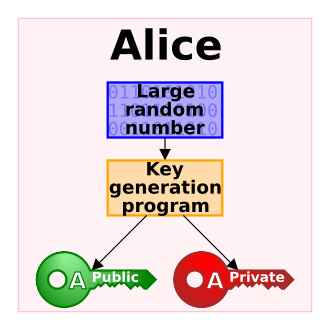

# Chapter 11: Certificates, TLS, and Service Trust


*Image source: [Public-key cryptography](https://en.wikipedia.org/wiki/Public-key_cryptography) on Wikipedia / Wikimedia Commons.*

This chapter is about one of the most important ideas in secure administration: encryption is not enough if you cannot trust who is on the other end of the connection.

Certificates, certificate authorities, and TLS exist to reduce that problem. They bind a public key to an identity through a signing process that clients can evaluate against a trusted authority.


## What You Should Be Able To Explain

By the end of this chapter, you should be able to explain:

- why confidentiality without authentication is not enough,
- how symmetric and asymmetric cryptography play different roles in TLS,
- what PKI and a certificate authority actually do,
- what a CSR contains and what it does not contain,
- how a Linux CA workflow can be built and inspected,
- and how Apache TLS deployment fails when hostname, trust, or file roles do not line up.

## Why Certificates Matter

When you connect to a service over TLS, you usually want two things at once:

- **confidentiality**, so attackers cannot casually read the traffic,
- **authentication**, so you know the remote service is actually the one you intended to reach.

Without authentication, encryption alone is not enough. An attacker can still attempt a **man-in-the-middle** attack and present a false service.

Certificates matter because they are not just “crypto files.” They are part of the trust decision.

## Symmetric vs Asymmetric Cryptography

Treat this distinction as prerequisite knowledge, because it will keep showing up throughout the rest of the chapter.

### Symmetric cryptography

The same secret key is used for encryption and decryption.

### Asymmetric cryptography

There is a public key and a private key.

- the **public key** can be shared,
- the **private key** must remain secret.

TLS uses both models for different reasons:

- asymmetric cryptography supports identity and key-establishment tasks,
- symmetric cryptography is still used for efficient ongoing session protection.

| Role | Why it matters in TLS |
| --- | --- |
| Asymmetric cryptography | Makes identity, signing, and certificate-based trust possible |
| Symmetric cryptography | Protects the live session efficiently after trust is established |

## PKI and Certificate Authorities

**PKI**, or **Public Key Infrastructure**, is the trust system around keys, certificates, issuers, and client trust stores.

A **certificate authority (CA)** signs certificates. The client then decides whether it already trusts that CA.

At a high level, the trust chain works like this:

1. a service generates key material,
2. a certificate signing request is created,
3. a CA signs the request,
4. the issued certificate is installed on the service,
5. the client validates the certificate against trusted CA material.

That is how TLS turns “I see a key” into “I trust that this key belongs to the service I meant to reach.”

## What a Certificate Contains

A certificate is not “the private key in another format.” It is a signed identity structure that usually contains:

- the **subject** identity,
- the **issuer** identity,
- the **public key**,
- a **validity period**,
- and a **digital signature** from the issuer.

These fields answer practical questions:

- who is this certificate for,
- who signed it,
- is it within its valid date range,
- and does it match the service name the client is using?

This is why certificate inspection is an administrative skill, not just a cryptography exercise.

## Keep the File Roles Separate

One of the repeating teaching problems in certificate work is students blurring together three different objects:

- the **private key**,
- the **CSR**,
- and the **issued certificate**.

They are not interchangeable.

| File or object | Purpose |
| --- | --- |
| Server private key | Proves the server controls the key pair |
| CSR | Requests signing and carries public identity information |
| Issued certificate | Signed identity document presented to clients |
| CA private key | Used by the CA to sign certificates |
| CA certificate | Distributed to clients as trust anchor material |

If a student loses this distinction, TLS troubleshooting becomes much harder than it needs to be.

## Housekeeping Before Certificate Work

Before jumping straight into OpenSSL commands, you need a clean administrative baseline:

- hostnames should be consistent,
- `/etc/hostname` and `/etc/hosts` should agree,
- systems should be able to reach each other by name,
- and cross-host administration should be practical.

That usually means checking or configuring:

- `/etc/hostname`,
- `/etc/hosts`,
- `ssh-keygen`,
- `ssh-copy-id`,
- and, in some environments, `visudo` for controlled administrative convenience.

Those are not random preliminaries. TLS work becomes much easier when:

- the machines have stable names,
- the names resolve correctly,
- and administrators can move between hosts without fumbling every step.

If hostname configuration and `/etc/hosts` disagree, even `sudo` may complain about being unable to resolve the local hostname. That is a systems-consistency lesson, not just a certificate lesson.

> **Note:** `/etc/hosts` is fine for local testing and small environments. Larger environments usually depend on DNS, but the requirement for consistent naming remains exactly the same.

## Building a Small Linux CA

Certificate authority work should be understood operationally, not just conceptually.

A small Linux CA begins with state on disk:

```bash
mkdir /etc/ssl/CA
mkdir /etc/ssl/newcerts
echo 01 > /etc/ssl/CA/serial
touch /etc/ssl/CA/index.txt
cp /etc/ssl/openssl.cnf /etc/ssl/openssl.cnf.original
```

Those files matter:

- `serial` tracks the next certificate serial number,
- `index.txt` tracks issued certificates,
- and the OpenSSL configuration controls where CA files live.

The next step is to edit the `[ CA_default ]` section of `/etc/ssl/openssl.cnf` so OpenSSL knows where to find:

- the certificate database,
- the serial file,
- the CA certificate,
- and the CA private key.

That matters because a CA is not “one magic cert file.” It is a small trust-management workflow with state.

## Creating the CA Certificate and Key

This workflow uses a self-signed CA for learning purposes rather than a full offline-root and intermediate-CA hierarchy. That keeps the process manageable while still teaching the important distinctions.

The concrete OpenSSL command matters:

```bash
openssl req -new -x509 -extensions v3_ca -keyout cakey.pem -out cacert.pem -days 365
```

That step creates two very different things:

- `cakey.pem`, the encrypted CA private key,
- `cacert.pem`, the CA certificate.

You should inspect those files rather than blindly trust filename extensions:

```bash
openssl x509 -text -noout -in cacert.pem | less
openssl rsa -text -noout -in cakey.pem | less
```

That is a good habit. Extensions such as `.pem`, `.key`, or `.csr` are suggestive, not authoritative.

The CA materials are then installed in the expected places:

```bash
mv cakey.pem /etc/ssl/private/
mv cacert.pem /etc/ssl/certs/
```

This is also the right moment to state an important trust lesson plainly:

- if a **server private key** is compromised, one service is in trouble,
- if the **CA private key** is compromised, the trust problem spreads much wider.

That is why CA private-key protection deserves extra seriousness.

## Creating a CSR for the Web Server

The chapter does not stop at CA theory. It walks through a real server request.

The web server builds a CSR using a small OpenSSL request config. The details matter because they force students to think about subject names and subject alternative names instead of treating “certificate identity” as a vague concept.

A representative request file looks like:

```ini
[req]
default_bits=2048
prompt=no
default_md=sha256
req_extensions=req_ext
distinguished_name=dn

[dn]
C=CA
ST=Ontario
L=London
O=example
OU=example.local
emailAddress=admin@example.local
CN=www.example.local

[req_ext]
subjectAltName=@alt_names

[alt_names]
DNS.1=example-apache.example.local
```

A concrete request command is worth keeping:

```bash
openssl req -new -sha256 -nodes \
  -out www.example-ca.local.csr \
  -newkey rsa:2048 \
  -keyout www.example.local-apache.key \
  -config <(cat csrdetails)
```

This makes several truths explicit:

- the private key is generated on the server,
- the CSR is a separate object,
- the CSR contains public-facing identity information,
- and SAN-style naming matters.

The CSR can then be inspected directly:

```bash
openssl req -text -noout -in www.example-ca.local.csr | less
```

## Moving the CSR and Signing It

Moving the CSR between hosts is ordinary Linux administration, which is exactly why the example matters. Certificate work is not isolated from the rest of systems administration.

One detail worth preserving is that SSH key-based convenience may exist for a normal user account but not for root. That is why copying the CSR across hosts can fail if administrators assume root magically has the same SSH trust setup.

Once the CSR is on the CA system, the signing step is:

```bash
openssl ca -in www.example-ca.local.csr -config /etc/ssl/openssl.cnf
```

That command updates the CA state:

- the certificate database,
- the serial file,
- and the issued-certificate output in `/etc/ssl/newcerts/`.

Another useful operational detail is that if the same CSR is submitted again, the CA database can detect the duplicate request and complain. That is not just trivia. It teaches that a CA has memory and policy state.

## Deploying TLS on Apache

The chapter only works if certificate theory turns into service deployment.

The Apache example keeps the configuration concrete:

```bash
cp /etc/apache2/sites-available/000-default.conf \
   /etc/apache2/sites-available/000-default-ssl.conf
```

Then the copied site is modified so it listens on `443` and enables TLS:

```apache
SSLEngine on
SSLCertificateFile /etc/ssl/certs/example-apache.example.local
SSLCertificateKeyFile /etc/ssl/private/example-apache.example.local.key
```

Apache also gets a global name hint:

```apache
ServerName localhost
```

Then the site and SSL module are enabled:

```bash
a2ensite 000-default-ssl.conf
a2enmod ssl
systemctl restart apache2
systemctl status apache2
```

This is a valuable administrative sequence because it turns certificate work into service work:

- file paths must be correct,
- Apache must be able to read the files,
- the right site must be enabled,
- and the service must actually restart successfully.

## Client Trust Stores and Hostname Matching

The workflow does not end when Apache starts.

At that point, the browser may still show a certificate warning. That is the correct behavior if the CA is not yet trusted by the client.

Importing the CA certificate into the Firefox authorities store shows what client trust actually means. Trust is not magic and it is not automatic. Somebody has to decide which issuers count as trusted.

For a small controlled environment, the example uses a hosts-file workaround instead of full DNS:

- the client adds host mappings,
- the expected hostname resolves to the target IP,
- and the browser can finally evaluate the certificate against the right name.

This is where one of the most practical lessons in the whole certificate unit appears:

- the site can be encrypted,
- Apache can be running,
- the certificate can be valid,
- and the browser can still complain if the **hostname does not match**.

That is why visiting `www.example.local` and `example.local` are not interchangeable if the certificate was only created for one of them. A mismatch warning is not the browser being picky. It is the browser doing its job.

## OpenSSL as an Inspection Tool

This material repeatedly pushes students toward inspection instead of guesswork.

OpenSSL helps because it can answer different questions about different objects:

```bash
openssl x509 -text -noout -in certificate.pem
openssl req -text -noout -in request.csr
openssl rsa -text -noout -in private.key
```

These are not just syntax drills. They help answer:

- is this file a certificate, request, or key,
- who is the issuer,
- what subject is encoded,
- and whether the object is even the one you think it is.

This is why TLS problems should not be treated as mystery. They are usually diagnosable.

## A Practical TLS Troubleshooting Sequence

The most useful troubleshooting model in this chapter is procedural:

1. confirm Apache is actually listening and restarted cleanly,
2. inspect the deployed certificate,
3. verify issuer, subject, and dates,
4. verify that the certificate matches the hostname the client is using,
5. verify that the client trusts the issuing CA,
6. verify that Apache points to the correct certificate and key files,
7. verify that the certificate and private key roles have not been mixed up.

This is a far better mental model than saying “OpenSSL is broken” or “TLS is broken.”

## Worked Examples

### Example: a CSR is not a certificate and not a private key

These roles are easy to blur together until you create, move, inspect, and deploy each object separately.

### Example: the CA database is part of the trust workflow

The `serial` file and `index.txt` are not decorative. They are how the CA tracks issued certificates and duplicate requests.

### Example: Apache can be correct enough to start and still fail trust

The service may restart successfully and still produce a browser warning because the hostname does not match or the CA is not trusted yet.

### Example: browser trust stores make the trust chain visible

Importing the CA certificate into Firefox is one of the clearest demonstrations in the chapter that trust is configured, not assumed.

### Example: hostname consistency is part of security work

When `/etc/hostname`, `/etc/hosts`, client host mappings, and certificate names disagree, certificate work becomes painful fast. That is why the chapter begins with housekeeping instead of jumping straight to OpenSSL.

## Practice Connections

- For the cleaned crypto lecture note, use [Symmetric and Asymmetric Encryption](../../course-materials/lectures/security/symmetric-and-asymmetric-encryption.md).
- For hands-on certificate work, use [Certificates](../../labs/lab_certificates_md/README.md).
- For the repo-facing chapter map, use [Repo Companion Material](repo-companion-material.md).

## Chapter Summary

- TLS needs both confidentiality and trust.
- Asymmetric cryptography supports identity and key-establishment roles that symmetric cryptography cannot provide alone.
- PKI uses certificate authorities to extend trust beyond one manually known server.
- A CSR is a request for signing, not a substitute for a private key.
- A Linux CA is a workflow with state, not just one certificate file.
- Apache TLS deployment only becomes trustworthy when certificate files, hostname, and client trust all line up.

## Review Questions

1. Why is encryption alone not enough to make a network service trustworthy?
2. What is the difference between a server private key, a CSR, a server certificate, and a CA certificate?
3. Why do CA files such as `serial` and `index.txt` matter in a signing workflow?
4. Why can Apache be listening successfully and still fail the browser’s trust check?
5. Why is hostname matching a security control rather than a cosmetic browser detail?
6. Why is a CA private-key compromise more serious than a single server-key compromise?

## Further Reading

- [Public-key cryptography](https://en.wikipedia.org/wiki/Public-key_cryptography)
- [Transport Layer Security](https://en.wikipedia.org/wiki/Transport_Layer_Security)
- [Public key infrastructure](https://en.wikipedia.org/wiki/Public_key_infrastructure)
- [Certificate authority](https://en.wikipedia.org/wiki/Certificate_authority)
- [OpenSSL](https://en.wikipedia.org/wiki/OpenSSL)
