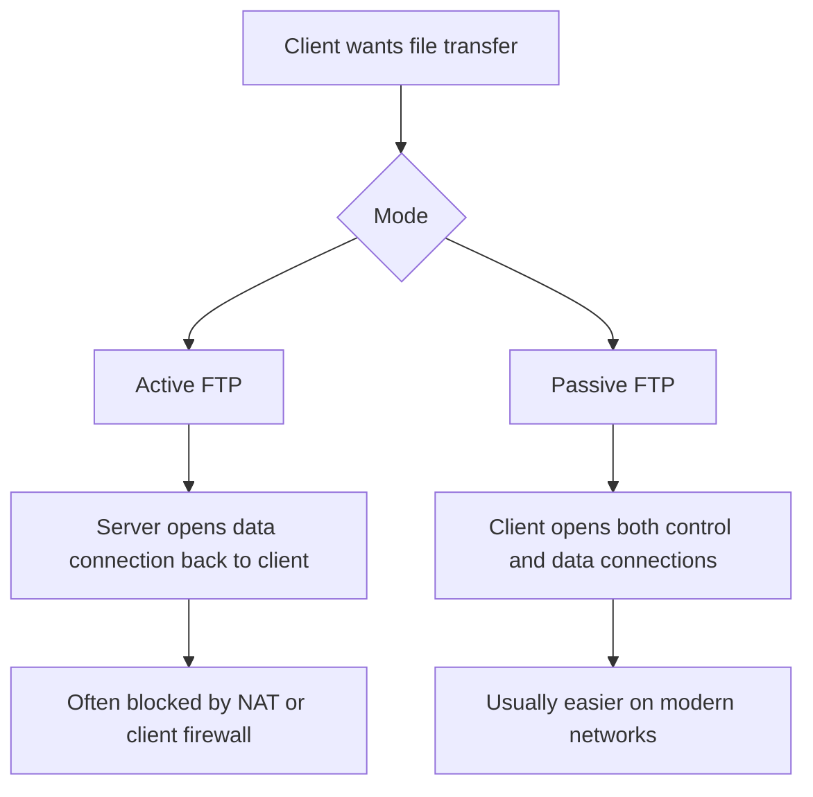
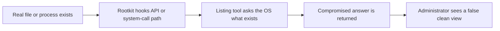

# Chapter 12: File Transfer, File Sharing, Hardening, and Rootkits

This final chapter works as a capstone because it ties service configuration, attack-surface reduction, and stealthy compromise together. Students finish by moving from “how to make services work” to “how to make them work safely, and how to think when the system itself may be lying to you.”

It also deliberately continues the trust story from earlier chapters. Chapter 8 asked how much you should trust a remote administrative path. Chapter 11 asked how much you should trust the identity presented by a service. This chapter asks what happens after you expose file-sharing services to the network and why hardening has to continue after the service first appears to work.



## What You Should Be Able To Explain

By the end of this chapter, you should be able to explain:

- how FTP and Samba solve different file-sharing problems,
- why active and passive FTP behave differently through firewalls,
- how FTPS, confinement, and account controls reduce FTP risk,
- how Samba share definitions interact with Linux permissions and Samba-specific credentials,
- what hardening actually means operationally,
- and what rootkits hide, how they hide it, and why memory analysis matters.

## File Sharing Increases Attack Surface

Any network file-sharing service expands what an attacker or careless user can interact with.

That means a sensible deployment must answer:

- who can connect,
- how they authenticate,
- what directories they can access,
- whether traffic is encrypted,
- what firewall rules are required,
- and how misuse is limited.

| Service family | Main use | Main security question |
| --- | --- | --- |
| FTP / FTPS | Transfer files between client and server | Is transport protected and is access confined correctly? |
| Samba / SMB | Present shared folders to network clients | Does the share definition match Linux permissions and intended audience? |

## `vsftpd`: A Concrete FTP Service Example

`vsftpd` is a useful teaching daemon because it makes the security tradeoffs visible.

The initial administrative steps are very ordinary:

```bash
sudo apt-get install vsftpd
sudo systemctl enable vsftpd
sudo cp /etc/vsftpd.conf /etc/vsftpd.conf.original
```

Even this early, a good habit is reinforced: back up the service configuration before experimenting.

One of the first changes is enabling uploads:

```ini
write_enable=YES
```

and then restarting the service:

```bash
sudo systemctl restart vsftpd
```

This is not the end state. It is the setup for a security lesson.

## FTP Basics and Why Plain FTP Needs Help

**FTP** is a classic file-transfer protocol. It supports:

- authenticating to a server,
- listing directories,
- uploading files,
- and downloading files.

Historically important does not mean safe by default.

Without encryption, plain FTP exposes too much:

- usernames,
- passwords,
- and transferred data.

So the chapter does not stop at “make FTP work.” It moves directly into:

- active vs passive behavior,
- confinement,
- and TLS.

## Active vs Passive FTP

This is one of the most practical networking lessons in the file-transfer sequence.

### Active FTP

In active mode, the client opens the control connection, but the server opens the data connection back toward the client.

That means active mode often collides with:

- client firewalls,
- NAT,
- and networks that only expect client-initiated flows.

### Passive FTP

In passive mode, the client initiates both the control and data connections.

That usually fits modern networks better, but it also means:

- the server needs a defined passive port strategy,
- and firewall rules must permit that range intentionally.

The point is simple:

> FTP problems are often networking-design problems, not “the daemon is broken” problems.

## The First Big FTP Security Mistake: Over-Broad Access

This `vsftpd` example lets you see that a regular FTP user can initially:

- browse too much,
- write too broadly,
- and traverse places they should not be able to touch in a tightly controlled file-transfer setup.

That is how the chapter should introduce confinement. It is not “because jails are neat.” It is because the default result can be broader than intended.

## Chroot Jails and the Writable-Root Problem

The next step is to confine users with:

```ini
chroot_local_user=YES
```

That immediately leads to one of the most memorable `vsftpd` errors in the whole course:

the user reconnects and receives a complaint about a **writable root inside chroot**.

This is useful because it shows that a security feature can fail safely if the surrounding permissions are still too loose.

In this scenario, the problem is the user's writable home directory. There are two broad ways to address it:

- remove write permission from the jailed top-level directory,
- or, if the design truly requires it, explicitly permit writable chroot behavior with:

```ini
allow_writeable_chroot=YES
```

The lesson is not “always turn that on.” The lesson is:

- understand why the daemon is warning you,
- decide whether the directory should be writable,
- and only loosen the service if that design choice is intentional.

That is real administration.

## Selective Jail Exceptions

The configuration can also demonstrate selective behavior through:

```ini
chroot_list_enable=YES
chroot_list_file=/etc/vsftpd.chroot_list
```

That allows the administrator to treat different accounts differently.

This is useful because security policy is rarely “every user gets the exact same behavior.” Some accounts need tighter confinement than others.

The technical lesson is simple:

- one service can enforce more than one confinement pattern,
- but the administrator must understand which users are inside the jail and which are exceptions.

## FTPS: Add TLS, But Do Not Pretend That Solves Everything

The next step is to secure the service with TLS.

The concrete self-signed key and certificate generation step is:

```bash
openssl req -x509 -nodes \
  -keyout /etc/ssl/private/vsftpd.key \
  -out /etc/ssl/private/vsftpd.pem \
  -days 365 \
  -newkey rsa:4096
```

Then `vsftpd.conf` is updated to reference the certificate and key and to enable SSL/TLS behavior.

The configuration can also forbid non-encrypted logins afterward. That matters because it turns TLS from an optional nice-to-have into an actual policy.

Testing with FileZilla configured for **explicit FTP over TLS** exposes the certificate dialogue directly instead of hiding all of the trust behavior behind a browser.

The point remains:

- encryption improves the transport,
- but you still have to think about passive ports,
- firewall behavior,
- certificate trust,
- and client configuration.

## Samba Solves a Different Problem

Where FTP is mainly about transferring files, **Samba** is about presenting shared folders to SMB/CIFS clients, especially Windows-style clients.

That means Samba is usually about:

- browsable shares,
- mapped network drives,
- authenticated access to shared folders,
- and ongoing directory use rather than one-off transfers.

FTP and Samba belong in the same chapter, but they should not be mentally treated as the same service with different syntax.

## Linux Permissions and Samba Permissions Must Agree

The Samba workflow begins by creating a share path and aligning Linux ownership first.

The exact path is not important. The structural lesson is:

1. create the directory that should be shared,
2. assign the right ownership and group,
3. set the intended Unix permissions,
4. then define the Samba share to match.

For example, the workflow uses commands such as:

```bash
chmod 770 /srv/samba/share
chgrp projectgroup /srv/samba/share
```

The meaning is critical:

- `770` says owner and group may read, write, and traverse,
- others get nothing.

If the underlying directory permissions are wrong, Samba does not magically make the design secure.

## Samba Share Definitions: Paths, Audience, and Masks

The Samba section then moves into `smb.conf` and defines both read-write and read-only shares.

The parameters that matter are not exotic; they are the ones administrators actually reason about:

```ini
[PROJECT-RW]
path = /srv/samba/share
read only = no
browsable = yes
valid users = @projectgroup
create mask = 0770
directory mask = 0770

[PROJECT-RO]
path = /srv/samba/share
read only = yes
browsable = yes
valid users = @projectgroup
create mask = 0770
directory mask = 0770
```

Three details are worth keeping:

- `valid users = @group` means the share is group-scoped,
- `create mask` controls default permissions on newly created files,
- `directory mask` controls default permissions on newly created directories.

These settings matter because administrators often focus on the share name and forget to think about how new content will inherit permissions afterward.

## Why `smbpasswd` Matters

A useful Samba lesson is that share access can still fail even after:

- the directory exists,
- Linux permissions look correct,
- and the share is defined in `smb.conf`.

Why? Because Samba keeps its own authentication data.

So the workflow uses:

```bash
smbpasswd -a username
```

This matters because Linux account existence and Samba access are related but not identical. A user can exist on the Linux host and still be unable to authenticate to Samba until a Samba password is set.

That is a durable real-world lesson.

## Hardening Services Means Removing Convenience You Did Not Mean to Offer

The hardening part of the chapter works best when it stays operational rather than abstract.

Important attack-surface questions include:

- which services are running,
- which ports are listening,
- which accounts are allowed in,
- which directories are writable,
- and whether the current access is actually justified by the system’s role.

This is the bridge between service configuration and the security material:

- a service that “works” may still be too broad,
- a writable path may still be too permissive,
- and a network share may still be exposed farther than intended.

## Subjects, Objects, Permissions, Rights, and Privileges

The hardening section preserves a useful access-control model:

- **subjects** try to do things,
- **objects** are the resources being acted on,
- and the operating system decides whether the action is allowed.

The chapter also distinguishes:

- **permissions**, which are often object-specific,
- from broader **rights** or **privileges**, which belong to an identity or account.

That matters because:

- you can harden one file or share correctly,
- while still leaving an account with too much wider power.

## Patch, Remove, and Narrow the Role

Good hardening is not only about permissions. It is also about keeping software current and refusing to run more than the system needs.

Important habits include:

- patch software because vulnerabilities change,
- remove unnecessary components,
- disable unneeded services,
- and inspect what is actually running instead of defending an imagined system.

That is how hardening stays tied to operations rather than slogans.

## Rootkits Attack Visibility

While hardening reduces the attack surface, determined attackers may still find a way in. Once they do, the next goal is usually persistence and evasion. That is where rootkits enter the picture: they are built to subvert the operating system and hide malicious activity from ordinary administrative tools.

The capstone topic, rootkits, belongs here because it ties together privilege, system calls, stealth, and trust.

A **rootkit** is primarily a stealth mechanism. It hides malicious activity rather than replacing the malicious payload entirely.

The central lesson is:

**a rootkit changes what the system shows you.**

That means:

- files may exist but not appear in listings,
- processes may run but not appear in ordinary tools,
- and the operating system’s answers may no longer be trustworthy.

## User-Mode, Kernel-Mode, and Driver-Level Rootkits

The key distinction is between:

- **user-mode rootkits**, which interfere from ordinary application space,
- **kernel-mode rootkits**, which operate much closer to the operating-system core.

Kernel-mode rootkits are more serious because the kernel mediates:

- process management,
- filesystem operations,
- memory access,
- device access,
- and system-call handling.

One concrete delivery example is a fake “graphics patch” or FPS-improvement driver that actually installs a malicious driver-level component.

That example matters because low-level compromise often arrives disguised as convenience.

## Boot, Disk, and Firmware Persistence

Rootkits are not limited to ordinary running software.

They may also target:

- boot structures,
- MBR or bootloader-adjacent locations,
- disk-level persistence points,
- or firmware-related layers.

The earlier malicious code executes, the more control it may gain before ordinary tools and defenses are fully active.

| Persistence level | Why it matters |
| --- | --- |
| User mode | Easier to build, usually easier to detect or bypass |
| Kernel mode | Can alter core OS behavior and visibility |
| Boot / MBR | Loads early, before normal OS startup finishes |
| Firmware | Sits below ordinary file/process views and can be difficult to inspect |

## Hooking, API Interception, and Why Tools Can Lie

The main hiding mechanism preserved in the rootkit material is **hooking**:

- intercepting API calls,
- intercepting system-call paths,
- and altering the results before tools see them.

That means a normal utility may ask the system for a directory listing or process list and receive a sanitized answer instead of the truth.



A concrete Windows-flavored example uses:

- calls through `kernel32.dll`,
- especially file-enumeration paths such as `FindFirstFile`.

That example is valuable because it turns rootkit stealth into a simple mental model:

- the file may still exist,
- but the enumeration path has been hooked,
- so ordinary tools never show it.

## Detection, Inconsistencies, and Memory Analysis

This chapter does not offer a fake “10 easy steps to catch every rootkit.” The better lesson is that defenders should look for:

- inconsistencies between tools,
- symptoms that do not match the reported state,
- and evidence collected from a stronger trust position.

That is why **memory-dump analysis** matters. If the live operating system may be lying, then investigators want evidence gathered in a way that is harder for the rootkit to sanitize.

Memory analysis is valuable because it may expose:

- hidden processes,
- injected code,
- hooked functions,
- suspicious drivers,
- and artifacts invisible to normal user-facing tools.

In practice, defenders often capture a memory image and analyze it offline with frameworks such as **Volatility**. That offline view matters because it does not rely on the compromised operating system to describe itself honestly. If a rootkit is hiding a process, an injected DLL, or a suspicious network connection from normal tools, memory forensics can often reveal the real state of the machine.

## Worked Examples

### Example: the writable-root-inside-chroot failure is a security lesson

`vsftpd` refuses an unsafe jail configuration for a reason. That error teaches you to reason about confinement and write access instead of blindly toggling options.

### Example: `allow_writeable_chroot=YES` is a policy choice, not a magic fix

If the service needs a writable jailed top directory, the daemon can be told to allow it, but you should understand what risk you are accepting when you do so.

### Example: Linux and Samba credentials are related but not identical

A user can exist on the Linux host and still fail Samba login until `smbpasswd` has been used. That is one of the clearest identity-model lessons in the chapter.

### Example: read-write and read-only shares should feel different

A read-only share is not just a differently named share. The combination of `read only`, `valid users`, and mask settings should produce visibly different behavior for users.

### Example: rootkits hide by changing the answer, not by making the question disappear

The `kernel32.dll` / `FindFirstFile` example makes this idea practical. If the enumeration path is hooked, the operating system can return a false clean view.

### Example: a “graphics patch” can really be a kernel compromise

The malicious-driver example is effective because it explains how low-level persistence may arrive disguised as a helpful optimization.

## Practice Connections

- For the cleaned repo service lab, use [FTP and Samba](../../labs/lab_ftp_samba_md/README.md).
- For a practical Windows visibility tool related to hardening, use [Process Explorer](../../labs/070-lab-process-explorer/README.md).
- For the repo-facing chapter map, use [Repo Companion Material](repo-companion-material.md).

## Chapter Summary

- FTP and Samba solve different file-sharing problems and should be configured with different assumptions.
- Passive FTP is usually easier to support through modern firewalls than active FTP.
- `vsftpd` confinement teaches real lessons about chroot, writable directories, and policy choices.
- FTPS adds encryption but still requires network and certificate planning.
- Samba share definitions must align with underlying Linux ownership, mode bits, and Samba-specific authentication.
- Hardening is an ongoing process of reducing attack surface, patching, and narrowing system roles.
- Rootkits undermine trust by changing what the operating system reports.
- Memory analysis matters because a compromised live system may lie to ordinary tools.

## Review Questions

1. Why do FTP and Samba belong in the same chapter even though they solve different problems?
2. Why is passive FTP usually easier to support on modern networks than active FTP?
3. What does the writable-root-inside-chroot error teach about service confinement?
4. Why can a Samba share still deny access even when Linux permissions look correct?
5. How do `valid users`, `create mask`, and `directory mask` change Samba behavior?
6. Why is a rootkit best understood as an attack on visibility and trust rather than just “another malware file”?
7. Why is memory analysis more trustworthy than ordinary live tools when a rootkit is suspected?

## Further Reading

- [File Transfer Protocol](https://en.wikipedia.org/wiki/File_Transfer_Protocol)
- [Chroot](https://en.wikipedia.org/wiki/Chroot)
- [Server Message Block](https://en.wikipedia.org/wiki/Server_Message_Block)
- [Security hardening](https://en.wikipedia.org/wiki/Security_hardening)
- [Rootkit](https://en.wikipedia.org/wiki/Rootkit)
