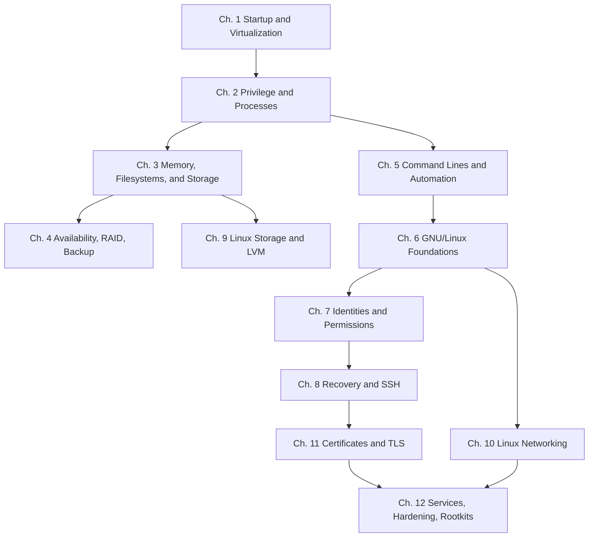

# Study Guide and Reading Paths

This guide is for students who want more than a table of contents. The book was built from a computing-foundations sequence and a later Linux administration and security sequence, so some chapters are true prerequisites for the ones that follow.

## If You Are New To The Whole Subject

Read the chapters in order.

That path was designed to move from:

1. what a computer is doing when it starts,
2. how the operating system separates users, processes, memory, and storage,
3. how command-line work becomes administration work,
4. how Linux systems are configured and recovered,
5. and finally how trust, services, and defensive practice fit together.

If you skip too far ahead, the later Linux material will still make sense mechanically, but you will miss why the system is designed that way.

## If You Already Know Basic Computer Hardware

Start here:

1. [Privilege, System Calls, Processes, and Interfaces](02-privilege-system-calls-and-processes.md)
2. [Memory, Filesystems, and Storage Layout](03-memory-filesystems-and-storage-layout.md)
3. [Command Lines, Batch Files, and Administrative Automation](05-command-lines-batch-files-and-administrative-automation.md)
4. [GNU/Linux Foundations, Editors, Packages, and Source-Based Administration](06-gnu-linux-foundations-editors-packages-and-source-based-administration.md)

Then continue in order through the Linux and trust chapters.

## If You Mainly Want Linux Administration

Use this path:

1. [GNU/Linux Foundations, Editors, Packages, and Source-Based Administration](06-gnu-linux-foundations-editors-packages-and-source-based-administration.md)
2. [Identities, Permissions, ACLs, and Local Security](07-identities-permissions-acls-and-local-security.md)
3. [Boot, Recovery, Terminals, and Secure Remote Access](08-boot-recovery-terminals-and-secure-remote-access.md)
4. [Linux Storage, LVM, and Filesystem Administration](09-linux-storage-lvm-and-filesystem-administration.md)
5. [Linux Networking and Distribution-Specific Administration](10-linux-networking-and-distribution-specific-administration.md)
6. [Certificates, TLS, and Service Trust](11-certificates-tls-and-service-trust.md)
7. [File Transfer, File Sharing, Hardening, and Rootkits](12-file-transfer-file-sharing-hardening-and-rootkits.md)

If you take this shortcut, still come back later for:

- [Privilege, System Calls, Processes, and Interfaces](02-privilege-system-calls-and-processes.md)
- [Memory, Filesystems, and Storage Layout](03-memory-filesystems-and-storage-layout.md)
- [Availability, RAID, Backup, and Recovery Planning](04-availability-raid-backup-and-recovery-planning.md)

Those chapters explain many of the design choices behind Linux administration work.

## If You Mainly Want Security And Services

Do not jump straight to TLS, SSH, or rootkits.

Read in this order:

1. [Identities, Permissions, ACLs, and Local Security](07-identities-permissions-acls-and-local-security.md)
2. [Boot, Recovery, Terminals, and Secure Remote Access](08-boot-recovery-terminals-and-secure-remote-access.md)
3. [Certificates, TLS, and Service Trust](11-certificates-tls-and-service-trust.md)
4. [File Transfer, File Sharing, Hardening, and Rootkits](12-file-transfer-file-sharing-hardening-and-rootkits.md)

This sequence keeps trust and hardening connected to system administration instead of turning them into isolated buzzwords.

## Dependency Map

## Best Chapters To Pair With Hands-On Work

- Chapter 1 with [Linux Install](repo-companion-material.md#chapter-1-systems-startup-and-virtualization)
- Chapter 2 with [Process Explorer](repo-companion-material.md#chapter-2-privilege-system-calls-and-processes)
- Chapter 4 with [Storage Redundancy, iSCSI for Windows Server, and Linux Storage](repo-companion-material.md#chapter-4-availability-raid-backup-and-recovery-planning)
- Chapter 5 with [Windows Batch Files](repo-companion-material.md#chapter-5-command-lines-batch-files-and-administrative-automation)
- Chapter 6 with [Modifying Source Code](repo-companion-material.md#chapter-6-gnulinux-foundations-editors-packages-and-source-based-administration)
- Chapter 7 with [Linux Users, Groups, and Mode](repo-companion-material.md#chapter-7-identities-permissions-acls-and-local-security)
- Chapter 8 with [SSH Keys and X11 Forwarding](repo-companion-material.md#chapter-8-boot-recovery-terminals-and-secure-remote-access)
- Chapter 9 with [LVM Setup](repo-companion-material.md#chapter-9-linux-storage-lvm-and-filesystem-administration)
- Chapter 11 with [Certificates](repo-companion-material.md#chapter-11-certificates-tls-and-service-trust)
- Chapter 12 with [FTP and Samba](repo-companion-material.md#chapter-12-file-transfer-file-sharing-hardening-and-rootkits)

## Chapters Students Commonly Underestimate

### Chapter 2

Students often want to rush to tools and commands. That usually backfires. Privilege levels, system calls, and processes explain why the operating system can enforce policy in the first place.

### Chapter 4

Students often think RAID is a backup chapter. It is not. This chapter matters because availability and recoverability are different design goals.

### Chapter 7

Permissions look basic until they fail in production. This chapter is where many administration mistakes become understandable.

### Chapter 11

Certificates confuse students when they are taught as memorized TLS vocabulary. This chapter works better if you read it as a trust workflow chapter instead of a crypto buzzword chapter.

## A Good Revision Strategy

For each chapter:

1. Read the chapter once straight through.
2. Re-read the `What You Should Be Able To Explain` section.
3. Answer the `Review Questions` without looking back immediately.
4. Use the hands-on companion material if the topic is operational.
5. Use the [Glossary](glossary.md) when terms start to blur together.

## Before Exams Or Practical Work

Focus on explaining, not just naming:

- why user mode and kernel mode are separated,
- why file permissions alone do not cover all access-control needs,
- why RAID is not backup,
- why Linux storage has layers,
- why runtime networking changes differ from persistent configuration,
- why certificates depend on trust chains and hostname validation,
- and why hardening is an ongoing operational habit instead of a one-time setup step.
