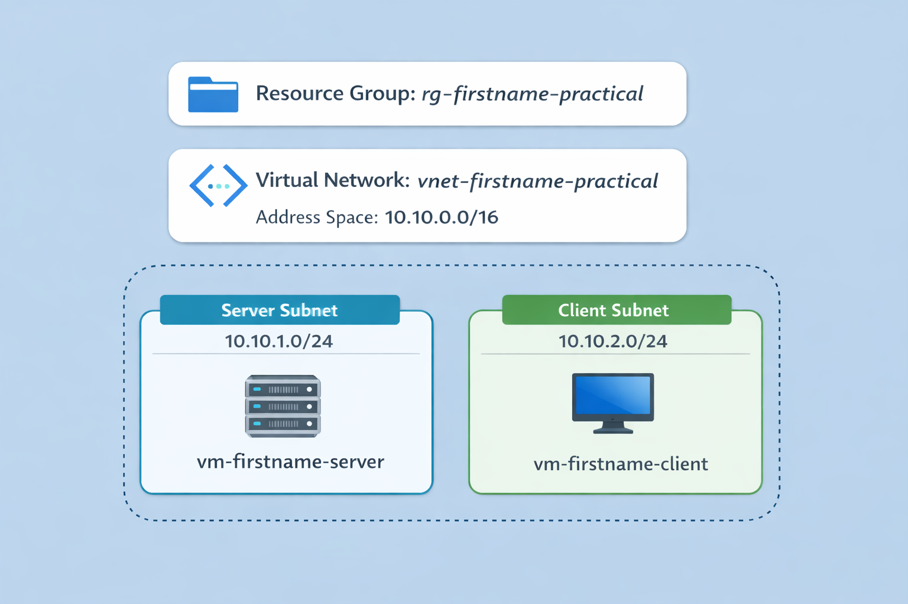
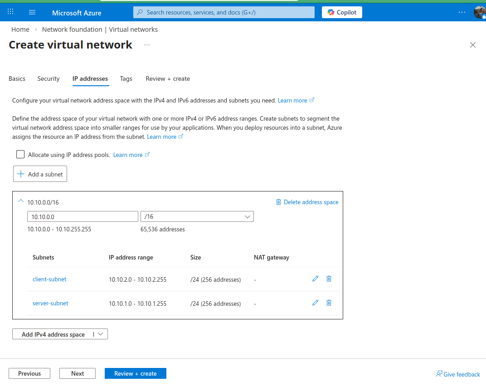

# Build Azure Resources

Complete [01 Before You Begin](01_before-you-begin.md) before starting this page.

## Step 1. Create the Azure resources



Create the resource group:

- `rg-firstname-practical`

> [!IMPORTANT]
> Use the same region for the resource group, VNet, and both VMs.
> If the regions do not match, you can create extra confusion for yourself later.

Validate:

- the resource group exists
- the region is the one you intend to use for the full challenge

If you build the virtual network through the Azure portal, use the `Create virtual network` wizard and be explicit about the subnet settings instead of accepting the defaults.

## Step 1a. Create the network

On the `Create virtual network` page:

- select the resource group you just created for this challenge
- set `Virtual network name` to `vnet-firstname-practical`
- use the same region you plan to use for the virtual machines

On the `IP addresses` tab:

1. Change the virtual network address space to `10.10.0.0/16`.
2. Edit the existing `default` subnet and change it to:
   - `Name`: `server-subnet`
   - `Starting address`: `10.10.1.0`
   - `Size`: `/24`
3. Leave `Subnet purpose` as `Default`.
4. Leave `Enable private subnet` unchecked.
5. Click `Add a subnet` and create:
   - `Name`: `client-subnet`
   - `Starting address`: `10.10.2.0`
   - `Size`: `/24`
6. Again, leave `Subnet purpose` as `Default` and leave `Enable private subnet` unchecked.

After saving, the subnet list should show:

- `server-subnet` with `10.10.1.0/24`
- `client-subnet` with `10.10.2.0/24`



Then click `Review + create`.

Validate:

- the VNet address space is `10.10.0.0/16`
- both subnets exist
- the server and client subnets use different `/24` ranges
- no subnet is still named `default`

## Step 1b. Create the virtual machines

Create two Ubuntu VMs in the VNet you just built:

- **Server VM:** `vm-firstname-server`
- **Client VM:** `vm-firstname-client`

For this step, the goal is simple: create both VMs, make sure you can SSH into them, and then move on to configuring the server. The final `server-subnet` NSG comes later.

> [!IMPORTANT]
> Build first, lock down later.
> Both VMs get temporary NIC-level SSH access now so you can configure the server.
> You will replace this with the final subnet NSG in Step 4.

### Use these settings for both VMs

| Setting | Value |
| --- | --- |
| Subscription | `Azure for Students` |
| Resource group | `rg-firstname-practical` |
| Region | same region as the VNet |
| Availability options | `No infrastructure redundancy required` |
| Security type | `Standard` |
| Image | `Ubuntu Server LTS` |
| VM architecture | `x64` |
| Size | a small supported size such as `Standard_B1s`, if available |
| Authentication type | `Password` |
| Username | your first name in lowercase, for example `steve` |
| Password | a strong password that you record safely |
| Hibernation | disabled |

Use the same username on both VMs.

### Temporary SSH settings for both VMs

On the `Basics` tab:

- `Public inbound ports`: `Allow selected ports`
- `Select inbound ports`: `SSH (22)`

On the `Networking` tab:

- `NIC network security group`: `Basic`
- `Public inbound ports`: `Allow selected ports`
- `Select inbound ports`: `SSH (22)`


The screenshot above shows the **server VM** example, so `server-subnet` is the correct subnet in that image.

This is temporary build access. It is not the final access policy for the challenge.

### Build the server VM first, then the client VM

Use these VM-specific values:

| Setting | Server VM | Client VM |
| --- | --- | --- |
| `Virtual machine name` | `vm-firstname-server` | `vm-firstname-client` |
| `Virtual network` | `vnet-firstname-practical` | `vnet-firstname-practical` |
| `Subnet` | `server-subnet` | `client-subnet` |
| `Public IP` | yes | yes |

Select `server-subnet` for the server VM and `client-subnet` for the client VM.

### Validate the VM networking from Azure Cloud Shell

Instead of taking separate portal screenshots during VM creation, use **Azure Cloud Shell** to validate what was actually deployed.

Open **Cloud Shell** from the Azure portal.

If Cloud Shell opens in **PowerShell**, that is fine. The commands below work there as written.

If you see a warning that more than one subscription is active, fix that first.

Run:

```powershell
az account list -o table
az account show -o table
az account set --subscription "Azure for Students"
az account show -o table
```

Validate:

- `Azure for Students` is now the default subscription
- you are no longer pointed at the wrong subscription by mistake

Next, confirm that both VMs exist in the correct resource group:

```powershell
az vm list -g rg-firstname-practical -o table
```

Example output:

```text
Name             ResourceGroup       Location
---------------  ------------------  -------------
vm-steve-client  rg-steve-practical  canadacentral
vm-steve-server  rg-steve-practical  canadacentral
```

Validate:

- both VMs appear in the table
- both are in `rg-firstname-practical`
- both are in the expected region

Now collect the networking details.

Run:

```powershell
az vm list-ip-addresses -g rg-firstname-practical -o table
az network nic list -g rg-firstname-practical --query "[].{NIC:name,PrivateIP:ipConfigurations[0].privateIPAddress,Subnet:ipConfigurations[0].subnet.id,NSG:networkSecurityGroup.id}" -o table
```

Example output for `az vm list-ip-addresses`:

```text
VirtualMachine    PublicIPAddresses    PrivateIPAddresses
----------------  -------------------  ------------------
vm-steve-client   20.151.15.224        10.10.2.4
vm-steve-server   20.220.14.156        10.10.1.4
```

Example output for `az network nic list ... -o table`:

```text
NIC                 PrivateIP    Subnet                                                                                                                                                                        NSG
------------------  -----------  ----------------------------------------------------------------------------------------------------------------------------------------------------------------------------  -----------------------------------------------------------------------------------------------------------------------------------------------------------
vm-steve-client702  10.10.2.4    /subscriptions/30cb7717-128d-4d34-b5da-c6da22d6e609/resourceGroups/rg-steve-practical/providers/Microsoft.Network/virtualNetworks/vnet-steve-practical/subnets/client-subnet  /subscriptions/30cb7717-128d-4d34-b5da-c6da22d6e609/resourceGroups/rg-steve-practical/providers/Microsoft.Network/networkSecurityGroups/vm-steve-client-nsg
vm-steve-server651  10.10.1.4    /subscriptions/30cb7717-128d-4d34-b5da-c6da22d6e609/resourceGroups/rg-steve-practical/providers/Microsoft.Network/virtualNetworks/vnet-steve-practical/subnets/server-subnet  /subscriptions/30cb7717-128d-4d34-b5da-c6da22d6e609/resourceGroups/rg-steve-practical/providers/Microsoft.Network/networkSecurityGroups/vm-steve-server-nsg
```

Validate:

- `vm-firstname-server` has a private IP in the `10.10.1.x` range
- `vm-firstname-client` has a private IP in the `10.10.2.x` range
- both VMs have public IPs during the build stage
- one NIC is on `server-subnet`
- one NIC is on `client-subnet`
- both NICs currently show a VM-side NSG path because temporary SSH access is still in place

### How to read the output

- the `Subnet` and `NSG` columns show full Azure resource IDs
- only the end of each value matters
- look for `/subnets/server-subnet` on the server NIC and `/subnets/client-subnet` on the client NIC
- at this stage, both NICs should still show temporary VM-side NSGs such as `vm-firstname-server-nsg` and `vm-firstname-client-nsg`

If the table is too wide to read in Cloud Shell, rerun the command with `-o json` or widen the output in PowerShell with `| Out-String -Width 300`.

Checkpoint:

- you should now have one resource group, one VNet, two subnets, one server VM, and one client VM

## **Screenshot 1: Resource Group Overview**

**Requirement:** Show the Azure **Resource group Overview** page with the resource group name visible and the main resources created visible in the resource list, including both VMs, the VNet, and the server NSG.

This screenshot replaces the old separate VM overview screenshots.

What happens next:

- configure the server while direct SSH still works
- after the server is configured, create and attach the `server-subnet` NSG
- remove the server VM's temporary VM-side SSH NSG/rule
- do not add HTTP on the NIC as part of the final design

---

[Prev](01_before-you-begin.md) | [Home](README.md) | [Next](03_configure-server-services.md)
