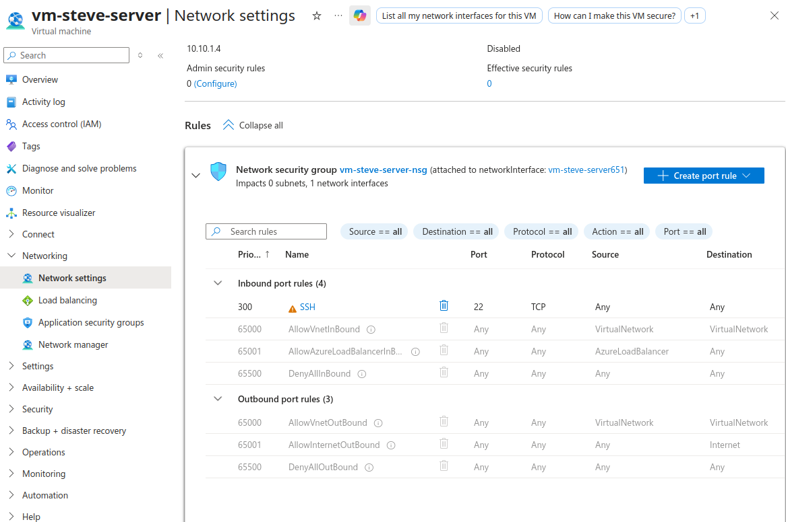
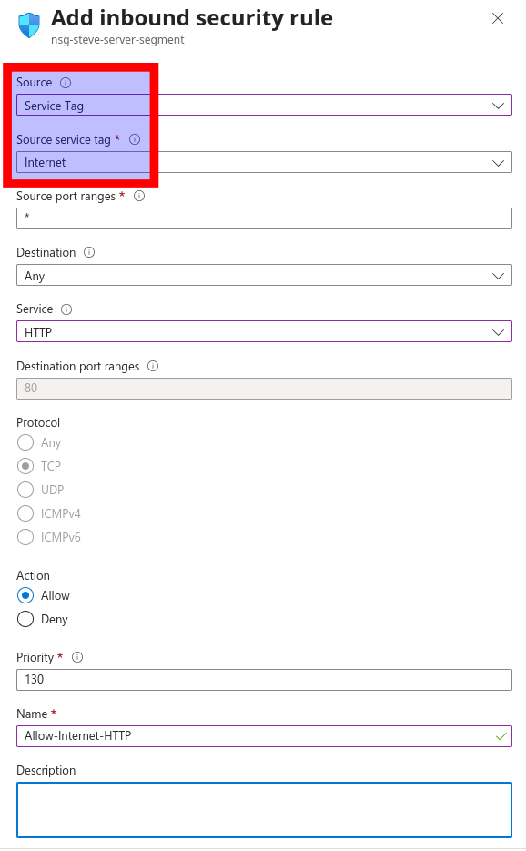
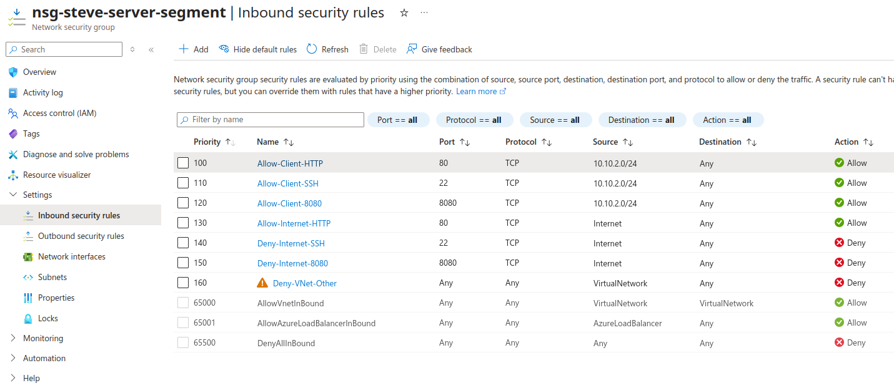
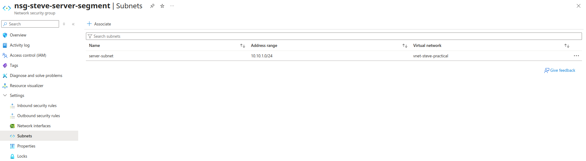
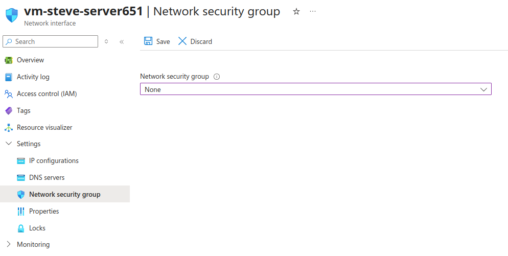
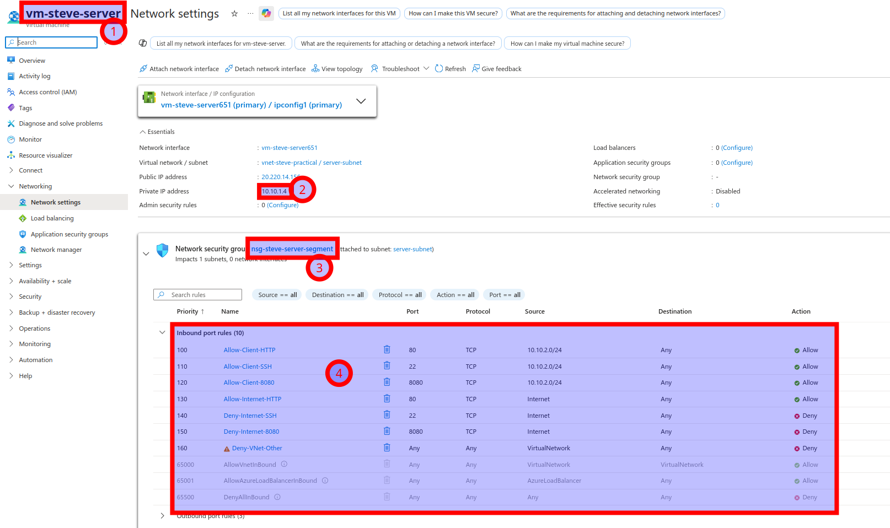

# Configure Server Subnet NSG

Complete [02 Build Azure Resources](02_build-azure-resources.md) and [03 Configure Server Services](03_configure-server-services.md) before starting this page.

By the end of this page, the server should still serve the public website on port `80`, but public SSH should fail.

## Step 4. Create and attach the server subnet NSG

Now that the server is fully configured, apply the final access policy in three sub-steps.

## Step 4a. Inspect the temporary server VM NSG

Before building the new NSG, take a quick look at what Azure created automatically during VM setup.

1. Open the **server VM** in the Azure portal.
2. Go to **Network settings**. You may see this labeled **Networking** in some portal views.
3. Open the NIC-level NSG. It will usually have a name like `vm-firstname-server-nsg`.
4. Review its inbound rules.

Notice:

- the **server VM name** is visible at the top, so you know you are looking at the correct VM
- the server **private IP** is visible, showing that this VM is in the `server-subnet` address range
- the **temporary inbound rule list** is visible, showing the one explicit SSH allow rule plus Azure's default NSG rules
- the temporary NIC-level **NSG name** is visible, showing that Azure attached a VM-side NSG during the initial build phase

This is a **before** view only. It shows the temporary VM-side NSG that Azure created to let you build and configure the server.

Your new NSG will attach to **`server-subnet`** and enforce the full access matrix.

## Step 4b. Create the new server-subnet NSG and add inbound rules

### Create the NSG

1. Search for **Network security groups** and click **Create**.
2. Set **Resource group** to `rg-firstname-practical`.
3. Set **Name** to `nsg-firstname-server-segment`.
4. Set **Region** to the same region as your VNet and VMs.
5. Click **Review + create**, then **Create**.

After the NSG is created, open it and go to **Inbound security rules**.

### NIC-level vs. subnet-level NSG

The temporary NSG is attached to one **NIC**. Your new NSG attaches to **`server-subnet`**, so the final policy is enforced in one place for traffic entering that subnet.

> [!IMPORTANT]
> Attaching the NSG to the subnet does **not** move the public IP.
> The public IP stays on the VM's NIC.
> For this lab, keep the **server VM public IP** so the public website on port `80` still works.
> Also keep the **client VM public IP** during the lab so you can still reach the client VM from outside Azure.

### How NSG priorities work

Lower priority number = evaluated first. Azure stops at the first matching rule.

- `100` is checked before `110`
- `110` is checked before `130`
- your custom rules are checked before Azure's default rules such as `65000`

That is why the rule numbers matter:

- `100` to `120` allow the client subnet first
- `130` allows public web traffic on port `80`
- `140` to `160` deny traffic you do not want

> [!IMPORTANT]
> Azure has a default inbound rule called `AllowVNetInBound` at priority `65000`.
> That is why the final rule list includes `Deny-VNet-Other` at a higher priority.
> Without it, your setup may appear to work for the wrong reason.

Use these same defaults unless the table says otherwise:

- **Source port ranges:** `*`
- **Destination:** `Any`
- **Service:** `Custom`
- **Description:** leave blank unless you want to add your own note

| Priority | Name                  | Source           | Protocol | Dest. port | Action  |
| -------: | --------------------- | ---------------- | -------- | ---------: | ------- |
|      100 | `Allow-Client-HTTP`   | `10.10.2.0/24`   | `TCP`    |         80 | `Allow` |
|      110 | `Allow-Client-SSH`    | `10.10.2.0/24`   | `TCP`    |         22 | `Allow` |
|      120 | `Allow-Client-8080`   | `10.10.2.0/24`   | `TCP`    |       8080 | `Allow` |
|      130 | `Allow-Internet-HTTP` | `Internet`       | `TCP`    |         80 | `Allow` |
|      140 | `Deny-Internet-SSH`   | `Internet`       | `TCP`    |         22 | `Deny`  |
|      150 | `Deny-Internet-8080`  | `Internet`       | `TCP`    |       8080 | `Deny`  |
|      160 | `Deny-VNet-Other`     | `VirtualNetwork` | `Any`    |          * | `Deny`  |

**Source type key**

- If **Source** is `10.10.2.0/24`, set **Source type** to `IP Addresses`.
- If **Source** is `Internet` or `VirtualNetwork`, set **Source type** to `Service Tag`.
- That means rule `160` uses **Source type** = `Service Tag` with **Source** = `VirtualNetwork`.

Reference example for the internet rules:

> [!IMPORTANT]
> Do **not** change `Internet` to `Any`.
> `Internet` is a specific Azure service tag.
> `Any` is broader and would match more traffic than intended.
>
> The same idea applies to `VirtualNetwork` in rule `160`.
> `VirtualNetwork` is also an Azure service tag, not `Any`.

Leave **Destination** set to `Any` for every rule. Because this NSG is attached to `server-subnet`, it already applies only to traffic headed toward that subnet.

Why the explicit internet deny rules are still useful:

- Azure already has a default catch-all inbound deny later in the rule list
- but using explicit denies for port `22` and `8080` makes the policy easier to understand, easier to test, and easier to grade

Reference example of what the finished inbound rule list should look like:

> [!NOTE]
> If you see a warning icon on rule `160`, that is expected.
> Azure is warning you because this rule overrides Azure's built-in `AllowVNetInBound` rule at priority `65000`.
> In this lab, that is exactly what you want.
> Rule `160` makes sure other VMs in the virtual network are **not** allowed unless you explicitly permitted them earlier in the list.
>
> That does **not** block your client VM, because the client subnet was already allowed earlier by the explicit `Allow-Client-*` rules.
> Rule `160` is there to block other VNet traffic that you did not explicitly allow.

## Step 4c. Attach the new NSG and remove the temporary one

### Attach the new NSG to `server-subnet`

1. Open `nsg-firstname-server-segment`.
2. Go to **Subnets** and click **Associate**.
3. Select `vnet-firstname-practical`.
4. Select `server-subnet`.
5. Click **OK** or **Save**.

Reference example of the NSG after it is associated with `server-subnet`:

### Remove the temporary NIC-level NSG from the server VM

> [!IMPORTANT]
> The final server policy should be enforced by the `server-subnet` NSG, not by a second NSG on the VM.

Use this order:

1. create the new `server-subnet` NSG
2. add the inbound rules to the new NSG
3. attach the new NSG to `server-subnet`
4. remove the temporary NIC-level NSG from the **server VM**
5. optionally delete the old NIC-level NSG object after it is no longer attached

Why this order matters:

- if you remove the old server NIC-level NSG **before** the new subnet NSG is attached, the server VM can be left exposed through its public IP with no filtering in place
- attaching the new subnet NSG first avoids that gap
- after the subnet NSG is attached, it is safe to remove the old NIC-level NSG from the server VM

Do this:

1. Open the **server VM**.
2. Go to **Network settings**.
3. Click the **network interface** link for the server VM.
4. On the NIC page, in the left menu, select **Network security group**.
5. Change the selected NSG to **None**.
6. Click **Save**.

Reference example of the server NIC after the temporary NSG has been dissociated:

At this point, the temporary NIC-level NSG is no longer attached to the server VM.

If you also want to delete the old NSG object after it has been dissociated:

1. Search for **Network security groups**.
2. Open the old NSG, usually named something like `vm-firstname-server-nsg`.
3. Click **Delete**.

At this stage:

- the **server VM** should no longer rely on a NIC-level NSG
- the **client VM** may still keep its temporary VM-side NSG if you still need direct SSH access from your own machine during testing

Validate:

- the NSG is attached to `server-subnet`
- the rules appear in the intended order
- the server VM no longer has its temporary VM-side NSG attached
- the server-subnet NSG is now the one doing the filtering

Checkpoint:

- at this point, the server should still serve the webpage on port `80`, but public SSH should now fail

## **Screenshot 4: Server NSG Inbound Rules**

**Requirement:** Show the **Inbound security rules** page with the full custom rule list from `100` through `160` visible. The screenshot must clearly show the internet allow and deny rules and the client-subnet allow rules, with the client CIDR visible in the **Source** column.

## **Screenshot 5: Server VM Final Network Settings**

**Requirement:** Show the server VM **Network settings** page after refresh.

The screenshot must show all four of these:

1. the **server VM name**
2. the server **IP information**
3. the new subnet-level **NSG name**
4. the full final **inbound rule list**

Reference example of the required result:

---

[Prev](03_configure-server-services.md) | [Home](README.md) | [Next](05_validate-and-prove.md)
