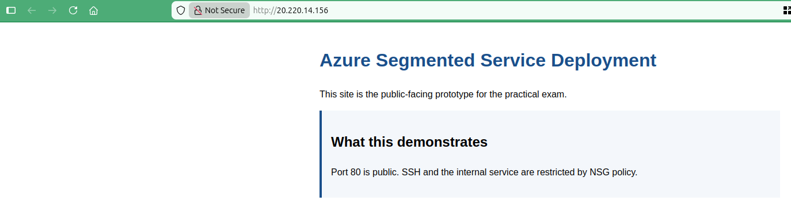
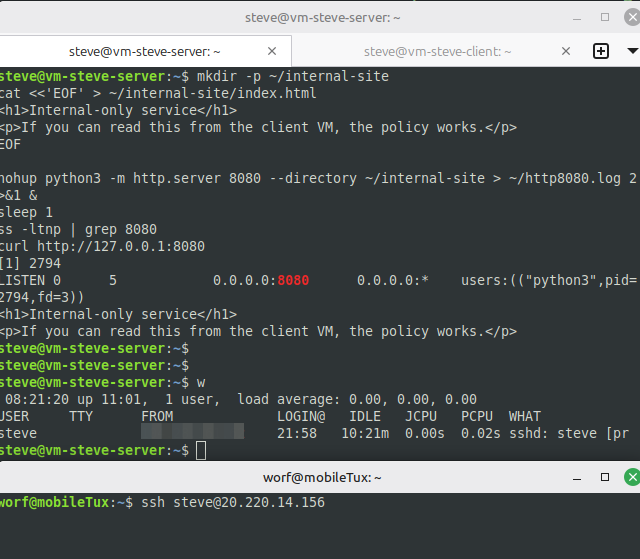
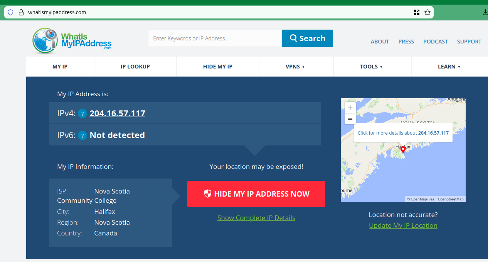
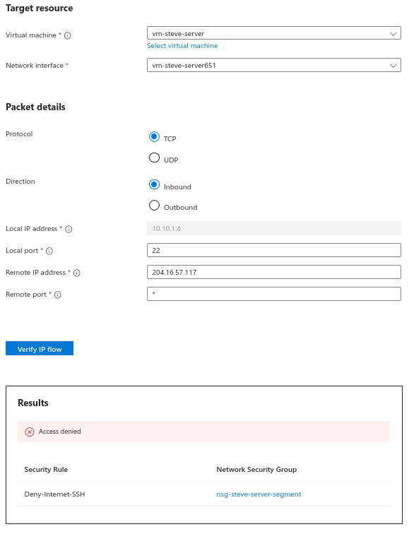
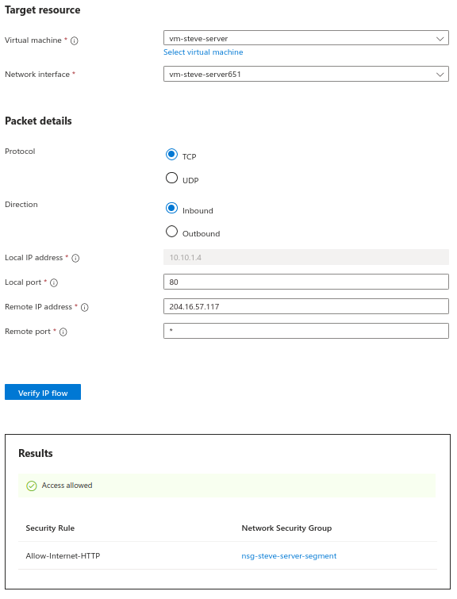
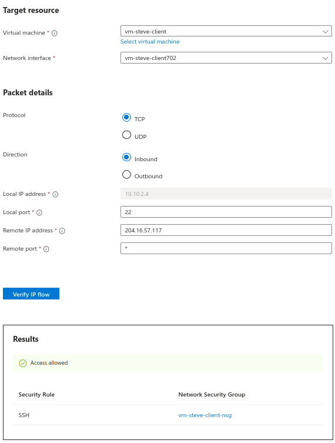
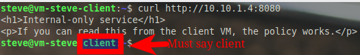

# Validate and Prove

Complete [04 Configure Server Subnet NSG](04_configure-server-subnet-nsg.md) before starting this page.

You will need the server public IP, server private IP, client public IP, and access to the client VM for these checks.

## Step 5. Test public web access

From your own machine, outside Azure, such as the college WAN:

Open:

```text
http://SERVER_PUBLIC_IP
```

Validate:

- the page loads from the public IP
- it is your page, not the default Nginx page

Reference example of the expected result:



## **Screenshot 6: Public Browser Access to Port 80**

**Requirement:** Show the server **public IP** in the browser address bar and the public webpage loaded successfully. This must be your custom page, not the default Nginx welcome page.

## Step 6. Test that public SSH is blocked

From your own machine, outside Azure:

> [!IMPORTANT]
> Azure NSGs affect **new** connections.
> If you already had an SSH session open to the server before you applied the final NSG, that existing session may stay connected.
> That is expected.
> Use a **new** terminal window or a second SSH attempt to prove that new public SSH connections are now blocked.

```bash
ssh -o ConnectTimeout=5 youruser@SERVER_PUBLIC_IP
```

Or:

```bash
nc -vz -w 5 SERVER_PUBLIC_IP 22
```

Validate:

- the connection attempt fails from a non-client source

Reference example of the idea:



## **Screenshot 7: Failed Public SSH Attempt**

**Requirement:** Show a **new** failed SSH attempt from outside Azure, with the server **public IP** visible in the command and a failure message such as `Connection timed out` or `Connection refused` visible.

## Step 7. Verify the deny rule in Azure

Use Network Watcher to prove that Azure agrees with your result.

For this course, use **IP Flow Verify** as the default path. It is usually the clearest tool for networking learners because it tells you whether the flow is allowed or denied and shows the matching rule.

Azure portal path:

1. Search for **Network Watcher**.
2. Open **Network Watcher**.
3. In the left menu, under **Network diagnostic tools**, select **IP flow verify**.

Before you run IP Flow Verify, find your current **public IP address** from the machine you are using outside Azure. You can use a site such as `whatismyipaddress.com` or another similar service.

Reference example of finding the external source IP you will test from:



Use these inputs:

- VM: server VM
- direction: inbound
- protocol: TCP
- local port: 22
- remote IP: your external public IP from outside Azure
- local port means the destination port on the server VM, so enter `22`

Validate:

- result says `Denied`
- result names the matching deny rule

Reference example of the deny proof:



## **Screenshot 8: Azure Deny Proof for SSH**

**Requirement:** Show **IP Flow Verify** or **NSG diagnostics** proving that inbound TCP `22` to the **server VM** is `Denied`. The screenshot must show the public source IP, the deny result, and the matched rule name.

If IP Flow Verify is unavailable in your portal view, you may use **NSG diagnostics** instead with the same goal: prove that inbound TCP `22` from the internet is denied and capture the rule name.

Optional Azure-side comparison:

- if you run the same check again with local port `80`, Azure should report `Access allowed`
- that confirms the server-subnet NSG is allowing the public website while still blocking public SSH

Reference example of the allow result for port `80`:



## Step 8. Test SSH from the client VM to the server VM

From your local machine, SSH to the client VM. Then from the client VM, SSH to the server private IP.

Important:

- use the client **public IP** only for the first hop from your own machine into Azure
- use the server **private IP** for the second hop from the client VM to the server VM

Connection path:

```text
Your PC -> CLIENT_PUBLIC_IP -> SERVER_PRIVATE_IP
```

Why the first hop still works:

- you removed the temporary NIC-level NSG from the **server VM**
- you did **not** remove the temporary NIC-level NSG from the **client VM**
- the client VM still has its original NIC-level NSG, usually named something like `vm-firstname-client-nsg`
- that means Azure should still allow inbound SSH to the client VM from your own machine while the server remains locked down from the internet

Reference example of Azure showing the client VM still allows inbound SSH on port `22` through its temporary VM-side NSG:



```bash
ssh youruser@CLIENT_PUBLIC_IP
ssh youruser@SERVER_PRIVATE_IP
```

Validate:

- SSH works from the client VM to the server VM
- you used the server private IP, not the public IP

After you log in to the server from the client VM, run:

```bash
w
```

This gives you the **FROM** column needed for the required SSH proof screenshot.

Checkpoint:

- At this point, you should be able to administer the server from inside the VNet even though public SSH is blocked.

Reference example of the SSH proof:


For this required screenshot, make sure all four of these are visible:

1. the **client hostname** before the SSH command
2. the **server private IP** in the SSH command, showing you connected to the server subnet
3. the **server hostname** after the login succeeds
4. the output of the `w` command, with the **client private IP** visible in the `FROM` column, showing the connection came from the client subnet

## **Screenshot 9: Client-to-Server SSH on the Private IP**

**Requirement:** In one screenshot, show all four of these:

- the **client hostname** before the SSH command
- the **server private IP** in the SSH command
- the **server hostname** after the login succeeds
- the output of the `w` command, with the **client private IP** visible in the `FROM` column

## Step 9. Test the internal-only service from the client VM

From the client VM:

- use the server **private IP**, not the public IP

```bash
curl http://SERVER_PRIVATE_IP:8080
```

Optional:

```bash
nc -vz SERVER_PRIVATE_IP 8080
```

Validate:

- the internal-only page loads from the client VM

If the server VM was rebooted after Step 3, restart the Python `8080` service before testing this step.

Reference example of the internal-only service proof:



For this required screenshot, make sure these are visible:

1. the **client hostname**, so it is clear the test is being run from the client VM
2. the server **private IP** with port `8080` in the `curl` command
3. the returned internal-only page content

## **Screenshot 10: Client Curl to Port 8080**

**Requirement:** Show the **client hostname**, the same server **private IP** used in the SSH proof with port `8080` in the `curl` command, and the returned internal-only page content.

## Optional check: prove client-to-server HTTP is explicitly allowed

This check is optional. It is useful extra proof, but it is not required for the core screenshot list.

From the client VM:

```bash
curl http://SERVER_PRIVATE_IP
# or
curl http://SERVER_PRIVATE_IP:80
```

Validate:

- the public webpage loads successfully from the client VM using the server private IP
- this confirms your explicit `Allow-Client-HTTP` rule is working and not accidentally blocked

This is optional but recommended because it closes the loop on the client-subnet allow rules: the client can reach all three intended ports (`80`, `22`, `8080`), while the internet should only reach port `80`.

## Optional check: prove public access to port 8080 fails

This check is optional. It is useful extra proof, but it is not required for the core screenshot list.

From your own machine, outside Azure:

```bash
curl --max-time 5 http://SERVER_PUBLIC_IP:8080
```

Validate:

- it fails publicly

---

[Prev](04_configure-server-subnet-nsg.md) | [Home](README.md) | [Next](06_submission-and-cleanup.md)
