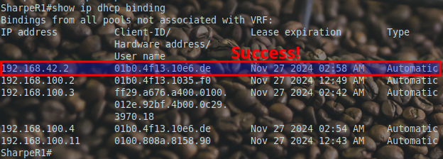
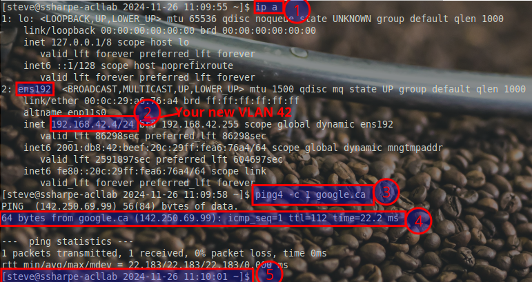

# ACL for matching

## Expanding NAT to Include VLAN 42

In the previous part of this lab, you configured an **extended ACL** to control access to the management network. Now, we’ll explore a different use case by creating a **standard ACL** to match "interesting traffic" for NAT.

In this section, you’ll configure **VLAN 42: AnswerToEverything** on the switch and router, associate it with a port, and update the NAT configuration to include VLAN 42. This ensures devices in VLAN 42 can access external resources via NAT while maintaining internal IPv6 connectivity.

### **1. Configure VLAN 42 on the Switch**

On **LastNameSW1**, you’ll name VLAN 42, assign IP addressing, and configure **GigabitEthernet 21** to use it.

**Step 1.1: Create and Name VLAN 42**

- Enter VLAN configuration mode and name the VLAN:
   ```bash
   vlan 42
   name AnswerToEverything
   ```

**Step 1.2: Assign IPv4 and IPv6 Addresses**

- Configure the Layer 3 interface for VLAN 42:
   ```bash
   interface vlan 42
   ip address 192.168.42.1 255.255.255.0
   ipv6 address fe80::42:beef link-local
   ipv6 address 2001:db8:42:beef::1/64
   ```


 **Step 1.3: Assign Port Gi21 to VLAN 42**

Configure **GigabitEthernet 21** as an access port and associate it with VLAN 42:
```bash
interface gigabitEthernet 21
switchport mode access
switchport access vlan 42
```

Verify the port is correctly assigned:


### **2. Configure VLAN 42 on the Router**

On **LastNameR1**, configure the subinterface for VLAN 42 with the appropriate addressing.

**Step 2.1: Configure Subinterface for VLAN 42**

- Create and configure the subinterface:
   ```bash
   interface fa0/0.42
   encapsulation dot1q 42
   ip address 192.168.42.254 255.255.255.0
   ipv6 address fe80::42:1 link-local
   ipv6 address 2001:db8:42:beef::254/64
   ```


### **3. Configure the DHCP Pool for VLAN 42**

On **LastNameR1**, set up a DHCP pool for VLAN 42:

For **VLAN 42: AnswerToEverything**, here’s how the DHCP scope would look, including exclusions for key devices:

### DHCP Scope:

- **Subnet:** `192.168.42.0/24`
- **Exclusions:**
  - Gateway (`192.168.42.1`)
  - Router (`192.168.42.254`)

**DHCP Pool Configuration:**

```bash
ip dhcp excluded-address 192.168.42.1
ip dhcp excluded-address 192.168.42.254
ip dhcp pool VLAN42_POOL
  network 192.168.42.0 255.255.255.0
  default-router 192.168.42.1
  dns-server 10.10.10.2
  domain-name answer.local
```

**Key Features:**
- The exclusions ensure the gateway and router IPs are safe.
- The `default-router` is set to the VLAN 42 gateway.
- `dns-server` is the 2811 stub resolver we've configured.

Bring a system online, plug into port 21, and check if it found the DHCP server:

**`show ip dhcp binding`**




### **4. Modify the NAT ACL**

Expand the `NAT_TRAFFIC` ACL on **LastNameR1** to include traffic from VLAN 42:

- Add VLAN 42’s subnet to the existing ACL:
   ```bash
   ip access-list standard NAT_TRAFFIC
   permit 192.168.42.0 0.0.0.255
   ```

- Verify the updated ACL:
   ```bash
   show access-lists NAT_TRAFFIC
   ```
   The ACL should now include:
   - `permit 192.168.100.0 0.0.0.255` (VLAN 1)
   - `permit 192.168.42.0 0.0.0.255` (VLAN 42)

### **5. Test Connectivity**

- **On a Device in VLAN 42 (connected to Gi21):**
  - Verify the device receives an IP address via DHCP.
  - Ping the VLAN 42 default gateway (**`192.168.42.1`**).
  - Ping an external IP (e.g., **`8.8.8.8`**) to confirm NAT functionality.

- **On LastNameR1:**
  - Check NAT translations: **`show ip nat translations`**

- **Test Internal IPv6:**
  - Ping **LastNameR1**’s IPv6 loopback (**`2001:cafe::2`**) from the VLAN 42 device to verify IPv6 connectivity.


## **Screenshot 8 Testing VLAN 42 IPv4 Connectivity**



**1. The Command**

The screenshot must include the output of the following commands and elements in this exact order:

**1. Interface and IP Address**
- Run the **`ip a`** command:
  **`ip a`**
  - Confirm the **interface name** (e.g., `ens192`) is visible and correct.
  - Verify that the assigned IPv4 address is from **VLAN 42**: `192.168.42.0/24`.
    - Example: `192.168.42.x`.

**2. The `ping4` Command**
- Run the following command to test external connectivity:
  **`ping4 -c 1 google.ca`**
  - **ping4:** Ensures IPv4 is used (required as the college WAN does not support IPv6).
  - **-c 1:** Sends a single ICMP echo request to minimize unnecessary traffic.

**3. Successful Response**
- The **`ping4`** output must show:
  - A successful ICMP echo reply from `google.ca` (e.g., `142.250.69.99`).
  - A valid round-trip time (RTT) in milliseconds.
    - Example: `64 bytes from 142.250.69.99: icmp_seq=1 ttl=112 time=22.2 ms`.

**4. Host Naming and Customized Prompt**
Your Debian machine must meet the following requirements:

**Hostname:** Must follow the format: **`FirstInitialLastName-acllab`**
   - Example: If your name is John Smith, the hostname must be: **`JSmith-acllab`**

- **Login Name:** You must be logged in as your **first name**, visible in the prompt.
   - Example: `steve@...`

- **Prompt:** The shell prompt must include **Date and Time**, formatted as shown in the example:
   **`[steve@sharpe-acllab 2024-11-26 11:09:55]`**

---

[Prev](02_secure-management.md) | [Home](README.md) | [Next](04_acl-for-control.md)
