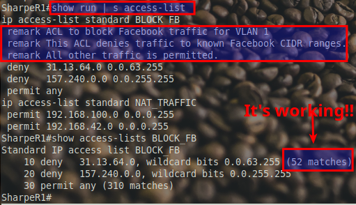
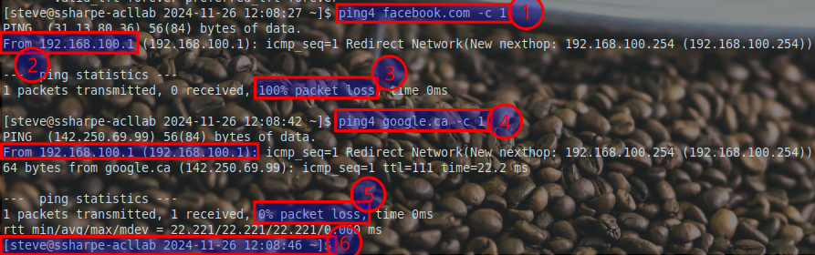

# ACL for control

## **Block Facebook for a single VLAN**

So far, you've configured secure management access and optimized NAT configurations with ACLs. Here's a quick recap:

**What You've Done So Far:**

**Secure Management Access Using Extended ACLs:**

  - Blocked device management protocols (e.g., SSH, HTTP, HTTPS) on all physical interface ports.

  - Configured the network to allow management access exclusively through the loopback interface.

  - Gained insights into how extended ACLs enhance security by controlling management traffic.

**Configured Standard ACLs for NAT Traffic Matching:**

  - Defined "interesting" traffic for NAT using standard ACLs.

  - Integrated the ACLs with NAT configurations to ensure only specific traffic is translated.

  - Explored the role of ACLs in optimizing network performance.

**What You’re Doing in This Section:**

In this final section, you'll implement and verify a named standard ACL to control traffic on VLAN 1. Specifically, you will:

- Block Facebook resources for VLAN 1.

- Permit all other traffic, ensuring smooth operation for non-Facebook services.

Verify and test your configuration to confirm expected behavior.

### **Placement Guide for the BLOCK_FB Standard ACL**

When deciding where to apply a standard ACL like `BLOCK_FB`, keep these key points in mind:

### **Mnemonic Explanation:**

**Standard Stays Back (Destination):**

  - Standard ACLs are best applied **as close to the destination as possible**.

  - Since standard ACLs only filter traffic based on the **source address**, placing them closer to the destination avoids unnecessary blocking of legitimate traffic.

**BLOCK_FB Placement:**

  - The `BLOCK_FB` ACL is applied **outbound** on the VLAN 1 interface (`fa0/0.1`) because:

    - This interface connects to the devices in the **192.168.100.0/24** network (VLAN 1).

    - It ensures that traffic destined for Facebook IPs from this VLAN is filtered effectively, but all other traffic is allowed.

### **Visualization:**

- Think of the **BLOCK_FB** ACL as a **guard at the exit gate (Destination)**:

  - Devices in VLAN 1 are the "people" trying to leave.

  - The guard (ACL) checks if someone is trying to reach Facebook and denies them. All other traffic is allowed to pass.

### **Rhyme to Remember:**

- **"Standard waits till the end station; Extended acts at the initiation."**

By remembering this rhyme, you can easily decide that the `BLOCK_FB` ACL should be applied at the **destination-facing interface**.

### **Comparison to Extended ACLs:**

- If this were an **extended ACL**, you could place it closer to the source (e.g., on the incoming interface for VLAN 1).

- However, since this is a **standard ACL**, which only matches the source IP address, you want to avoid applying it too early (near the source). Otherwise, it could unintentionally block traffic meant for destinations other than Facebook.

### **Step 1: Define a Named Standard ACL**

Define the named ACL and add remarks for documentation:

```bash
ip access-list standard BLOCK_FB
  remark ACL to block Facebook traffic for VLAN 1
  remark Deny traffic to known Facebook CIDR ranges
  remark Permit all other traffic
  deny 31.13.64.0 0.0.63.255
  deny 157.240.0.0 0.0.255.255
  permit any
```

**Note:** Remarks appear in the running configuration but do not show up in the output of `show access-lists`. They are purely for documentation purposes within the configuration file.

### **Step 2: Apply the ACL to VLAN 1**

Apply the ACL to the VLAN 1 subinterface in the **outbound** direction:

```bash
interface fa0/0.1
  ip access-group BLOCK_FB out
```



## **Verification and Testing**

### **Test Blocking Facebook**

- From a VLAN 1 device:
   - Open a browser and try accessing `facebook.com`.
   - Use the `ping` command to test Facebook’s known IP addresses (e.g., **`31.13.64.0`**).

### **Test Other Traffic**

- From a VLAN 1 device:
   - Verify access to other websites (e.g., `google.com`, `example.com`).
   - Confirm DNS functionality remains unaffected.

### **Check ACL Statistics**

- View the ACL to confirm matches on the `deny` statements:
   **`show access-lists BLOCK_FB`**

Example output:
```plaintext
Standard IP access list BLOCK_FB
    10 deny 31.13.64.0 0.0.63.255 (xx matches)
    20 deny 157.240.0.0 0.0.255.255 (yy matches)
    30 permit any (zz matches)
```

- **Note:** Hit counts are displayed next to the rules, showing how many packets matched each statement.


## **Screenshot 9 Testing VLAN 1 IPv4 ACLs**



This screenshot must include all the elements listed below. Each part is critical to verifying the ACL functionality and ensuring everything is configured correctly.

### **Required Elements for Screenshot 9**

**Use `ping4` for Facebook**
   - Use the **`ping4`** command to ensure IPv4 is explicitly used. Regular `ping` defaults to IPv6, which is unsupported by the college WAN, leading to failure.
   - Command: **`ping4 facebook.com -c 1`**
   - The output must:
     - Clearly show that the command was targeting `facebook.com`.
     - Confirm that the source is the **192.168.100.0/24** network, verifying that it originates from VLAN 1.
     - Show **100% packet loss**, confirming that Facebook traffic is successfully blocked by the ACL.

**Source Address Confirmation**
   - The output must explicitly show the source address (e.g., **`192.168.100.1`**).
   - This ensures the traffic originates from VLAN 1 and is being filtered by the ACL.

**Ping Results for Facebook**
   - Confirm that the `ping4` output for Facebook shows:
     - **0 packets received**.
     - **100% packet loss**, validating the ACL block.

**Use `ping4` for Google**
   - Test connectivity to Google to confirm that other traffic is permitted:
     **`ping4 google.ca -c 1`**
   - The output must:
     - Show successful results for the ICMP echo request to `google.com`.
     - Confirm **0% packet loss** and a valid round-trip time (RTT), such as:
       **`64 bytes from 142.250.69.99: icmp_seq=1 ttl=111 time=22.2 ms`**

**Successful Response for Google**
   - The results must show that traffic to Google is successfully permitted by the ACL, validating that only Facebook is blocked.

**Prompt Requirements**
   - Configure the terminal prompt to include:
     - The correct hostname format: **`FirstInitialLastName-acllab`**. Example: If your name is John Smith, the hostname must be `JSmith-acllab`.
     - Your login name (e.g., `steve` in the example screenshot).
     - The shell prompt must display the current date and time: Example format: **`[steve@sharpe-acllab 2024-11-26 12:08:46]`**


### **Checklist for Screenshot 9**

Ensure the following are included:

**Ping4 for Facebook:**

  - Command and output showing 100% packet loss.

  - Source IP address in the **192.168.100.0/24** range.

**Ping4 for Google:**

  - Command and output showing a successful reply with 0% packet loss.

**Source Address Confirmation:**

  - Output explicitly showing the originating address (e.g., `192.168.100.1`).

**Prompt Configuration:**

  - Correct hostname, login name, and date/time format.
---

[Prev](03_acl-for-matching.md) | [Home](README.md) | [Next](05_submission-guide.md)
