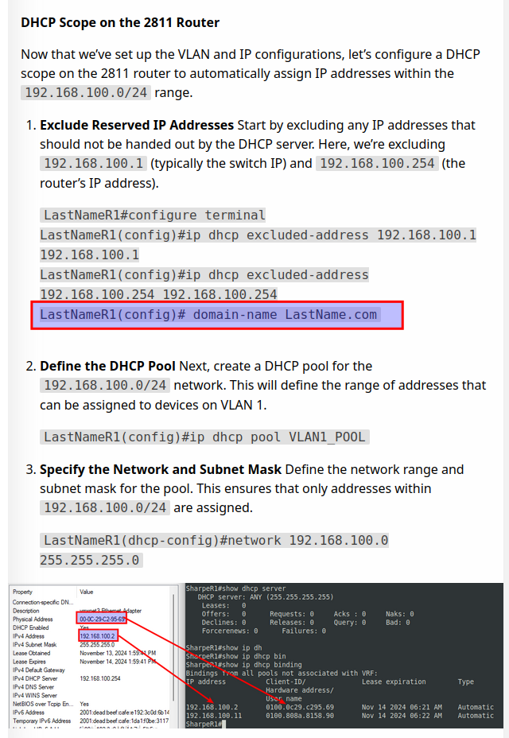

# Changelog

## 2024

### November 14
For the subinterface **`fa0/0.1`**, we added the global IPv6 address **`2001:dead:beef:cafe::2/64`**.

### November 25

- Added domain-name to DHCP scope.

---

[Prev](10_dns.md) | [Home](README.md)
