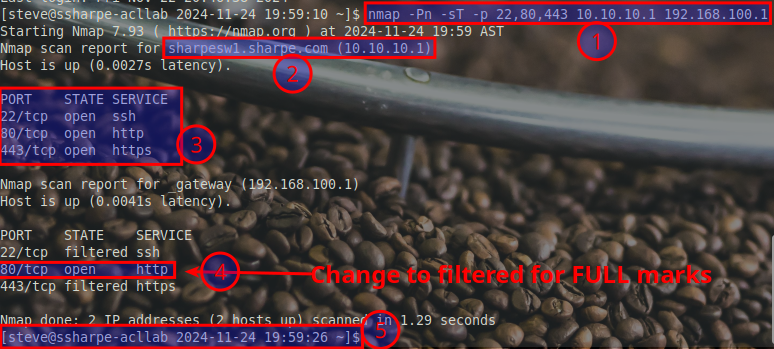
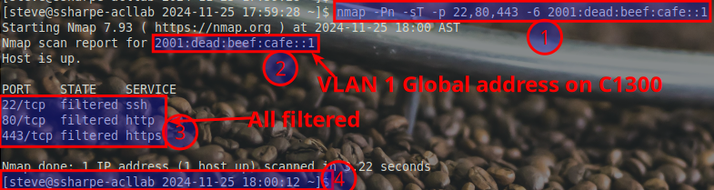
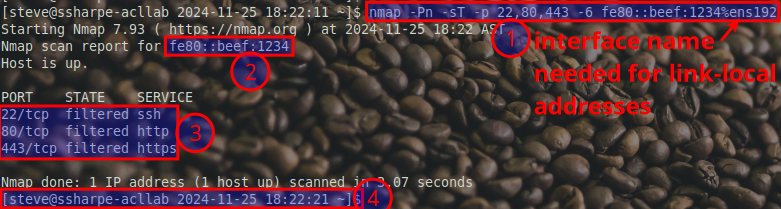

# Secure Management

## Objective

The goal is to:

- Allow general web traffic **through** the switch without restriction.
- Block **only SSH, HTTP, and HTTPS management traffic** targeting the Catalyst 1300 physical interface addresses.
- Permit SSH and HTTPS access to the Catalyst 1300 **only via loopback interfaces**.

I do not evaluate blocking HTTP toward the loopback, but unencrypted HTTP should still be blocked.

This ACL is an **extended ACL**, which means it applies filtering closer to the **Source** of the traffic.

**Why This is an Extended ACL**

- **Extended -> Source**: The acronym helps us remember that **Extended ACLs** are placed near the **Source** of the traffic to block unwanted data before it gets far into the network.

- Unlike **Standard ACLs**, which only filter based on destination IP, extended ACLs allow filtering based on **source IP, destination IP, protocol, and port numbers**. This granularity ensures greater control and efficiency in traffic management.

**Why We Use Extended ACLs in This Case**

In this lab, we're controlling traffic based on both **source** (e.g., `any`) and **destination** (e.g., `192.168.100.1`, `2001:dead:beef:cafe::1`). We're also specifying protocols (TCP) and ports (SSH, HTTP, HTTPS). This level of detail is only possible with an extended ACL.

- **Security at the Source:**
  By applying the extended ACL to VLAN 1 with the `service-acl input` command, SSH and HTTPS traffic targeting management interfaces is stopped close to the origin.

**Catchy Way to Remember:**

**Extended ACLs act early at the source.**

Think of them as proactive guards, screening traffic as it tries to enter the network. In contrast, standard ACLs wait passively at the destination.

Extended ACLs: **Efficient, Early, Exact.**

**IPv4 and IPv6 ACLs**

The following configurations specify rules to block management access to the Catalyst 1300's physical interface addresses while allowing general traffic to pass through.

**IPv4 ACL:**

```bash
ip access-list extended MGMT_ACL_V4
  deny tcp any any 192.168.100.1 0.0.0.0 22 ace-priority 15 # Deny SSH to VLAN1
  deny tcp any any 192.168.100.1 0.0.0.0 443 ace-priority 25 # Deny HTTPS to VLAN1
  permit ip any any ace-priority 50 # Allow all other traffic
```
### Explanation of the Line:

**`deny tcp any any 192.168.100.1 0.0.0.0 22 ace-priority 15`**

**Command Breakdown:**
   - **`deny tcp`**: Denies all traffic using the TCP protocol.
   - **`any any`**: Applies the rule to any source and destination IP addresses.
   - **`192.168.100.1 0.0.0.0`**: Targets traffic specifically destined for `192.168.100.1`, as the wildcard mask `0.0.0.0` specifies an exact match.
   - **`22`**: Specifies the destination port for SSH traffic.
   - **`ace-priority 15`**: Assigns this rule a priority of `15`, determining its order of evaluation.

- **What This Rule Does:** This rule blocks all SSH traffic destined for `192.168.100.1`. By explicitly denying SSH to this interface, it ensures unauthorized management access is prevented.

### Why Use `ace-priority`?

In this case, the **`ace-priority`** is used to control the order in which the rules are processed. ACLs are evaluated **top-to-bottom**, and the first matching rule determines the action taken. Assigning a specific priority allows precise control over this order.

**Incremental Organization:**

 Rules are prioritized in **increments of 5**. This leaves space for adding additional rules later, such as one to block **HTTP** (hint, hint, full marks opportunity!).

**Flexibility:**

 By keeping unused priorities available, you can easily insert new rules without needing to rewrite or renumber the entire ACL.

### Best Practices for `ace-priority`:

**Incremental Gaps:**

 Use increments (e.g., 5) to provide flexibility for future additions.

**Restrictive First, Permissive Last:**

 Place restrictive rules (e.g., `deny`) with **lower priorities** so they are processed before broader permissive rules (e.g., `permit ip any any`).

**Plan for Growth:**

 Leave gaps in your numbering to accommodate changes, especially in dynamic environments.

**IPv6 ACL:**

```bash
ipv6 access-list MGMT_ACL_V6
  deny tcp any any fe80::beef:1234/128 22 ace-priority 15 # Deny SSH to link-local
  deny tcp any any fe80::beef:1234/128 443 ace-priority 16 # Deny HTTPS to link-local
  deny tcp any any 2001:dead:beef:cafe::1/128 443 ace-priority 20 # Deny HTTPS to VLAN1
  deny tcp any any 2001:dead:beef:cafe::1/128 22 ace-priority 21 # Deny SSH to VLAN1
  permit ipv6 any any ace-priority 50 # Allow all other IPv6 traffic
```

### **Explanation of IPv6 Deny Rules**

**The Two SSH Deny Rules**

**`deny tcp any any fe80::beef:1234/128 22 ace-priority 15`**
   - This rule blocks SSH traffic to the **link-local address** `fe80::beef:1234`.
   - **Link-local addresses** are automatically assigned to all IPv6-enabled interfaces and are valid only within the same link (e.g., LAN or VLAN).
   - Since link-local addresses are always active, they can serve as an unintended backdoor for management access. This rule explicitly denies SSH traffic to the link-local address, enhancing security.

**`deny tcp any any 2001:dead:beef:cafe::1/128 22 ace-priority 21`**
   - This rule blocks SSH traffic to the **global unicast address** `2001:dead:beef:cafe::1`.
   - **Global unicast addresses** are routable across the internet or a larger network. This address might represent a VLAN's management interface, making it a critical target to secure.
   - This rule ensures that SSH access to the global interface is blocked, even from external sources, to reduce exposure to potential attacks.


**Why Two Rules for SSH?**

IPv6 assigns multiple types of addresses to interfaces, each serving a different purpose. In this case:

**Link-local address (`fe80::/10`):**

  - Used for local communication within a link.

  - Mandatory on all IPv6 interfaces.

  - Allows access within the same VLAN or subnet, so securing it is crucial.

**Global unicast address (`2001::/16` or similar):**

  - Used for communication across networks.

  - Routable and visible beyond the local network, increasing its exposure to attacks.

Having two separate deny rules ensures that SSH is blocked for **both link-local and global addresses**, closing all potential access vectors and strengthening security.

**Why Use Priority `21` Instead of an Increment of 5?**

The **`ace-priority`** value of `21` reflects a **practical shortcut** during the ACL editing process. After deleting and re-adding the rule, the decision was made **not to renumber or reorder the entire ACL** for such a minor change.

**Why This is Acceptable:**

- **Minimal Impact:** The adjustment to priority `21` was a small change that didn’t disrupt the ACL’s intended processing order.

- **Efficiency Over Perfection:** For a minor update, reordering or renumbering every rule wasn’t necessary.

- **Clear Position:** The rule still fits logically between other priorities, maintaining its purpose in the sequence.

**Best Practices for Handling Similar Situations:**

**Use Incremental Priority Gaps:**

  - Always leave room (e.g., increments of 5) for future edits to minimize disruption.

**Preserve Processing Order:**

  - Avoid renumbering unless absolutely necessary, as this can inadvertently change how the ACL behaves.

**Document Adjustments:**

  - Clearly explain why specific priorities deviate from the standard increment.

  - In this case, priority `21` is a valid adjustment for maintaining functionality while incorporating late changes.

**Real world lesson:**

Sometimes practicality wins over perfection. The priority `21` was chosen as a quick adjustment rather than renumbering the entire ACL, which wasn’t necessary for such a minor change.

This approach highlights a real-world balance between efficiency and meticulousness. Renumbering can always be done later when time allows, or when you're feeling less lazy! 😉

### **Why Use Comments (`#`)?**

> [!IMPORTANT]
> The `#` symbol and accompanying text in the ACL commands are **comments for your reference only**. These **cannot be entered into the Cisco CLI**.
> 
> When entering commands, you **must omit everything after and including the `#`**. While the **`remark`** keyword is best practice on other devices, the Catalyst 1300 does not support it.

**Example:**

- **What you see in the guide:**
  **`deny tcp any any 192.168.100.1 0.0.0.0 22 ace-priority 15 # Deny SSH to VLAN1`**

- **What you enter in the CLI:**
  **`deny tcp any any 192.168.100.1 0.0.0.0 22 ace-priority 15`**

### **Applying the ACLs**

To bind both IPv4 and IPv6 ACLs to VLAN 1, use the following command: 

```bash
interface vlan 1
  service-acl input MGMT_ACL_V4 MGMT_ACL_V6 # Apply both ACLs
```

### **Using `nmap` for Testing ACLs**

`nmap` (Network Mapper) is a powerful tool commonly used for network discovery and security auditing. In this lab, it plays a key role in validating your ACL configuration by testing access to specific ports and IP addresses.

**What Does `nmap` Do?**

- **Port Scanning:** Identifies whether specific ports (e.g., `22`, `80`, `443`) are open, closed, or filtered.
- **Service Identification:** Confirms which services (e.g., SSH, HTTP, HTTPS) are running on those ports.
- **Testing ACLs:** Validates whether your ACL rules are effectively blocking or allowing traffic as expected.

In this case:
- The goal is to block access to management ports (SSH, HTTP, HTTPS) on `192.168.100.1` while allowing traffic to `10.10.10.1` (loopback interface).
- `nmap` provides real-time feedback to ensure your ACL is working as intended.

**Install `nmap`**

Before running the scan, make sure you have `nmap` installed on your system. If not, you can install it using the following command:

**`sudo apt install nmap`**

Once installed, use `nmap` to run the command provided in the guide and verify your ACL configuration.

**The Syntax of the Command**

**`nmap -Pn -sT -p 22,80,443 10.10.10.1 192.168.100.1`**

- **`nmap`**: The command-line tool used for network exploration and security auditing.
- **`-Pn`**: Disables ping checks before scanning, assuming the host is up. Useful if ICMP is blocked.
- **`-sT`**: Specifies a TCP connect scan, which establishes a full TCP connection to determine if a port is open.
- **`-p 22,80,443`**: Specifies the ports to scan: **22** (SSH), **80** (HTTP), and **443** (HTTPS).
- **`10.10.10.1 192.168.100.1`**: The two target IP addresses to scan.

## Screenshot 1 Explanation and Requirements



**1. The Command**

The command visible in the screenshot is:

**`nmap -Pn -sT -p 22,80,443 10.10.10.1 192.168.100.1`**

This command runs an **Nmap TCP connect scan** for the ports SSH (`22`), HTTP (`80`), and HTTPS (`443`) on two IP addresses:

- **`10.10.10.1`**: This is the loopback interface of your device.
- **`192.168.100.1`**: This is the VLAN management interface.

**2. DNS and Pointer Records**

When you configured DNS in the prerequisite lab, you set up **forward zones** (hostnames mapped to IP addresses).

Here’s where **Pointer (PTR) records** come in:

- **PTR records** handle **reverse lookups**, resolving IP addresses back to hostnames.
- The **Cisco 2811 automatically generates PTR records** based on the forward zone configuration.
  - If you followed the correct DNS configuration steps in the prerequisite lab, the PTR record for `10.10.10.1` should resolve to: **`LastNameSW1.LastName.com`**

By doing the forward zone configuration correctly, you automatically set up reverse DNS functionality without needing to manage PTR records manually.

**3. Port Status for Grading**

- For **grading purposes**, all ports for `10.10.10.1` (loopback interface) **must be open**.
  - Any port showing as **filtered** indicates a configuration or connection issue, and your submission will not be graded.

**4. HTTP Reachability**

- **In this screenshot:** Port `80` (HTTP) must be **open** for `192.168.100.1` to verify the gateway is reachable.
- **In the next screenshot:** All ports for `192.168.100.1` must show as **filtered**, confirming proper ACL implementation.

**5. Host Naming and Customized Prompt**

Your Debian machine must meet the following requirements in all screenshots:

- **Hostname:** Must be formatted as: **`FirstInitialLastName-acllab`**
  - Example: If your name is John Smith, the hostname must be `JSmith-acllab`.
- **Login Name:** You must be logged in as your **first name**, as shown in the screenshot.
- **Prompt:** The shell prompt must include **Date and Time**, as shown in the screenshot.
  - Example: `[steve@sharpe-acllab 2024-11-24 19:59:26]`.

### **Key Note About DNS**

- While you configured forward zones (hostnames to IP addresses) during the prerequisite lab, the Cisco 2811 automatically created the **PTR records** for reverse DNS lookups.
- You do not need to configure PTR records yourself. If your DNS setup was done correctly, reverse lookups will work seamlessly.

### **Strict Submission Requirements**

Your screenshot must match the following:

- Correct DNS resolution (both forward and reverse).
- Accurate hostname, login name, and prompt (with date and time).
- The expected port status results for `10.10.10.1` and `192.168.100.1`.

**Any deviation will result in a zero for this slide.** If anything is unclear, make sure to ask for assistance!

### **Removing an ACL on the Catalyst 1300**

Now that you need to modify the ACL, it's a good time to understand how to make changes. Changes to an ACL are locked while it is applied to an interface. You can modify the ACL in several ways:

- Add new rules using the **ace-priorities** we discussed earlier, ensuring precise control over the evaluation order.
- Delete or adjust individual rules as needed, then reapply the updated ACL.
- Completely remove the ACL, edit it, and rebind it to the interface.

The following instructions will be useful regardless of which approach you take.

**Why You Can't Directly Delete an ACL**

When an ACL is applied to an interface, attempting to remove it directly results in an error:

```plaintext
LastNameSW1(config)# no ip access-list extended MGMT_ACL_V4
This action may cause a brief interruption of ACL/policy services.
Cannot delete/modify MGMT_ACL_V4, ACL is in use.
```
The system prevents you from deleting an ACL that is actively bound to an interface.

**Steps to Remove an ACL**

**1. Unbind the ACL from the Interface**

Unlike traditional IOS, the Catalyst 1300 uses a simplified command for unbinding ACLs. To remove both IPv4 and IPv6 ACLs from VLAN 1, use:

**`LastNameSW1(config-if)# no service-acl input`**

**Output Example:**

```plaintext
28-Nov-2024 18:27:10 %QOS_CLI-I-NETACLIFCHANGED: Input ACL 'MGMT_ACL_V4' and ACL 'MGMT_ACL_V6' have been removed
```

At this point, the ACLs are no longer applied to the interface, freeing them for deletion or modification.

**2. Delete the ACLs**

With the ACL unbound, you can now remove it safely:

- **For IPv4:**
  **`LastNameSW1(config)# no ip access-list extended MGMT_ACL_V4`**

- **For IPv6:**
  **`LastNameSW1(config)# no ipv6 access-list MGMT_ACL_V6`**

**3. Reapply the ACLs After Changes**

Once you've made the necessary changes to the ACLs, reapply them to the interface:

**`LastNameSW1(config-if)# service-acl input MGMT_ACL_V4 MGMT_ACL_V6`**
### **Key Notes**

- The Catalyst 1300's `no service-acl input` command differs from standard IOS syntax by requiring only the base `no service-acl input` to remove all ACL bindings from an interface.

- Always remember to unbind the ACLs before attempting to delete or modify them.

- After completing any changes, ensure ACLs are re-applied to maintain the intended security policies.

## **Screenshot 2 Explanation and Requirements**


**1. The Command**

The `nmap` command visible in the screenshot:

`nmap -Pn -sT -p 22,80,443 10.10.10.1 192.168.100.1 `

This command scans **SSH (22)**, **HTTP (80)**, and **HTTPS (443)** ports on:

- **`10.10.10.1`** (loopback interface).

- **`192.168.100.1`** (VLAN management interface).

**2. DNS Resolution**

The DNS setup must resolve `10.10.10.1` to the FQDN:

`LastNameSW1.LastName.com`

This confirms that both forward and reverse DNS records are correctly configured.

**3. Port Status for Grading**

- **For `10.10.10.1`:** All ports (**22, 80, 443**) must be **open** for grading.

- **For `192.168.100.1`:** All ports must be **filtered** for full marks.

  - **Partial Marks:** If **22 (SSH)** and **443 (HTTPS)** are filtered but **80 (HTTP)** is open.

**4. HTTP and Filtering**

- **VLAN Interface Filtering:** For the VLAN interface `192.168.100.1`, ensure all specified ports are **filtered** to demonstrate proper ACL implementation.

- Any open ports on this interface indicate an incomplete or incorrect ACL configuration.

**5. Host Naming and Customized Prompt**

Your Debian machine must meet the following requirements:

- **Hostname:** Must be formatted as:

 `FirstInitialLastName-acllab`

 Example: If your name is John Smith, the hostname must be `JSmith-acllab`.

- **Login Name:** You must be logged in as your **first name**, visible in the prompt.

- **Prompt:** The prompt must include:

  - **Date and Time**, as shown in the screenshot.

 Example: `[steve@sharpe-acllab 2024-11-24 20:20:49]`.

### **Key Submission Notes**

**All ports for `10.10.10.1` must be open.**

- **All ports for `192.168.100.1` must be filtered** for full marks.

- Ensure DNS is configured correctly to resolve forward and reverse lookups automatically.

- Follow naming and prompt requirements exactly.

- Any deviation will result in a deduction or a zero for this slide.

Ask questions if you need clarification!

## **Screenshot 3 IPv6 Loopback Scan**


**1. The Command**

The `nmap` command visible in the screenshot:

`nmap -Pn -sT -p 22,80,443 -6 2001:cafe::1 `

- **`-6`**: This flag is required because the target address is an **IPv6 address**. Without `-6`, `nmap` defaults to IPv4.

- **Purpose:** This command verifies that the listed ports (**22**, **80**, **443**) are accessible and reachable on the Catalyst 1300's **IPv6 global loopback address** (`2001:cafe::1`).

**2. Port Status for Grading**

- All listed ports (**22** for SSH, **80** for HTTP, and **443** for HTTPS) **must be OPEN**.

- This ensures the IPv6 loopback interface is fully reachable and accessible for the required services.

**3. No DNS Requirements**

- Unlike Screenshots 1 and 2, **there are no DNS resolution requirements** for this screenshot.

- The IPv6 address `2001:cafe::1` is used directly, without relying on a hostname.

**4. Host Naming and Customized Prompt**

Your Debian machine must meet the following requirements:

- **Hostname:** Must follow the format:

 `FirstInitialLastName-acllab`

 Example: If your name is John Smith, the hostname must be `JSmith-acllab`.

- **Login Name:** You must be logged in as your **first name**, as shown in the prompt.

- **Prompt:** The shell prompt must include:

  - **Date and Time**, as shown in the screenshot.

 Example: `[steve@sharpe-acllab 2024-11-25 11:46:30]`.

### Summary of Requirements

- Use the `-6` flag to scan the IPv6 global loopback address.

- All listed ports (**22**, **80**, **443**) must show as **open**.

- DNS is **not required** for this screenshot; the IPv6 address is sufficient.

- Ensure your hostname, login name, and prompt formatting are correct and include the date and time.

**Deviations will result in a zero for this slide.** If unsure, ask for clarification!

## **Screenshot 4 VLAN 1 Global IPv6 Address**


**1. The Command**

The `nmap` command visible in the screenshot:

`nmap -Pn -sT -p 22,80,443 -6 2001:dead:beef:cafe::1 `

- **`-6`**: Specifies that the target address is an **IPv6 address**. Ensure this flag is included, or the command will not work correctly with IPv6.

- **Purpose:** This scan targets the **global IPv6 address** assigned to VLAN 1 on the Catalyst 1300 (`2001:dead:beef:cafe::1`).

**2. Double-Check the Address**

- Ensure the scanned address is correct: `2001:dead:beef:cafe::1`.

- If the address does not match or is misconfigured, the output will not reflect proper testing of the VLAN 1 global interface.

**3. Port Status for Grading**

- **Port 22 (SSH) and Port 443 (HTTPS):** Must show as **filtered** to demonstrate that management traffic to these services is blocked.

- **Port 80 (HTTP):** Must remain **open** for this screenshot to verify the reachability of the gateway.

  - **Note:** You will filter HTTP (`80`) in the **next slide**, which must be completed to earn full marks for the lab. If port 80 is filtered here, the next slide will not be graded.

**4. Host Naming and Customized Prompt**

Your Debian machine must meet the following requirements:

- **Hostname:** Must be formatted as:

 `FirstInitialLastName-acllab`

 Example: If your name is John Smith, the hostname must be `JSmith-acllab`.

- **Login Name:** You must be logged in as your **first name**, visible in the prompt.

- **Prompt:** The shell prompt must include:

  - **Date and Time**, as shown in the screenshot.

 Example: `[steve@sharpe-acllab 2024-11-25 13:23:20]`.

### Key Notes:

- Use the **`-6` flag** for scanning IPv6 addresses.

- Confirm the address `2001:dead:beef:cafe::1` is correct and matches the VLAN 1 global address.

- Ensure ports:

  - **22 (SSH):** Filtered.

  - **443 (HTTPS):** Filtered.

  - **80 (HTTP):** Open.

- Ensure your hostname, login name, and prompt (with date and time) are correctly displayed.

**Deviations from these requirements will result in deductions or a zero for this slide.** Ask questions if needed!

## **Screenshot 5 VLAN 1 Global IPv6 Address**



**1. The Command**

The `nmap` command visible in the screenshot:

`nmap -Pn -sT -p 22,80,443 -6 2001:dead:beef:cafe::1 `

- **`-6`**: Indicates that the scanned target is an **IPv6 address**. Ensure this flag is included for proper IPv6 scanning.

- **Purpose:** This scan tests the **global IPv6 address** of VLAN 1 on the Catalyst 1300 (`2001:dead:beef:cafe::1`) to confirm that all specified ports are blocked by your ACL configuration.

**2. Double-Check the Address**

- Verify that the scanned IPv6 address is correct: `2001:dead:beef:cafe::1`.

- This address must match the VLAN 1 global address to confirm proper ACL implementation on the intended interface.

**3. Port Status for Grading**

- **All ports (`22`, `80`, `443`) must show as filtered.**

  - **Port 22 (SSH):** Filtered.

  - **Port 443 (HTTPS):** Filtered.

  - **Port 80 (HTTP):** Filtered.

This ensures that the ACL is correctly blocking all management and HTTP traffic on VLAN 1's global IPv6 address. If any port is open, the configuration is incomplete, and your submission will not be graded.

**4. Host Naming and Customized Prompt**

Your Debian machine must meet the following requirements:

- **Hostname:** Must be formatted as:

 `FirstInitialLastName-acllab`

 Example: If your name is John Smith, the hostname must be `JSmith-acllab`.

- **Login Name:** You must be logged in as your **first name**, visible in the prompt.

- **Prompt:** The shell prompt must include:

  - **Date and Time**, as shown in the screenshot.

 Example: `[steve@sharpe-acllab 2024-11-25 18:00:12]`.

### Key Notes:

- Use the **`-6` flag** for scanning IPv6 addresses.

- Confirm the scanned IPv6 address is `2001:dead:beef:cafe::1`, matching the VLAN 1 global address.

- Ensure all ports (**22**, **80**, **443**) are **filtered** to verify that the ACL is properly applied.

- Follow all prompt and hostname requirements.

**Any deviation from these requirements will result in deductions or a zero for this slide.** Be sure to double-check your setup!

## Verifying Your Interface Name


Before testing **link-local addresses**, you need to identify the correct **interface name** on your machine. In this example, the interface name is **`ens192`**, but your interface name may differ depending on your configuration. This screenshot is provided **for guidance only** and is not part of your submission.

## **Screenshot 6 Testing Link-Local Address for VLAN 1**


**1. The Command**

The `nmap` command visible in the screenshot:

`nmap -Pn -sT -p 22,80,443 -6 fe80::beef:1234%ens192 `

- **`-6`**: Indicates that the target address is IPv6.

- **`fe80::beef:1234%ens192`**: The `%ens192` portion specifies the **interface name**, which is required when working with **link-local addresses**.

  - **Why?** Link-local addresses are unique per interface. Without specifying the interface, the network stack wouldn’t know which interface to use.

**2. Verify the IP Address**

- Confirm that the **link-local address** being tested is correct: `fe80::beef:1234`.

- This must match the link-local address of the Catalyst 1300 on VLAN 1. Ensure you include the correct **interface name** (`%interface-name`).

**3. Port Status for Grading**

- **Port 22 (SSH):** Must be **filtered**.

- **Port 443 (HTTPS):** Must be **filtered**.

- **Port 80 (HTTP):** Must remain **open** for this slide to verify the reachability of HTTP traffic.

  - **Note:** You will filter HTTP traffic in the next slide to earn full marks.

**4. Host Naming and Customized Prompt**

Your Debian machine must meet the following requirements:

- **Hostname:** Must follow the format:

 `FirstInitialLastName-acllab`

 Example: If your name is John Smith, the hostname must be `JSmith-acllab`.

- **Login Name:** You must be logged in as your **first name**, visible in the prompt.

- **Prompt:** The shell prompt must include:

  - **Date and Time**, as shown in the screenshot.

 Example: `[steve@sharpe-acllab 2024-11-25 17:25:20]`.

### Key Notes:

- Use the **`-6` flag** for IPv6 scanning.

- Include the **`%interface-name`** for link-local addresses to resolve ambiguity.

- Ensure:

  - **Port 22 (SSH):** Filtered.

  - **Port 443 (HTTPS):** Filtered.

  - **Port 80 (HTTP):** Open.

- Follow all hostname, login name, and prompt requirements.

**Failure to meet these requirements will result in a deduction or zero for this slide.** If you’re unsure about your interface name or the configuration, ask for assistance!

## **Screenshot 7 Testing Link-Local Address for VLAN 1 (All Ports Filtered)**



**1. The Command**

The `nmap` command visible in the screenshot:

`nmap -Pn -sT -p 22,80,443 -6 fe80::beef:1234%ens192 `

- **`-6`**: Specifies that the target is an IPv6 address.

- **`fe80::beef:1234%ens192`**: The `%ens192` portion specifies the **interface name**, which is required when working with **link-local addresses** to resolve ambiguity.

**2. Verify the IP Address**

- Confirm the **link-local address** being tested: `fe80::beef:1234`.

- Ensure the correct interface name (`%ens192`) is included.

**3. Port Status for Grading**

- **All ports (`22`, `80`, `443`) must show as filtered.**

  - **Port 22 (SSH):** Filtered.

  - **Port 443 (HTTPS):** Filtered.

  - **Port 80 (HTTP):** Filtered.

This confirms that the ACL is correctly blocking all traffic to the Catalyst 1300's link-local address on VLAN 1.

**4. Host Naming and Customized Prompt**

Your Debian machine must meet the following requirements:

- **Hostname:** Must follow the format:

 `FirstInitialLastName-acllab`

 Example: If your name is John Smith, the hostname must be `JSmith-acllab`.

- **Login Name:** You must be logged in as your **first name**, visible in the prompt.

- **Prompt:** The shell prompt must include:

  - **Date and Time**, as shown in the screenshot.

 Example: `[steve@sharpe-acllab 2024-11-25 18:22:21]`.

### Key Notes:

- Use the **`-6` flag** for IPv6 scanning.

- Include the **`%interface-name`** for link-local addresses to resolve ambiguity.

- Ensure all ports (**22**, **80**, **443**) are filtered to verify complete ACL blocking.

- Follow all hostname, login name, and prompt requirements.

**Deviations from these requirements will result in deductions or a zero for this slide.** Make sure your configuration matches exactly!
---

[Prev](01_introduction.md) | [Home](README.md) | [Next](03_acl-for-matching.md)
