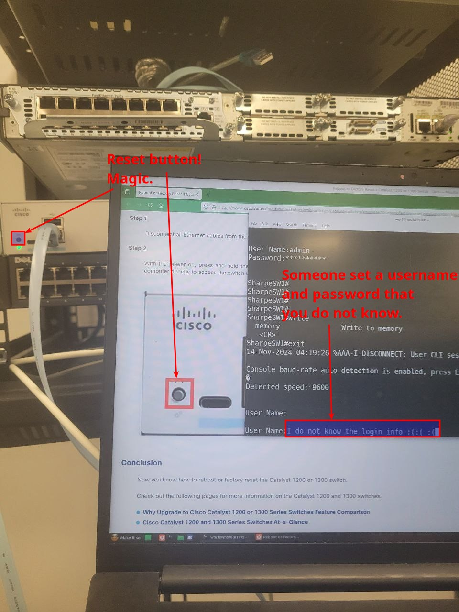
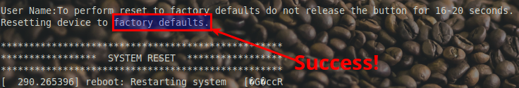

# Getting Started

## Let’s Reset This Bad Boy 🎛️

1. **Connected? Check!** You’re in the console port! If you were looking for a good view, well, this is it. Enjoy the CLI, the blank slate of possibilities.
2. **No Idea on the Username or Password?** We've all been there. If you can't guess your way in (admin/admin isn't magic), don’t worry.
3. **Put Hands in the Air?** You could, but let’s not get too dramatic. We’ve got solutions.

Below is the official guide by Cisco on a how to [Factory Reset a Catalyst 1300 Switch](http://www.cisco.com/c/en/us/support/docs/smb/switches/Catalyst-switches/kmgmt3620-reboot-factory-reset-catalyst-1200-1300-switches.html)

[Reboot or Factory Reset a Catalyst 1300 Switch](https://www.cisco.com/c/en/us/support/docs/smb/switches/Catalyst-switches/kmgmt3620-reboot-factory-reset-catalyst-1200-1300-switches.html)

**Time for the Exact-Second Factory Reset!**

Cisco’s official instructions are great, but experience speaks louder! Here’s the trick:

1. **Unplug All Ethernet Cables** For the factory reset to work, make sure *all* Ethernet cables are unplugged from the switch. The console port can stay connected, but every other cable must go!
2. **Hold the Reset Button for 18 Seconds (Trust Us, It’s the Sweet Spot)** Cisco mentions a timing range of 16 to 20 seconds, but we’ve found that **holding the reset button for 18 seconds** hits the mark perfectly. Think of it as the “Goldilocks zone”—not too short, not too long. If you’re a second or two off, the switch might just reboot instead of fully resetting.
3. **Expect Some Console Jargon** Once you let go, you should see messages like:

The garbled output is just the switch dumping data as it resets; it’s normal and nothing to worry about.

4. **Reconnect and Confirm** After the reset completes, reconnect to confirm the device is back to its default settings. You’re now ready to configure from scratch!

If you don’t hit that 18-second Goldilocks zone exactly, the switch will only reboot instead of resetting to factory defaults. Here’s what that looks like:

In the screenshot, notice the absence of any “resetting device to factory defaults” message. Instead, you’ll just see the usual reboot sequence with lines like:

and then standard initialization messages before arriving at the familiar login prompt. Without that confirmation of a factory reset, the old configuration and passwords are still in place.

**Pro Tip**: Use a timer to ensure you’re holding the reset button for precisely 18 seconds! One second off, and it’s back to square one with just a regular reboot.

### 🎥 Factory reset Cisco Catalyst 1300
[Watch Video](https://youtu.be/9l0VK863DVU)

---
### 🧠 Resetting device

> [!NOTE]
> **Statement:** I successfully reset the password!!
> 
> - [ ] True
> - [ ] False

👉 <b>Reveal answer</b>

**Correct:** True

---

## Setting Up Your Login Credentials

After the factory reset, you’ll be able to log in using the default credentials:

- **Username:** **`cisco`**
- **Password:** **`cisco`**

Once logged in, you’ll be prompted to create a new username and password. While Cisco’s C1300 platform has its own minimum password requirements, we recommend the following to make your life easier:

- **Username:** **`admin`**
- **Password:** **`Don'tpanic`**

This combo meets the minimum requirements and is simple to type. But, if you’re feeling adventurous, feel free to create the most complex password you’d like—just remember it for future logins!

## Why is the Status Light Blinking?

The blinking status light on your Catalyst 1300 switch indicates that, while the switch is operational, it hasn’t been fully integrated into your network setup. By default, the switch is assigned the IP address **192.168.1.254** on **VLAN 1**, which allows initial access via the Web GUI or console port. However, until it’s assigned an IP address that aligns with your network’s addressing scheme, the switch will keep blinking to signal it’s not yet fully configured for network management.

In the next step, we’ll set an IP address to match your network and stop the blinking!
---

[Prev](01_specs.md) | [Home](README.md) | [Next](03_setting-an-ip.md)
