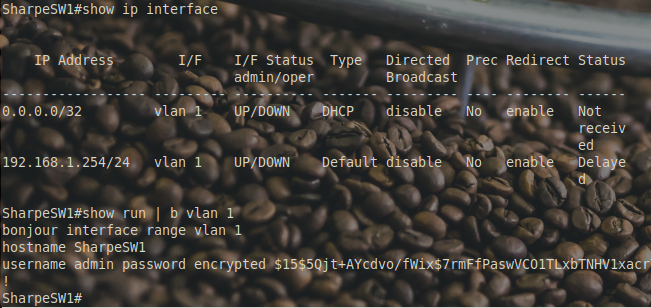
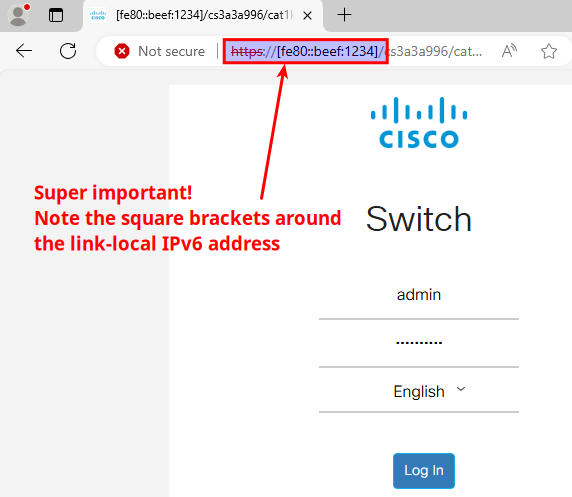
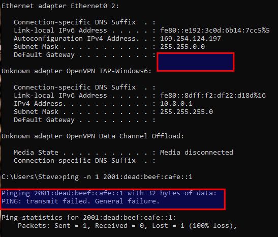

# Setting an IP

## Rules & Guidelines

Before we dive into configuring the IP address for your Catalyst 1300 switch, here are some key ground rules:

1. **No Static IPs on College Computers** Do not set a static IP address on any college-provided computer. We’ll guide you through configuring a DHCP server and connecting via both IPv4 and IPv6. College computers must connect using **DHCP ONLY** for IPv4 or through **IPv6 router advertisements**.
2. **Personal Virtual Machines on College Computers? Static IPs Allowed** If you’re running virtual machines on a college computer, you may set static IPs on your **personal virtual machines** as long as they’re in **bridge mode**. However, **do not set a static IP on the college’s physical host machine**—stick to DHCP or IPv6 to avoid any network issues.
3. **Bring Your Own Device (BYOD)** If you’re using your own device on the college network, you have full control—feel free to configure IPs however you prefer!

Before we get into setting up the IP address, here’s a quick reminder of the default login details:

- **Default Username:** `cisco`
- **Default Password:** `cisco`

If you haven’t changed these yet, it’s a good time to do so! We recommend updating to the following for an easier login experience that still meets security requirements:

- **Suggested Username:** `admin`
- **Suggested Password:** `Don'tpanic`

If you’ve already completed this step, you’re good to go. Let’s proceed to configuring the IP address!

## Why Does VLAN 1 Already Have an IP Address?



You might notice that VLAN 1 on your Catalyst 1300 switch has an IP address, even though it doesn’t appear in the running configuration. This default IP (usually **192.168.1.254/24**) is hard-coded into the switch to allow administrators quick access to the device out of the box. It provides immediate connectivity for initial setup, making it accessible via the Web GUI or console port without needing configuration.

And yes, **this is why that status light is happily blinking**—the switch is letting you know it’s ready for initial setup with its default IP.

Once the switch is officially configured with a specific IP, this default IP is no longer needed, and the new IP will override it in VLAN 1.

## Setting an IP

Configure VLAN 1 with an IPv4 address:

```bash
interface vlan 1
  ip address 192.168.100.1 255.255.255.0
```

### IPv6 Address Configuration on VLAN 1

In addition to IPv4, we can configure IPv6 addresses on VLAN 1. Here’s a breakdown of the commands:

1. **Link-Local Address**
   ```bash
   ipv6 address fe80::beef:1234 link-local
   ```
   This command assigns a **link-local IPv6 address** to VLAN 1. Link-local addresses, which start with `fe80::`, are automatically available on each IPv6-enabled interface and are used for communication within the local network segment. This type of address isn’t routable outside the local link, meaning it won’t go beyond this specific network. The `link-local` keyword specifies that this address is for local communication only.

2. **Global Unicast Address**
   ```bash
   ipv6 address 2001:dead:beef:cafe::1/64
   ```
   This command assigns a **global unicast IPv6 address** to VLAN 1. Global unicast addresses, like this one starting with `2001:`, are routable on the public internet and uniquely identify the device on the global IPv6 network. The `/64` at the end is the prefix length, indicating that the first 64 bits define the network portion, while the remaining bits are for host addresses. This address makes the switch reachable on networks outside the local link.


---
### 🧠 Rules Q1: Static IP

> [!NOTE]
> **Statement:** At this stage, we need to set the college computer to 192.168.100.10/24
> 
> - [ ] True
> - [ ] False

<details>
<summary>👉 <b>Reveal answer</b></summary>

**Correct:** False

**Feedback:** You're paying attention :)
</details>

---


---
### 🧠 Status light blinking?

> [!NOTE]
> **Statement:** Is your status light still blinking?
> 
> - [ ] True
> - [ ] False

<details>
<summary>👉 <b>Reveal answer</b></summary>

**Correct:** False

**Feedback:** If only all of lifes problems could be solved by setting an IP address
</details>

---


**Pro Tip**: Quick Refresh for Network Changes

If you need to quickly refresh your IP settings, unplugging and replugging the Ethernet cable is the fastest way to reinitiate the DHCP process (DORA). While this doesn’t release an existing DHCP lease, it does trigger a refresh of the interface, which starts a new DORA phase if you’re set to DHCP. It also clears certain caches like DNS and ARP, helping the network pick up any configuration changes.

For those using virtual machines, make sure the **"Replicate physical network connection state"** option is selected in the VM settings (see image below). This setting ensures that your VM’s network connection mirrors any physical changes on the host, including the unplug/replug trick.

If you absolutely need to release a DHCP lease, you’ll still need to do that through the OS. However, in most cases, a simple unplug and replug will do the job of refreshing the connection.

This method allows your VM to quickly renew its IP settings, just like a physical machine.


### Reaching the Link-Local Address Despite a Failed DORA

In the example below, you can see the **169.254.x.x** address assigned by Windows. This IP address range is Microsoft’s way of signaling that the DHCP process (DORA: Discover, Offer, Request, Acknowledge) has failed, meaning the system couldn’t obtain an IP address from a DHCP server.

However, even without a DHCP-assigned IPv4 address, we can still reach the **link-local IPv6 address** we set on the device. In this case, `fe80::beef:1234` is accessible, as shown by the successful ping response. Link-local addresses are independent of DHCP and are designed to work on the local network segment, allowing communication even when other IP configuration options fail. This provides a reliable fallback for local connectivity!



### Accessing the Web GUI via Link-Local IPv6 Address (For Initial Setup Only)

Now that the link-local IPv6 address is set, you should be able to access the Catalyst 1300 switch’s Web GUI. One critical detail: **when entering the link-local IPv6 address in the browser, make sure to enclose it in square brackets**. This is required for IPv6 addresses in URLs.

For example:

`https://[fe80::beef:1234]/ `

Without the brackets, the browser won’t interpret the IPv6 address correctly. Once entered, you’ll see the login screen for the switch’s Web GUI.

### Why We’re Using Link-Local for Initial Access Only

In this example, we can easily access the Web GUI using the link-local address because there’s only one active network interface card (NIC) on IPv6. Link-local addresses are unique to each network segment, so this setup is straightforward.

However, with multiple NICs, accessing resources like a Web GUI via link-local addresses becomes tricky. Each NIC would have a unique link-local address, which can cause confusion as the browser may not identify the correct link to use. This makes link-local addresses impractical for consistent access in complex setups.

For this reason, we’re only using the link-local address here to demonstrate that it *is* possible to connect. Going forward, we’ll switch to a global IPv6 address for reliable connectivity, ensuring the switch remains accessible regardless of network configuration.


**Why Did the Initial Ping Fail?**

In this example, the initial ping to the link-local address `fe80::beef:1234` failed. The reason? Link-local IPv6 addresses are unique to each network segment, and they’re only valid on a specific link. When a host has multiple network interfaces (or links), it creates ambiguity for the operating system, which doesn’t automatically know which interface to use for the link-local address.

To resolve this, we need to specify the exact interface we want to use for the ping. In IPv6, you can do this with the `%` symbol followed by the interface identifier:

- **On Windows**: Use the **interface number**, which you can find by running the **`route print`** command.
- **On Linux**: Use the **interface name**, which can be found with commands like **`ip addr`**. In this example, the interface name is `enx00808a815890`.

So, the successful ping command looks like this:

**`ping -c 1 fe80::beef:1234%enx00808a815890`**

By appending `%enx00808a815890`, we’re telling the system to send the ping specifically through this interface, eliminating any ambiguity and allowing the ping to succeed.



**Why Can’t We Access Anything Beyond Link-Local?**

In the initial screenshot, you’ll notice that our network setup lacks both a **default gateway** and a **global IPv6 address**. Without these, the switch can only communicate within its immediate network segment (link-local) and is isolated from any external networks.

This is because **IPv6 routing** and **global address configuration** aren’t automatically enabled. To fix this, we can use the following command on the switch:

**`ipv6 unicast-routing`**

**Enabling IPv6 Unicast Routing**

When we enable IPv6 unicast routing, a few things happen:

1. **Router Advertisements (RAs)**: The switch begins sending router advertisements to connected devices. These advertisements allow devices on the network to automatically configure their own global IPv6 addresses without needing DHCP.
2. **IPv6’s Magic Without DHCP**: Unlike IPv4, IPv6 doesn’t require DHCP to function. Devices can configure themselves using information from the router advertisements, allowing them to access the internet or other networks seamlessly. DHCP is entirely optional in the IPv6 world, primarily used only when additional configuration details (like DNS servers) are needed.

Once **`ipv6 unicast-routing`** is enabled, the switch and connected devices can automatically assign global addresses and discover the default gateway, enabling full connectivity beyond the local network.


**Identifying Your Network Interface for IPv6 Link-Local Connections**

In the example shown, my network interface is labeled **vmnet3 Ethernet Adapter** because I’m working on a Linux host. If you're using a Windows host, your interface name will likely show up as something similar to **Intel(R) Ethernet Connection** or **Intel(R) Ethernet Adapter** in Windows.

To connect via a link-local IPv6 address, you need the correct interface identifier. As shown in the screenshot, you can use `%5` after the IPv6 address, where `5` is the interface number specific to this adapter. On Windows, you can find this interface number by using `route print` in the command prompt.

Using this identifier will ensure you’re targeting the right interface, especially when dealing with multiple network adapters.


---
### 🧠 Q: Access IPv4

> [!NOTE]
> **Question:** So we've set an IPv4 address on the switch. We will access it by:
> 
> - [ ] **A.** Setting the college computer to a static IP within this subnet
> - [ ] **B.** Tune into the next step **Configuring DHCP**

<details>
<summary>👉 <b>Check your answer</b></summary>

**Correct Option: B**

**Feedback:** You're on the right track :)
</details>

---


[Prev](02_getting-started.md) | [Home](README.md) | [Next](04_configuring-dhcp-ipv4.md)
