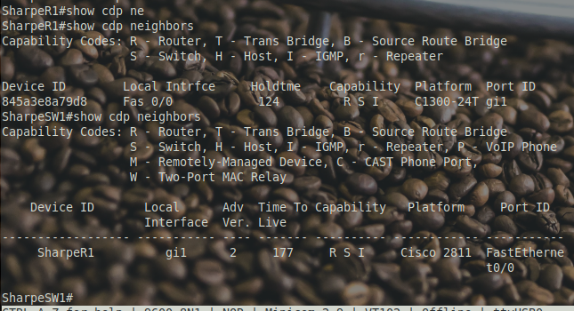
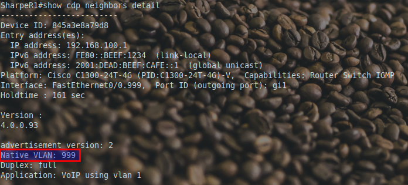
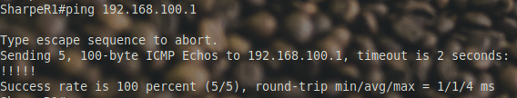

# Configuring DHCP (IPv4)

**DHCP on the Catalyst 1300: Proceed with Caution**

While the Catalyst 1300 *technically* supports DHCP, its behavior and performance can be unreliable. In our experience, DHCP functionality on the C1300 can be intermittent, leading to inconsistent client connectivity—a risk we’d rather avoid in our labs.

To keep things stable and predictable, we’ll set up a trunk port between the Catalyst 1300 and a Cisco 2811 ISR router. The 2811 will handle DHCP and DNS services for the VLANs on the C1300. This approach allows the 2811 to manage IP assignments more reliably, ensuring smooth operations for all connected devices.

Using the 2811 for these services will provide a consistent experience and let us focus on the core lab activities without troubleshooting DHCP hiccups on the C1300.


**Verify physical connections**

**Connect the Devices**

Physically connect **Gigabit 1** on the Catalyst 1300 switch to **FastEthernet 0/0** on the 2811 router, as shown in the diagram.

**Rename the Devices**

Change the Catalyst 1300 switch hostname to `LastNameSW1`.

Change the 2811 router hostname to `LastNameR1`.

**Enable the Interface on the Router**

On the 2811 router, go to the FastEthernet 0/0 interface and run the **`no shutdown`** command to activate the port. This allows the router and switch to begin exchanging CDP (Cisco Discovery Protocol) messages.

```bash
LastNameR1#configure terminal
LastNameR1(config)#interface FastEthernet0/0
LastNameR1(config-if)#no shutdown
```

**Verify the Connection with CDP**

Use the **`show cdp neighbors`** command on both the router and switch to confirm that they’re connected through the correct ports. You should see each device listed as a neighbor, with the corresponding ports (Gigabit 1 on the switch and FastEthernet 0/0 on the router).

By following these steps, you’ll establish a trunk connection between the Catalyst 1300 and the 2811 router, ready for DHCP and DNS setup on the 2811.



**Configuring a Blackhole VLAN as the Native VLAN**

## What is a Blackhole VLAN?

A **blackhole VLAN** is a VLAN that’s intentionally unused and typically not routed. By assigning the **native VLAN** on a trunk port to a blackhole VLAN, we prevent untagged traffic from inadvertently being accepted or processed by either device on the trunk link. This is a good security practice to isolate untagged traffic and prevent any potential misconfigurations from creating security risks.

In our case, we’ll use VLAN 999 as the blackhole VLAN and set it as the native VLAN on the trunk link between the Catalyst 1300 and the 2811 router.

Steps to Configure the Blackhole VLAN as the Native VLAN

**Create VLAN 999 and Name it "blackhole" on the Switch**

Configure VLAN 999 as the blackhole VLAN on the Catalyst 1300:

```bash
LastNameSW1#configure terminal
LastNameSW1(config)#vlan 999
LastNameSW1(config)#interface vlan 999
LastNameSW1(config-if)#name blackhole
```

**Set Gigabit 1 to Trunk Mode**

Configure Gigabit 1 as a trunk port to carry traffic for multiple VLANs, allowing communication with the 2811 router’s sub-interfaces for VLANs:

```bash
LastNameSW1#configure terminal
LastNameSW1(config)#interface gigabitEthernet 1
LastNameSW1(config-if)#switchport mode trunk
```

**Set VLAN 999 as the Native VLAN on the Trunk**

Assign VLAN 999 as the native VLAN for the trunk port. This ensures any untagged traffic is sent to VLAN 999 (the blackhole VLAN) and doesn’t interfere with active VLAN traffic:

**`LastNameSW1(config-if)#switchport trunk native vlan 999`**

**Configure Sub-Interface on the 2811 for Native VLAN 999**

On the 2811 router, create a sub-interface on FastEthernet 0/0 for VLAN 999. This sub-interface will act as the "native" VLAN for untagged traffic:

```bash
LastNameR1#configure terminal
LastNameR1(config)#interface FastEthernet0/0.999
LastNameR1(config-subif)#encapsulation dot1q 999 native
LastNameR1(config-subif)#exit
```

**Verify the Configuration with CDP**

Use the **`show cdp neighbors detail`** command on both devices to confirm the connection is established with the native VLAN 999 as expected.




**Configuring VLAN 1 on a Sub-Interface of the 2811 Router**

Now that we have our trunk port configured on the Catalyst 1300, let’s set up a corresponding sub-interface on the 2811 router for **VLAN 1**. This will allow the router to handle IP addressing for VLAN 1.

1. **Access the Sub-Interface for VLAN 1 on the 2811**
   ```bash
   LastNameR1#configure terminal
   LastNameR1(config)#interface FastEthernet0/0.1
   ```
   Start by creating a sub-interface on **FastEthernet0/0** specifically for VLAN 1. This sub-interface will handle all traffic tagged with VLAN 1 on the trunk link.

2. **Configure VLAN Encapsulation for VLAN 1**
   ```bash
   LastNameR1(config-subif)#encapsulation dot1Q 1
   ```
   Use the `encapsulation dot1Q 1` command to tag this sub-interface with VLAN 1. This tells the router to expect traffic for VLAN 1 on this sub-interface.

3. **Assign an IPv4 Address**
   ```bash
   LastNameR1(config-subif)#ip address 192.168.100.254 255.255.255.0
   ```
   Configure an IPv4 address for this sub-interface within the VLAN 1 subnet. This address will later be used as part of the DHCP scope for VLAN 1.

4. **Configure IPv6 Addresses**
   ```bash
   LastNameR1(config-subif)#ipv6 address fe80::1 link-local
   LastNameR1(config-subif)#ipv6 address 2001:dead:beef:cafe::2/64
   ```
   - Add a **link-local IPv6 address** (`fe80::1`) to the sub-interface for local IPv6 communication.
   - Configure a **global IPv6 address** (`2001:dead:beef:cafe::2/64`) on the sub-interface, which will allow broader IPv6 connectivity on VLAN 1.

5. **Important Note: IPv6 Addressing**
   Pay close attention to the IPv6 addressing here. The Catalyst 1300 switch has the global IPv6 address `2001:dead:beef:cafe::1/64` on VLAN 1, while the 2811 router sub-interface for VLAN 1 is configured with `2001:dead:beef:cafe::2/64`. The difference between `::1` (on the switch) and `::2` (on the router) is essential to ensure unique addresses for each device within the same subnet.

6. **Verify the Configuration**
   ```bash
   LastNameR1#show ip interface brief
   LastNameR1#show ipv6 interface FastEthernet0/0.1
   ```
   Use these commands to verify that the sub-interface `FastEthernet0/0.1` is up and has both the IPv4 and link-local IPv6 addresses assigned correctly.


### Using Extended Ping for IPv6 Link-Local Addresses

When working with IPv6, especially link-local addresses, a regular ping won’t always work as expected. This is where an **extended ping** becomes useful.

What is an Extended Ping?

An **extended ping** allows you to specify additional options that aren’t available in a standard ping command. In the extended ping mode, you can set parameters such as the source interface, packet size, and repeat count. This is especially important in IPv6 when working with link-local addresses.

Why is Extended Ping Important for IPv6 Link-Local Addresses?

IPv6 link-local addresses are unique to each network segment and are only valid on a specific interface. When you try to ping a link-local address, the router needs to know *which interface* to use, as the same link-local address could exist on multiple interfaces.

With an extended ping, you can explicitly specify the **output interface** to ensure the ping is sent from the correct network segment. In the example shown, the output interface is specified as `fastEthernet0/0.1` without any spaces, ensuring that the ping originates from the correct sub-interface for VLAN 1.

Here’s how you can perform an extended ping:

1. Enter `ping ipv6` at the prompt.

1. Provide the target IPv6 address (e.g., `fe80::beef:1234`).

1. When prompted for the **Output Interface**, specify the exact interface (e.g., `fastEthernet0/0.1`).

This level of control is essential when dealing with IPv6 link-local addresses to ensure the correct path is used for the ping test.



## Configuring a DHCP

**DHCP Scope on the 2811 Router**

Now that we’ve set up the VLAN and IP configurations, let’s configure a DHCP scope on the 2811 router to automatically assign IP addresses within the `192.168.100.0/24` range.

1. **Exclude Reserved IP Addresses**
   Start by excluding any IP addresses that should not be handed out by the DHCP server. Here, we’re excluding `192.168.100.1` (typically the switch IP) and `192.168.100.254` (the router’s IP address).
   ```bash
   LastNameR1#configure terminal
   LastNameR1(config)#ip dhcp excluded-address 192.168.100.1 192.168.100.1
   LastNameR1(config)#ip dhcp excluded-address 192.168.100.254 192.168.100.254
   ```

2. **Define the DHCP Pool**
   Next, create a DHCP pool for the `192.168.100.0/24` network. This will define the range of addresses that can be assigned to devices on VLAN 1.
   ```bash
   LastNameR1(config)#ip dhcp pool VLAN1_POOL
   ```

3. **Specify the Network and Subnet Mask**
   Define the network range and subnet mask for the pool. This ensures that only addresses within `192.168.100.0/24` are assigned.
   ```bash
   LastNameR1(dhcp-config)#network 192.168.100.0 255.255.255.0
   LastNameR1(dhcp-config)#domain-name LastName.com
   ```


---

[Prev](03_setting-an-ip.md) | [Home](README.md) | [Next](05_improve-management.md)
