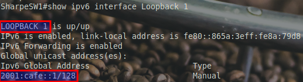
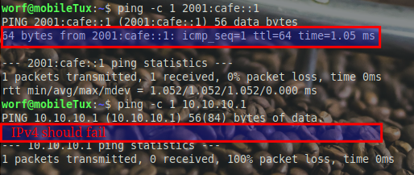
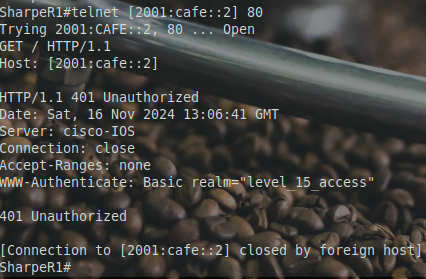

# Improve Management

### Why Use a Loopback Interface for Management and IP Services?

When configuring network devices, using a **loopback interface** for management (such as SSH and HTTP) and IP-based services (like DNS) is a common best practice. Here’s why:

- **Reliability and Availability:** A loopback interface is a **virtual interface** that’s always active as long as the device is running, regardless of the status of physical interfaces. Unlike physical interfaces, which may go down due to link issues or cable disconnections, the loopback interface remains reachable. This provides a stable, consistent IP address for management access.
- **Simplified Management:** Using a loopback interface as the **primary management IP** simplifies network management. You don’t need to track which physical interface IP to use, and this IP won’t change due to topology changes or reconfigurations.
- **Centralized IP for IP Services (DNS, SNMP, etc.):** For services like DNS or SNMP, a loopback interface IP ensures a consistent point of contact for the device, which remains reachable regardless of network changes. This improves reliability for systems that rely on a single IP.
- **Enhanced Security and Simplified Access Control:** Using a loopback interface makes it easier to apply **Access Control Lists (ACLs)**. Rather than configuring access restrictions on multiple physical interfaces, you can apply ACLs to the single loopback IP, which handles all management traffic.
  - **Example**: With the loopback IP, you can create ACLs that allow or restrict access to management services (like SSH or HTTP) in one place. This simplifies access control and reduces the potential for misconfigurations.


## Configurations on C1300 Switch

**Create and Configure Loopback 1**
   ```bash
   interface loopback 1
     ipv6 address 2001:cafe::1/128
     ip address 10.10.10.1 255.255.255.255
   ```

This configuration adds `2001:cafe::1/128` as a stable, easy-to-remember IPv6 address for management on **Loopback 1**. This address will remain reachable as long as the device is active, independent of any physical interface status.





### Test connection on host (Windows or Linux)



---
### 🧠 Why Did IPv4 Fail?

> [!NOTE]
> **Question:** Your Catalyst 1300 is unable to reach 10.10.10.1. What’s causing the issue?
> 
> - [ ] **A.** The IP address of the switch is on a different subnet, and there's no **default gateway** configured to guide the packets.
> - [ ] **B.** **IPv6 unicast routing** is disabled, so the switch won’t attempt to route any traffic.
> - [ ] **C.** The **subnet mask** is misconfigured, so the switch thinks it’s directly connected to 10.10.10.1 when it isn’t.
> - [ ] **D.** Someone forgot to enable **IPv4 routing**, so the switch doesn’t know how to forward packets.

<details>
<summary>👉 <b>Check your answer</b></summary>

**Correct Option: A**

**Feedback:**
- **A:** *Correct!* Without a default gateway, the switch can’t send packets to networks outside its own subnet. IPv4 routing doesn’t need to be enabled for this—it just needs the gateway address.
- **B:** *Not quite!* While **IPv6 unicast routing** does need to be manually enabled for IPv6 to work, this question is about IPv4. Keep thinking!
- **C:** *Close, but no dice!* A misconfigured **subnet mask** can cause issues, but here the problem is the missing default gateway.
- **D:** *Nope!* The Catalyst 1300 automatically handles **IPv4 routing** for packets destined for the default gateway, as long as the gateway is configured.
</details>


---


## Configurations on 2811 Router

### **Enabling the HTTP Server on the Cisco 2811**

By default, the Cisco 2811’s HTTP server is disabled. Follow these steps to enable both the standard and secure HTTP servers:

**a. Access Global Configuration Mode**

**Enter Privileged EXEC Mode:** **`enable`**
**Enter Global Configuration Mode:** **`configure terminal`**

**b. Enable the HTTP Server**

**Enable the Standard HTTP Server:** **`ip http server`**
**Enable the Secure HTTP Server:** **`ip http secure-server`**

**Note:** Although the Cisco 2811's `ip http secure-server` uses older crypto suites that may not be compatible with modern browsers, we are enabling it to allow verification of the HTTP ports using tools like **nmap**.

### Configuring the Loopback Interface on the Cisco 2811

**Configure Loopback Interface with IPv4 and IPv6 Addresses**

- **Access Loopback Interface Configuration**
  ```bash
  interface loopback 1
  ```

- **Configure the IPv4 Address** Assign an IPv4 address to the loopback interface:
  ```bash
  ip address 10.10.10.2 255.255.255.255
  ```
  **Note:** The `/32` (or `255.255.255.255`) subnet mask designates this as a single-host IP address. This means `10.10.10.2` is treated as an individual endpoint.

- **Configure the IPv6 Address** Assign an IPv6 address to the loopback interface:
  ```bash
  ipv6 address 2001:cafe::2/128
  ```
  **Note:** The `/128` prefix ensures the IPv6 address is treated as a unique single interface, just like the `/32` for IPv4.


**Notes:**

- **Loopback1:** Configured with both:

  - **IPv4 Address:** `10.10.10.2/32` (`255.255.255.255` subnet mask) indicates a single-host IP address, ensuring that `10.10.10.2` is treated as an individual endpoint.

  - **IPv6 Address:** `2001:cafe::2/128` ensures that the address is treated as a single unique interface.

**b. Consistency in Interface Numbering**

Even though the Cisco 2811 supports **Loopback0**, we are using **Loopback1** to maintain a standardized interface numbering scheme. This approach aids in easier management and scalability, especially when coordinating configurations across multiple devices.

## Testing the HTTP Server on the Cisco 2811 Using IPv6

**Telnet to the HTTP Server**

- **Establish a Telnet session to the IPv6 loopback interface**:
   **`telnet [2001:cafe::2] 80`**
   **Note:** Use square brackets (`[ ]`) to indicate the IPv6 address when specifying a port number.

- **Send an HTTP GET Request**:
   ```http
   GET / HTTP/1.1
   Host: [2001:cafe::2]
   ```
   **Important:** Press **Enter** twice after typing the command to properly send the request.

- **Observe the HTTP Response**: You should see a response like this:
   ```plaintext
   HTTP/1.1 401 Unauthorized
   Date: <timestamp>
   Server: cisco-IOS
   Connection: close
   Accept-Ranges: none
   WWW-Authenticate: Basic realm="level_15_access"
   ```
   This response indicates that the HTTP server is active and responding, but requires authentication to access its resources.




### **Why Does It Say Unauthorized?**

The `401 Unauthorized` response is expected. It means the HTTP server is running, but authentication is required. The `WWW-Authenticate` header tells you the device is set up to request credentials for **level 15 access**.

**Note:** This is not an error—it’s confirmation that the HTTP server is working as intended.
---

[Prev](04_configuring-dhcp-ipv4.md) | [Home](README.md) | [Next](06_enable-ssh.md)
