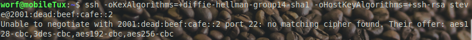
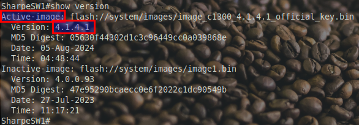

# Enable SSH

## Cisco 2811

### Enabling SSH on a Cisco 2811 Router

To enable SSH on the Cisco 2811 router, follow these steps. Make sure to replace fields with personalized values where indicated.

- **Set a Hostname and Domain Name:** SSH requires a hostname and domain name to generate encryption keys. Use your last name as the domain.
   ```bash
   LastNameR1#configure terminal
   LastNameR1(config)#hostname LastNameR1
   LastNameR1(config)#ip domain-name lastname.com
   ```

- **Generate RSA Encryption Keys:** Create RSA keys for SSH with a key size of 2048 bits for stronger encryption.
   ```bash
   LastNameR1(config)#crypto key generate rsa modulus 2048
   ```

- **Enable SSH Version 2:** Set the router to use SSH version 2, which is more secure than version 1.
   ```bash
   LastNameR1(config)#ip ssh version 2
   ```

- **Configure User Authentication:** Create a local user account with your first name for SSH login.
   ```bash
   LastNameR1(config)#username FirstName privilege 15 secret your_password
   ```

- **Enable SSH on the VTY Lines:** Configure the VTY lines to accept only SSH connections, restricting other access methods.
   ```bash
   LastNameR1(config)#line vty 0 4
   LastNameR1(config-line)#transport input ssh
   LastNameR1(config-line)#login local
   ```

- **Verify SSH Configuration:** Exit configuration mode and verify that SSH is enabled and working.
   ```bash
   LastNameR1#show ip ssh
   ```
## 2811 Test connection

[2811 is End Of Life](https://www.cisco.com/c/en/us/products/collateral/routers/2800-series-integrated-services-routers-isr/eos-eol-notice-c51-735924.html)

### Connecting to the Cisco 2811 Router Using SSH in a Linux VM

**Step 1: Attempt to Connect Using SSH**
   In your Linux virtual machine, try connecting to the router using SSH with the following command. Replace `FirstName` with your assigned username and use the correct IP address for the router (in this example, `2001:dead:beef:cafe::2`):
   ```bash
   ssh FirstName@2001:dead:beef:cafe::2
   ```
**Expected Error: Key Exchange Compatibility Issue**
   When you try to connect, you’ll likely see an error message similar to this:


- **Explanation of the Error**: This error occurs because the SSH client on your modern Linux system cannot find a **compatible key exchange algorithm** with the router. The Cisco 2811 router is using older algorithms like `diffie-hellman-group14-sha1`, which are considered outdated and are disabled by default on newer SSH clients due to security concerns.

**Attempt 2: Add Support for Older Key Exchange Algorithms**
   To connect, lets try to allow these older key exchange algorithms in our SSH command:
   ```bash
   ssh -oKexAlgorithms=+diffie-hellman-group14-sha1 -oHostKeyAlgorithms=+ssh-rsa FirstName@2001:dead:beef:cafe::2
   ```



- **Expected Error: Key Exchange Compatibility Issue**
  When you first tried to connect without specifying options, you likely saw an error indicating that the **key exchange method** was incompatible, followed by another error about **unsupported ciphers**.

  **Explanation of the Errors**: The Cisco 2811 router uses older key exchange algorithms and ciphers that modern SSH clients disable by default for security reasons. These include `diffie-hellman-group14-sha1` for key exchange and **CBC ciphers** like `aes128-cbc`. Since modern SSH clients prioritize stronger encryption, we need to explicitly enable these older algorithms to connect.

**Solution: The Complete Command to Connect**
   To establish the SSH connection, we used the following command:
   ```bash
   ssh -oKexAlgorithms=+diffie-hellman-group14-sha1 -oHostKeyAlgorithms=+ssh-rsa -oCiphers=+aes128-cbc,3des-cbc,aes192-cbc,aes256-cbc FirstName@2001:dead:beef:cafe::2
   ```
   - `-oKexAlgorithms=+diffie-hellman-group14-sha1`: Enables an older key exchange method.
   - `-oHostKeyAlgorithms=+ssh-rsa`: Allows the SSH client to use the RSA algorithm supported by the router.
   - `-oCiphers=+aes128-cbc,3des-cbc,aes192-cbc,aes256-cbc`: Enables the CBC ciphers supported by the router.

- **Explanation of the Solution**: Each part of this command temporarily allows the older protocols and ciphers needed to connect to the router. These options help us work around compatibility limitations due to the device’s age.
### Why This Solution Was Necessary: Legacy Hardware and Modern Security Standards

The Cisco 2811 router was introduced two decades ago and went **end-of-life in 2016**. Over the years, many security vulnerabilities have been discovered in SSH protocols, and the strongest encryption the 2811 supports has since been deprecated.

Since modern SSH clients have removed support for these older algorithms and ciphers, this workaround helps you connect to legacy devices. This exercise highlights the balance between connecting to older equipment and maintaining security standards—a valuable learning experience for real-world network management.

## SSH on Catalyst 1300

### Enabling SSH on the Cisco Catalyst 1300

The Cisco Catalyst 1300 switch simplifies SSH setup by automatically generating a pair of RSA keys upon factory reset. This means SSH is essentially ready to go out-of-the-box, without the need for manual key generation. However, it’s important to note that the Catalyst 1300 does not allow customization of key size or type, so the default settings are fixed.

Steps to Enable SSH

- **Enter Global Configuration Mode:** Start by accessing the Catalyst 1300 switch and entering configuration mode:
   ```bash
   enable
   configure terminal
   ```
- **Enable the SSH Server:** To turn on the SSH server functionality and allow SSH connections, enter:
   ```bash
   ip ssh server
   ```
- **Enable Password Authentication:** Ensure that password-based authentication is enabled for SSH sessions:
   ```bash
   ip ssh password-auth
   ```
   This setting allows you to log in using the configured username and password.

- **Create a User for SSH Login:** Create a new user account using your **first name** with privilege level 15 and a password:
   ```bash
   username FirstName privilege 15 password Don'tpanic
   ```
   Replace `FirstName` with your actual first name. The password is set to `Don'tpanic` to keep things consistent.
### Important Insights about SSH and RSA Keys on the Catalyst 1300

**Automatic RSA Key Generation**: Upon initial setup or after a factory reset, the Catalyst 1300 automatically generates RSA keys. This allows SSH access without the need for the `crypto key generate rsa` command.

**No Options for Key Customization**: The Catalyst 1300 has no settings to adjust key size, type, or encryption algorithms. The device uses a fixed RSA key size and type with no ability to switch to newer key types (like ECDSA or ED25519). This limitation reflects the Catalyst 1300’s focus on simplicity and small-to-medium business use rather than extensive security customization.

**Regenerating RSA Keys**: If you re-run the `crypto key generate rsa` command, it will overwrite the existing RSA keys. This process can disrupt ongoing SSH sessions and may cause SSH clients to prompt for reauthorization of the device, as the SSH fingerprint will change. Only regenerate keys if absolutely necessary.

After completing the SSH configuration on the Catalyst 1300, you may notice that even though this is a "modern" switch, it still requires a **manual downgrade of cipher-suites** to establish an SSH connection. Despite being new, the Catalyst 1300 uses older SSH encryption standards that aren’t compatible with default settings on modern SSH clients, such as those in Linux.

To connect, you’ll need to adjust the cipher-suite settings on your SSH client. Use the following command:

`ssh -oHostKeyAlgorithms=+ssh-rsa FirstName@2001:cafe::1 `

### Explanation

**Why This is Necessary**: The Catalyst 1300’s SSH implementation relies on older algorithms like `ssh-rsa`, which are no longer default in modern SSH clients due to updated security practices. As a result, your SSH client needs explicit instructions to enable these older algorithms.

**Command Breakdown**:

  - `-oHostKeyAlgorithms=+ssh-rsa`: This option tells your SSH client to allow the `ssh-rsa` algorithm for this session, making it compatible with the switch’s SSH configuration.

  - `FirstName@2001:cafe::1`: Replace `FirstName` with your actual SSH username and `2001:cafe::1` with the IP address of the Catalyst 1300.

This workaround may seem unexpected for a new device, but it’s a reflection of the Catalyst 1300’s focus on simplicity and basic compatibility rather than support for the latest cryptographic standards. By using this command, you’ll be able to securely access the Catalyst 1300, even with its older SSH settings.
## Firmware version



If you end up on a C1300 that Steve upgraded, you're golden. It has the latest cipher-suites :-)

## SSH Public Key Authentication on the Catalyst 1300

It seems that setting up SSH public keys for users via the CLI on the Catalyst 1300 is either unsupported or undocumented. After extensive searching, I was unable to find a way to achieve this using CLI commands.

However, Cisco provides a helpful **video tutorial** that walks through configuring SSH public key authentication using the **GUI interface**. You can follow along here:

[How to Configure SSH Public Key Authentication on Catalyst 1300](https://video.cisco.com/detail/video/6362214127112)


### What You’ll Learn in the Video:

- Accessing the Catalyst 1300's web-based GUI.
- Navigating to the SSH configuration section.
- Uploading and assigning public keys for specific users.


Since the GUI appears to be the only documented method for configuring public key authentication on the Catalyst 1300, this will be the approach for setting it up for key-based authentication. The CLI may be limited in this area due to the device’s focus on simplified operations.
---

[Prev](05_improve-management.md) | [Home](README.md) | [Next](07_routing-unidirectional.md)
