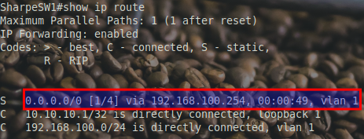
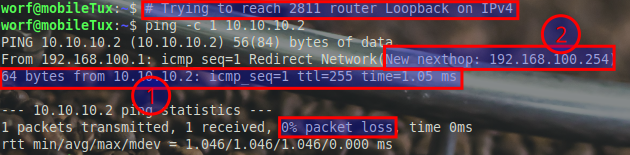
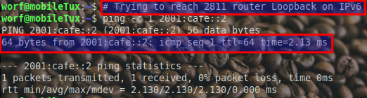

# Routing: Unidirectional

## Selecting the boss

**The Evolution of Network Design**

As organizations expand, their network infrastructures become increasingly complex. Efficient methods to manage and segregate network traffic become essential. One fundamental concept in modern networking is the use of **Virtual Local Area Networks (VLANs)**. VLANs allow network administrators to partition a physical network into multiple isolated logical networks. This segmentation enhances security, improves performance, and simplifies network management.

**The Challenge of Inter-VLAN Communication**

While VLANs provide numerous benefits, they introduce a significant challenge: **inter-VLAN communication**. Devices on different VLANs cannot communicate directly because each VLAN functions as a separate broadcast domain. To enable communication between these VLANs, a routing mechanism is required. Traditionally, this is where the **Router on a Stick (ROS)** design comes into play.

---
### 🧠 Knowledge Check

> [!NOTE]
> **Question:** What is going to be the **best** default gateway?
> 
> - [ ] **A.** Set the IP 192.168.100.254 as the Cisco 2811 is the **core** router.
> - [ ] **B.** Set the IP 192.168.100.1 as this the **SVI** to the C1300

<details>
<summary>👉 <b>Check your answer</b></summary>

**Correct Option: B**

**Feedback:**
- **A:** It would work, but would incur a performance penalty due to Router On a Stick.
- **B:** *Correct!* Cisco advertises the C1300 as capable of routing at **wire speeds**. The Cisco 2811 cannot come even remotely close to that kind of routing speeds for inter-vlan routing.
</details>

---


**Introducing Router on a Stick (ROS)**

**Router on a Stick** is a network design where a single physical or logical router interface handles traffic between multiple VLANs. Here's how it typically works:

- **Trunk Link**: A trunk link connects the switch, which hosts multiple VLANs, to the router. This trunk carries traffic from all the VLANs.

- **Subinterfaces**: On the router, the single physical interface is divided into multiple subinterfaces, each corresponding to a different VLAN.

- **Routing Traffic**: When a device on one VLAN needs to communicate with a device on another VLAN, the traffic is sent to the router via the trunk link. The router processes the traffic and routes it back down the trunk to the appropriate VLAN.

While ROS is effective in environments with limited VLANs and low traffic volumes, it introduces several inefficiencies in more demanding network scenarios.

**The Catalyst 1300 Switch Enters the Scene**

With advancements in network hardware, switches like the **Cisco Catalyst 1300** have emerged, offering enhanced capabilities beyond traditional switching. One standout feature of the Catalyst 1300 is its **wire-speed routing** capability. This means the switch can handle routing between VLANs internally at speeds matching its switching performance (e.g., gigabit speeds) without relying on an external router.

**Why Router on a Stick Falls Short with Catalyst 1300**

Leveraging the Catalyst 1300's internal routing capabilities offers significant advantages over the traditional ROS approach:

- **Avoiding Bottlenecks**: In ROS, all inter-VLAN traffic must traverse the router's single trunk interface, creating a potential bottleneck limited to that interface's speed (e.g., 1 Gbps). In contrast, the Catalyst 1300 can route traffic internally at wire-speed, eliminating this chokepoint.
- **Reducing Latency**: Since ROS requires traffic to exit the switch, be processed by the router, and then return to the switch, it introduces additional latency. The Catalyst 1300's internal routing streamlines this process, minimizing delays.
- **Optimizing Bandwidth**: With ROS, the single trunk link's bandwidth becomes a limiting factor for inter-VLAN traffic. The Catalyst 1300 can handle multiple VLANs simultaneously without constraining throughput to a single link's capacity.


You already have a DHCP pool named `VLAN1_POOL` configured with the excluded addresses and network. Now, follow these steps to add the default gateway for devices in VLAN 1.

**1. Access the Existing DHCP Pool**

Enter the DHCP pool configuration mode for `VLAN1_POOL`:
```bash
ip dhcp pool VLAN1_POOL
```

**2. Set the Default Gateway**

Specify the default gateway (default router) for the devices in VLAN 1. Use the IP address of the Catalyst 1300’s VLAN 1 interface:
```bash
default-router 192.168.100.1
```

**3. Exit**
```bash
exit
```

**Verification**

To ensure the default gateway is correctly applied:

### **Check DHCP Pool Configuration with Default Gateway**

Run this command:
**`show running-config | section ip dhcp pool`**

**What This Displays**

This will show the configuration of your DHCP pool, including the `default-router` (default gateway) setting, like this:
```plaintext
ip dhcp pool VLAN1_POOL
 network 192.168.100.0 255.255.255.0
 default-router 192.168.100.1
```


- **Test DHCP on a Device**:

  - Connect a device in VLAN 1 and verify it receives the correct default gateway (192.168.100.1).


This Linux screenshot has two default routes because I am connected both to this lab network and eduroam over wireless.


## Testing route


### **Round 1: Pinging the C1300 (Successful Tests)**

- **IPv6 Ping**:
   **`ping -c 1 2001:cafe::1`**
   **Expected Output**: Success
   - This works because `2001:cafe::1` is the IPv6 loopback address of the directly connected Catalyst 1300.

- **IPv4 Ping**:
   **`ping -c 1 10.10.10.1`**
   **Expected Output**: Success
   - Similarly, `10.10.10.1` is the IPv4 loopback address of the directly connected Catalyst 1300.


## Round 2: Pinging the 2811 Router (Failed Tests)

**Explanation of Results**

Based on the routing tables and the configuration of the Catalyst 1300 (`LastNameSW1`), the failed pings to the 2811 router are entirely expected. Let’s analyze why:


**IPv6 Routing Table on Catalyst 1300**

```plaintext
C> 2001:cafe::1/128 [0/0] via :: loopback1
C> 2001:dead:beef:cafe::/64 [0/0] via 2001:dead:beef:cafe::1 VLAN 1
```

- The **Catalyst 1300** only has routes for:
  - `2001:cafe::1/128` (the IPv6 loopback address of the switch itself).
  - `2001:dead:beef:cafe::/64` (the directly connected VLAN 1 subnet).

- **No Default Route:** The routing table does not contain a default route (`::/0`), nor is there a static route to `2001:cafe::2`. Without a route, the switch does not know how to forward packets destined for this address.

- **Ping Output:**
  **`From 2001:dead:beef:cafe::1 icmp_seq=1 Destination unreachable: No route`**
  This confirms that the switch cannot find a route for `2001:cafe::2`.


**IPv4 Routing Table on Catalyst 1300**

```plaintext
C 10.10.10.1/32 is directly connected, loopback 1
C 192.168.100.0/24 is directly connected, vlan 1
```

- The **Catalyst 1300** only has routes for:
  - `10.10.10.1/32` (the IPv4 loopback address of the switch itself).
  - `192.168.100.0/24` (the directly connected VLAN 1 subnet).

- **No Default Route:** The routing table does not contain a default route (`0.0.0.0/0`), nor is there a static route to `10.10.10.2`. As with IPv6, the switch cannot forward packets to an unknown destination.

- **Ping Output:**
  **`1 packets transmitted, 0 received, 100% packet loss`**
  This indicates the Catalyst 1300 does not have a route to `10.10.10.2`.

## Configuring Default Routes on the Catalyst 1300

### IPv4 Default Route Configuration

- **Set the IPv4 Default Route** Use the global unicast address of the Cisco 2811 router as the next hop for IPv4 traffic:
  ```bash
  ip route 0.0.0.0 0.0.0.0 192.168.100.254
  ```

- **Verify the Configuration** After configuring the default route, verify it using:
  **`show ip route`**





### **Ping Test to the 2811 Router's Loopback**

The screenshot above shows a successful ping to the 2811 router's IPv4 loopback address (`10.10.10.2`). However, there's an **ICMP Redirect** message indicating a "New nexthop" of `192.168.100.254`.

### IPv6 Default Route Configuration

- **Set the IPv6 Default Route** Specify the default route (`::/0`) and the link-local address of the next-hop router (`fe80::1`) with the correct interface ID (`Vlan1`):
  ```bash
  ipv6 route ::/0 fe80::1%Vlan1
  ```

- **Verify the Configuration** Verify the IPv6 routing table:
  **`show ipv6 route`**




### **Why Link-Local Addresses are Best Practice for Next Hops**

**Scope Limitation**

  - **IPv6 Link-Local Addresses** (`fe80::/10`) are confined to a single link. This ensures that the next-hop is always reachable on the directly connected interface, regardless of changes to the global unicast addressing scheme.

  - This provides stability since link-local addresses are automatically assigned to every IPv6-enabled interface and remain consistent even if the global unicast addresses are changed.

**Automatic Configuration**

  - Link-local addresses are automatically configured on every IPv6-enabled interface. This eliminates the need for additional address configuration and ensures there is always a functional address for routing between directly connected devices.

**Protocol Independence**

  - Many routing protocols, such as OSPFv3 and EIGRP for IPv6, use link-local addresses to communicate between neighbors. This consistency aligns with best practices in IPv6 network design.

**Simplified Troubleshooting**

  - When using link-local addresses for next-hop configuration, routing issues are easier to isolate. Since link-local addresses are unique per link, there is no ambiguity about which interface is being used for routing.

**Avoiding Dependency on Global Unicast Addresses**

  - While IPv6 does not face an address shortage, relying on global unicast addresses for next-hop routing introduces unnecessary dependencies. For instance, renumbering global IPv6 addresses (e.g., during network redesigns) can break next-hop configurations. Using link-local addresses avoids this issue entirely.

**Interoperability**

  - Using link-local addresses ensures compatibility across devices and vendors, as the practice is widely supported and standardized in IPv6 networking.
---

[Prev](06_enable-ssh.md) | [Home](README.md) | [Next](08_routing-bidirectional.md)
