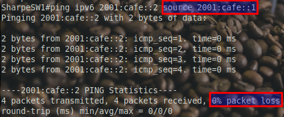
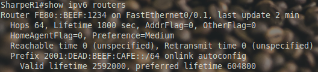
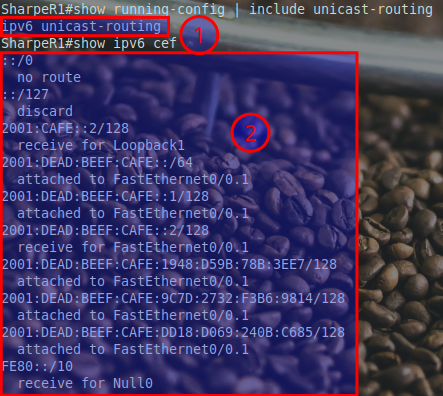

# Routing: Bidirectional

## Testing Bidirectional Routing with Source Binding

### **Testing IPv4**

In this test, we are initiating a **ping** from the Catalyst 1300 switch (C1300) to the Cisco 2811 router (2811) using their respective loopback addresses. However, the **ping failed** with a 100% packet loss. Here's why this test is important and what we're observing:

**What Are We Testing?**

- **Binding the Source IP:**
  - Normally, a ping uses the outgoing interface’s IP address as the source.
  - By binding the **source IP** explicitly to the C1300’s loopback address (**`10.10.10.1`**), we ensure the packets are sent with this specific source IP.
  - Command: **`ping ip 10.10.10.2 source 10.10.10.1`**

- **Why Bind the Source IP?**
  - **Simulating Loopback-to-Loopback Communication:** This ensures we're testing the routing path between two loopback interfaces, which are commonly used for management and testing purposes.
  - **Controlled Testing:** It helps identify if routing is working correctly for specific source-destination pairs. This is especially useful in multi-path networks or when troubleshooting route asymmetry.


**IPv4: Why It Fails Without a Return Path**

Let’s begin with a brain teaser: Why does IPv4 fail in this scenario? The answer lies in **the lack of a return path**.

- IPv4 doesn’t have a built-in mechanism to automatically discover routes like IPv6 does.
- Even though the Catalyst 1300 and the 2811 are directly connected, the 2811 has no knowledge of how to reach the Linux or Windows endpoints on the IPv4 network unless explicitly configured with a static route or a dynamic routing protocol.

To fix this issue:

1. Add a **static route** on the 2811 to reach the C1300’s loopback address (**`10.10.10.1`**):
   ```bash
   ip route 10.10.10.1 255.255.255.255 192.168.100.1
   ```
2. Test the ping again to confirm bidirectional connectivity.


### Testing IPv6

In this test, we are verifying **IPv6 bidirectional routing** by pinging the Cisco 2811 router’s loopback address (`2001:cafe::2`) from the Catalyst 1300 switch’s loopback (`2001:cafe::1`). Unlike the IPv4 test, this one **succeeded** with 0% packet loss. Let’s break down why:




**IPv6: Magic with Router Advertisements**

Now, let’s contrast this with IPv6. After enabling `ipv6 unicast-routing` on the Catalyst 1300, did you notice the “magic”?

- **Endpoints Get a Default Route**: Both the Linux and Windows endpoints automatically received a default route from the Catalyst 1300 via **Router Advertisements (RAs)**.

- **No DHCP Required**: Unlike IPv4, IPv6 doesn’t rely on DHCP to provide a default gateway. The default route came directly from the Catalyst 1300’s RA.

This is one of the powerful features of IPv6—automatic discovery and configuration of routes without needing additional services like DHCP.

### **Observing RAs and Routing Table Changes on the 2811**

1. **Enable Debugging First**
   Before resetting the interface, enable `debug ipv6 nd` to capture the incoming RA in real time:
   ```bash
   LastNameR1#debug ipv6 nd
   ```
   This ensures you don’t miss the RA message, which happens almost immediately after the link comes back up.

2. **Reset the Interface**
   Use one of the following methods to trigger the RA:
   
   **Option A: Shut Down and Re-enable the Interface**
   ```bash
   LastNameR1#configure terminal
   LastNameR1(config)#interface FastEthernet0/0.1
   LastNameR1(config-if)#shutdown
   LastNameR1(config-if)#no shutdown
   ```
   
   **Option B: Physically Unplug and Replug the Cable**
   - Disconnect and reconnect the Ethernet cable to the FastEthernet0/0.1 interface.

3. **Quickly Check the Routing Table**
   RAs are processed rapidly, so as soon as the link is back up:
   - Use the `show ipv6 route` command to capture the routing table **before** the RA is processed:


   - Wait briefly, and then rerun the same command to capture the updated routing table **after** the RA has added the default route:


**Stop Debugging**
Once you’ve captured the debug output, disable debugging to avoid unnecessary system overhead:
```bash
LastNameR1#undebug all
```


### **Pro Tips for Success**

- **Be Quick!** The RA is processed within seconds of the link coming back up. If you miss it, you’ll need to repeat the process.
- **Monitor Timing with Pings:** You can send a continuous ping to an IPv6 address (e.g., the loopback on the Catalyst 1300) while resetting the link. This helps gauge when the RA has been processed based on the success of the pings.
- **Double-Check RA Behavior:** If you don’t see the RA, ensure that the Catalyst 1300 is configured to send RAs on the VLAN interface (`ipv6 unicast-routing` must be enabled).

### show ipv6 routers



The **`show ipv6 routers`** command is used to display information about IPv6 Router Advertisements (RAs) received by the device. This command is particularly useful for:

- **Verifying Router Advertisements (RAs):** It shows which routers are advertising themselves as default gateways. In this case, the Catalyst 1300 (`FE80::BEEF:1234`) is sending RAs to the 2811.
- **Checking Prefix Information:** The command also lists advertised prefixes (e.g., `2001:DEAD:BEEF:CAFE::/64`) and their associated properties, such as:
  - **Onlink:** Indicates that this prefix can be used directly on this network segment.
  - **Autoconfig:** Suggests that devices can use this prefix to configure their IPv6 addresses automatically.
- **Monitoring RA Timers:**
  - **Lifetime:** Indicates how long the default route remains valid without receiving another RA.
  - **Reachable Time & Retransmit Time:** Specifies timing parameters for Neighbor Discovery Protocol (NDP) operations.

### **Why It’s Relevant Here**

This output confirms that:

- **Catalyst 1300 Is Sending RAs:** The link-local address (`FE80::BEEF:1234`) and advertised prefix (`2001:DEAD:BEEF:CAFE::/64`) are being received by the 2811.
- **Default Route Validity:** The `Lifetime` field of 1800 seconds (30 minutes) shows how long the 2811 will keep the advertised default route unless it receives another RA.
- **IPv6 Addressing Behavior:** The advertised prefix allows devices on the network to autoconfigure their IPv6 addresses without the need for DHCPv6.


By using this command, you can verify RA behavior and understand how default routes and prefixes are dynamically propagated in an IPv6-enabled network.

## IPv6 CEF


### What’s up with `no ipv6 cef`?

- The command **`no ipv6 cef`** disables **IPv6 Cisco Express Forwarding (CEF)**.
- CEF is responsible for making IPv6 routing more efficient by using hardware acceleration (instead of relying on slower software processing).
- When CEF is off, the router processes IPv6 packets manually, leading to slower performance and higher CPU usage.
- On older routers like the 2811, IPv6 CEF might be off by default or turned off to conserve resources.

### Turn IPv6 CEF Back On

You can re-enable IPv6 CEF like this:

Get into configuration mode:
**`configure terminal`**

Enable IPv6 CEF:
**`ipv6 cef`**


## ipv6 unicast-routing

### What’s Going on With IPv6 Without `ipv6 unicast-routing`?

When **`ipv6 unicast-routing`** is off, the router behaves more like an **IPv6 host** than an actual router. Here’s what happens:

1. **Limited IPv6 Functionality**:
   - Interfaces can still have IPv6 addresses and use Neighbor Discovery (ND) to communicate with devices on the same network.
   - The router can process **local traffic** (e.g., pings to its own IPv6 addresses) and manage directly connected routes (you'll see them in the routing table).
   - However, the router won’t:
     - Route IPv6 traffic between interfaces.
     - Generate Router Advertisements (RA) to share IPv6 routes.
     - Participate in IPv6 multicast groups designed for routers.

2. **Why You Saw Known Routes and Traffic Working**:
   - The magic you saw earlier was from the **Catalyst 1300** injecting static routes into the 2811 via RAs (Router Advertisements).
   - This worked because the 2811 acted as an IPv6 host and listened for RAs, accepting the injected routes. However, the 2811 wasn’t actively behaving as a router—more like a “listener.”

### What Happens When We Enable `ipv6 unicast-routing`?

By turning on **`ipv6 unicast-routing`**, the router changes behavior:

**Becomes an IPv6 Router**:
- It will participate in IPv6 multicast groups meant for routers.
- The 2811 will start sending **Router Advertisements (RAs)** to advertise routes to other IPv6 devices in the network.
- It can route IPv6 traffic between its interfaces and forward packets beyond its local network.

**Why We Waited Until Now**:
We left this “magic” disabled from the start to focus on IPv6 fundamentals. By not enabling automatic route injection and other automated behavior, we had more control over the learning process.


### Turning on IPv6 Unicast Routing and CEF

Here’s how to turn IPv6 unicast routing and CEF on:

**Enter Configuration Mode**:
**`configure terminal`**

**Enable IPv6 Unicast Routing**:
**`ipv6 unicast-routing`**
This tells the router to behave as an IPv6 router, not just a host.

**Enable IPv6 CEF**:
**`ipv6 cef`**
This re-enables Cisco Express Forwarding for IPv6 traffic, ensuring efficient packet forwarding.

## Verification



To confirm everything is working:

1. **Check if IPv6 Unicast Routing is Enabled**:
   **`show running-config | include ipv6 unicast-routing`**
   - You should see the `ipv6 unicast-routing` command in the output.

2. **Verify IPv6 CEF**:
   **`show ipv6 cef`**
   - Look for CEF entries for IPv6 prefixes, showing the router is forwarding IPv6 traffic efficiently.

---

[Prev](07_routing-unidirectional.md) | [Home](README.md) | [Next](09_wan-connection.md)
