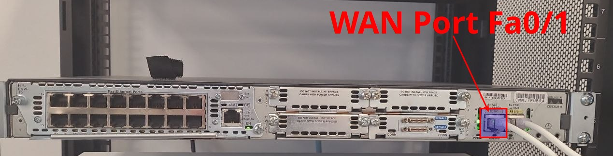

# WAN Connection

## Connecting to the WAN

You’ll be using the coupler to extend the length of the Ethernet cable, allowing it to connect to the FastEthernet 0/1 (Fa0/1) port on the Cisco 2811 router, which will serve as the WAN interface.


1. **Locate the Existing Ethernet Cable:** Find the Ethernet cable that is currently plugged into your workstation.

2. **Use the Coupler to Extend the Cable**
   - **Connect the Cable to the Coupler:** Unplug the Ethernet cable from your workstation and plug it into one side of the coupler.
   - **Add an Extension Cable:** Take a second Ethernet cable and plug one end into the other side of the coupler.

3. **Connect to the Cisco 2811 WAN Port (Fa0/1):** Plug the other end of the second Ethernet cable into the **FastEthernet 0/1 (Fa0/1)** port on the back of the Cisco 2811 router. Refer to the labeled photo provided for the exact port location.



### **Configuring FastEthernet0/1 for CCN Network and Testing DNS**

### **1. Configure FastEthernet0/1 to Obtain an IP Address**

We will configure the **FastEthernet0/1** interface on the Cisco 2811 router to obtain an IP address via DHCP from the college’s CCN network (VLAN 172).

**Steps for Configuration**

- **Access the Interface Configuration Mode:**
   ```bash
   LastNameR1(config)# interface FastEthernet0/1
   ```

- **Set the Interface to Use DHCP:** Configure the interface to dynamically obtain an IP address from the college’s DHCP server:
   ```bash
   LastNameR1(config-if)# ip address dhcp
   ```

- **Bring the Interface Online:** Enable the interface to ensure it is operational:
   ```bash
   LastNameR1(config-if)# no shutdown
   ```

- **Verify the Configuration:** Check if the interface has successfully obtained an IP address:
   ```bash
   LastNameR1# show ip interface brief
   ```
   Confirm that an IP address from the CCN network (VLAN 172) is assigned to **FastEthernet0/1**.


### **2. Verification and Testing**

**2.1. Verify IPv4 Connectivity**

- **Ping a Public IPv4 Address**

  - Test IPv4 connectivity by pinging a public IP address, such as `199.166.6.2`:

`LastNameR1# ping 199.166.6.2 `

  - **Expected Outcome:** The ping should succeed, verifying that the router has IPv4 connectivity to the outside network.

**2.2. Verify DNS Resolution**

- **Ping by Domain Name**

  - Test DNS resolution by pinging a domain name, such as `www.google.com`:

`LastNameR1# ping www.google.com `

  - **Expected Outcome:**

    - The router successfully resolves the domain name.

    - However, the router prioritizes the **AAAA record** (IPv6 address) over the **A record** (IPv4 address).

If IPv6 routing isn’t functional, the ping will fail, even though DNS resolution was successful.

​​​​​​**3. Why DNS Over IPv6 May Fail**

**DNS Record Types**

**A Record**

  - Maps a domain name to an IPv4 address (e.g., `199.166.6.2`).

  - Used for communication over IPv4.

**AAAA Record**

  - Maps a domain name to an IPv6 address (e.g., `2606:4700:4700::1111`).

  - Used for communication over IPv6.

**Why the Router Prioritizes IPv6**

- When both IPv4 and IPv6 are enabled, the router queries both **A** and **AAAA records** from the DNS server.

- Modern standards prioritize IPv6 (AAAA) over IPv4 (A), assuming IPv6 is preferred for communication.

- **Issue:** The CCN network does not support IPv6, so any attempt to use the AAAA record will fail.

**Future Solution**

- To address this limitation:

  1. We will disable IPv6 on the WAN interface (**FastEthernet0/1**) in a future step.

  1. Later, we will configure a routable IPv6 address block using Cloudflare.

### **4. Why IPv6 Is Causing Problems**

When IPv6 is enabled on the router:

- **FastEthernet0/1** assumes it can route IPv6 traffic.

- However, the CCN network doesn’t support IPv6, leading to failed attempts when the router tries to use an IPv6 AAAA record.

By disabling IPv6 on **FastEthernet0/1**, we will ensure the router only relies on IPv4 for external communication.

## Standard Access Lists: Numbered vs Named

**What is an Access Control List (ACL)?**

An Access Control List is a set of rules applied to network traffic to control or define what packets can pass through a device. ACLs are a fundamental feature in Cisco devices and come in two main types:

- **Standard ACLs:** Focus on filtering based solely on **source IP addresses**. Simple and efficient, but lack granularity.
- **Extended ACLs:** Allow filtering based on multiple parameters (e.g., source/destination IP, protocol, port numbers). Not covered yet—we’ll introduce these later.

**Why Use a Named ACL?**

While Cisco supports both **numbered** and **named** ACLs, named ACLs offer the following advantages:

- **Descriptive Names:** A name like `NAT_TRAFFIC` is easier to understand than a number like `10`.
- **Easier Management:** Named ACLs are simpler to edit and organize in complex configurations.

In this example, we will configure a **named standard ACL** to define traffic for Network Address Translation (NAT).

Create a **named standard ACL** called `NAT_TRAFFIC`:
**`ip access-list standard NAT_TRAFFIC`**

Permit traffic for NAT translation (e.g., all traffic from the **192.168.100.0/24** network):
**`permit 192.168.100.0 0.0.0.255`**

**Verify the ACL:**
**`show access-lists NAT_TRAFFIC`**

You should see an entry like:
```plaintext
Standard IP access list NAT_TRAFFIC 10
 permit 192.168.100.0, wildcard bits 0.0.0.255
```

**Apply the ACL for NAT:** Now that we’ve created the **NAT_TRAFFIC** ACL, we’ll use it to define the traffic eligible for Network Address Translation (NAT).


### **Steps to Configure NAT Using the ACL**

1. **Enter NAT Configuration Mode:**
   ```bash
   LastNameR1(config)# ip nat inside source list NAT_TRAFFIC interface FastEthernet0/1 overload
   ```
   - `inside source list NAT_TRAFFIC`: Specifies the **ACL** (`NAT_TRAFFIC`) to match interesting traffic for NAT.
   - `interface FastEthernet0/1`: Identifies the **WAN interface** where traffic will be translated.
   - `overload`: Enables **PAT (Port Address Translation)**, which allows multiple devices to share a single public IP.

2. **Mark Interfaces for NAT:**
   Assign the **inside NAT** role to the LAN-facing interface:
   ```bash
   LastNameR1(config)# interface FastEthernet0/0.1
   LastNameR1(config-if)# ip nat inside
   LastNameR1(config-if)# exit
   ```
   Assign the **outside NAT** role to the WAN-facing interface:
   ```bash
   LastNameR1(config)# interface FastEthernet0/1
   LastNameR1(config-if)# ip nat outside
   LastNameR1(config-if)# exit
   ```


### **Verify NAT Configuration**

1.

Check the NAT configuration:

 `LastNameR1# show ip nat translations`


**Important:** NAT entries will only appear after traffic matching the ACL (`NAT_TRAFFIC`) is generated.

 

After running `show ip nat translations` and generating traffic, your output might look like this:

`Pro Inside global Inside local Outside local Outside global

udp 172.16.0.1:12345 192.168.100.10:53 199.166.6.2:53 199.166.6.2:53

icmp 172.16.0.1:3 192.168.100.10:3 199.166.6.2:3 199.166.6.2:3 `

Here’s what each column means:

- **Inside local:** The private IP of the internal host (e.g., `192.168.100.10`).

- **Inside global:** The public IP used by the router for NAT (e.g., `172.16.0.1`).

- **Outside local/global:** The destination IP (e.g., `199.166.6.2`).

You’ll be using the coupler to extend the length of the Ethernet cable, allowing it to connect to the FastEthernet 0/1 (Fa0/1) port on the Cisco 2811 router, which will serve as the WAN interface.


**Generate Test Traffic:**

From a client device on the LAN (e.g., your Linux VM), generate traffic that matches the NAT ACL.

For example:

`traceroute 199.166.6.2 -n`

This tests connectivity to **Execulink's nameserver (199.166.6.2)** and generates NAT activity.

**Monitor NAT in Real-Time (Optional):**

Enable NAT debugging to observe translations as they occur:

**Caution:** Debugging generates a lot of output and can impact performance. Use it sparingly and **make sure to turn it off when you're done.**

`LastNameR1# debug ip nat `

To disable debugging, run:

`LastNameR1# undebug all `

Or simply:

`LastNameR1# u all`
---

[Prev](08_routing-bidirectional.md) | [Home](README.md) | [Next](10_dns.md)
