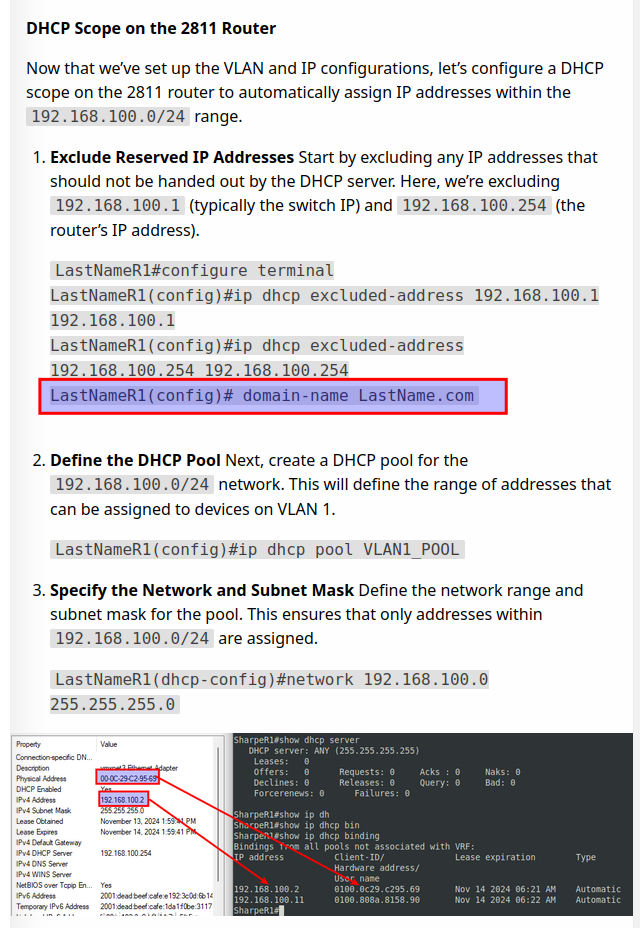

# Changelog

2024

### November 14

For the subinterface fa0/0.1

we added the global IPv6 address 2001:dead:beef:cafe::2/64

## November 25

Added domain-name to DHCP scope
---

[Prev](10_dns.md) | [Home](README.md)
