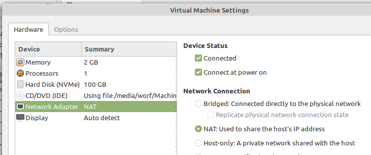
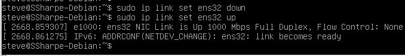
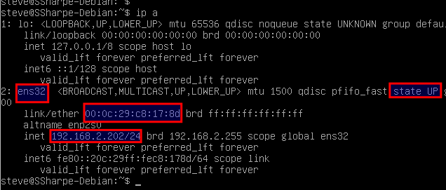
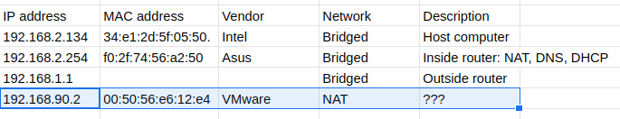
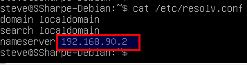
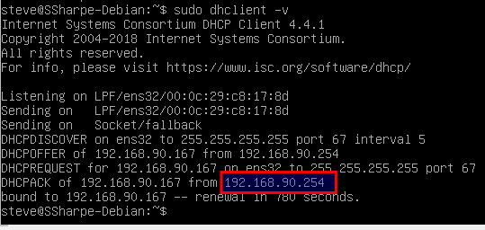
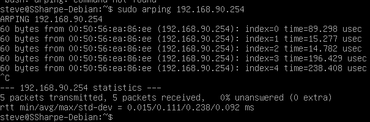
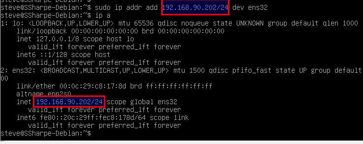
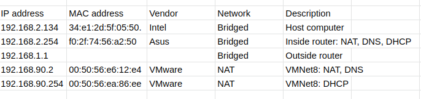

# Live tools: iproute2

This is the modern tool for interacting with Linux networking.

Change your VM network to NAT

To completely reset the adapter, let's turn the adapter OFF then back ON:

- To turn off the adapter: **`sudo ip link set ens32 down`**
- To turn on the adapter: **`sudo ip link set ens32 up`**

The command to view layer 2 & 3 address is **`ip address`** (or **`ip a`** for short) and layer 2 only is **`ip link`**, which is also how we set the status of the adapter (up or down).

Run **`ip a`** to view your adapter information.

In my example I still have the old IP. I didn't actually release correctly. To get rid of it we can manually run the release/renew.

- Release with: **`sudo dhclient -r`**
- Renew with: **`sudo dhclient`**

As before, if you wait past a minute, ARP should be clear. Test this by looking at the ARP cache with **`ip neighbor`** (or **`ip n`** for short).

Now that you've confirmed it's blank run a short ping making sure to only send two pings with -c 2 as before.

After pinging let's look at the results.

I have one entry 192.168.90.2. What is it? Lookup the mac address in my case it's 00:50:56:e6:12:e4.  You may have multiple entries, that's totally OK.

Populate your spreadshet with what you currently know. Remember to change the network in your spreadsheet for this entry to NAT.

Let's check our route with **`ip route`** (or **`ip r`** for short).

The top line reads "send all traffic you don't know about" (the definition of a default route) to `192.168.90.2` over device `ens32`. Turns out it's a router! Albeit a virtual one. Update your spreadsheet description to say `VMNet8: NAT`.

Now figure out who handles DNS

Looks like it handles DNS too! So add that your list.

Last up is DHCP. Best way is to use **`dhclient`** with the verbose option (**`-v`**).

First remember to release the IP; if you forget, look back through this lab. Now renew, but this time with verbose output: **`sudo dhclient -v`**.

Turns out `192.168.90.254` is the DHCP server! So you'll need a new line in your spreadsheet for this. The description would be `VMNet8: DHCP`.

Next we need to figure out the MAC, then you can search the vendor. To force an ARP, you could simply ping `192.168.90.254`, then break with **`CTRL+C`** to get the following result.

We get the MAC address `00:50:56:ea:86:ee`, however there is another tool we can use called **`arping`**. Run **`sudo apt install arping`**, then try **`sudo arping 192.168.90.254`**.

Next we're going to be setting a static IP, but prior to that make sure to release your current IP using **`dhclient`**. To set a static IP, the syntax is **`sudo ip addr add IP/CIDR dev [interface name]`**.

Example: **`sudo ip addr add 192.168.90.202/24 dev ens32`**

## **Screen shot 1 Your completed spreadsheet**

---
[Prev](03_live-tools-net-tools.md) | [Home](README.md) | [Next](05_legacy-networking.md)
