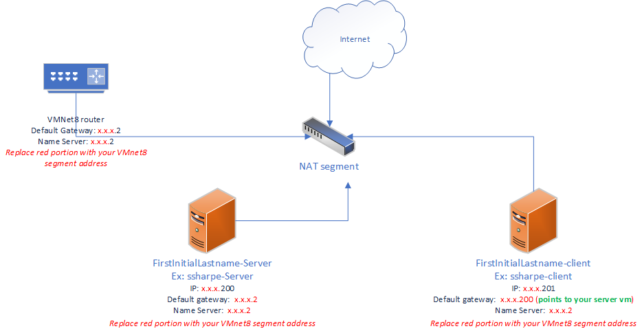

# Topology

This topology diagram outlines the final goal: one server virtual machine acting as a router with an external connection to the NAT segment, and one client virtual machine connected to the server.

---
[Prev](01_evaluation.md) | [Home](README.md) | [Next](03_cloning.md)
