# Cloning

## Preparing

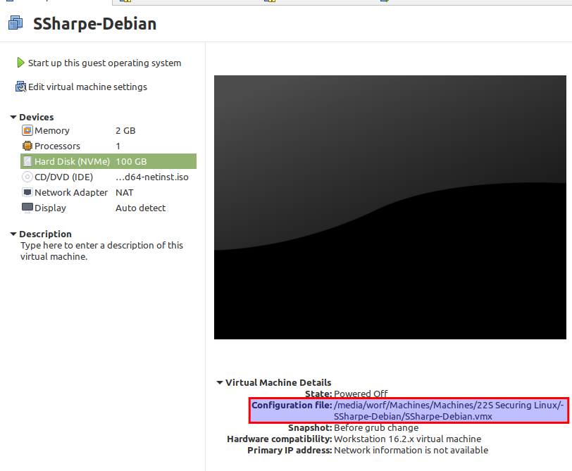

Start by locating where your VM is and verify you're able to actually find it. In my example, `/media/worf/Machines/Machines/22S Securing Linux/SSharpe-Debian/` is the location; the last part is the **`.vmx`** file which describes the hardware.

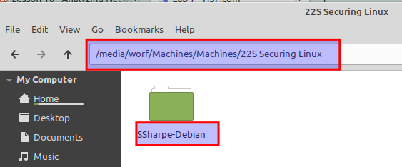

Confirm you can find the VM in your file explorer.

> [!NOTE]
> Your location will be a drive letter (C:, D:, etc.) followed by your specific path.

**Close VMware completely** before proceeding to the next step.

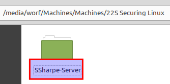

Rename the folder from `FirstInitialLastName-Debian` to `FirstInitialLastName-Server`.

Re-open VMware Workstation.

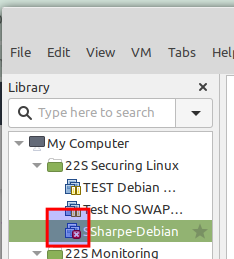

You'll now see a red **X** by your virtual machine. Right-click the VM and select **Remove**.

Select **File > Open** in VMware. Navigate to that **`.vmx`** file and open it.

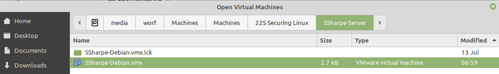

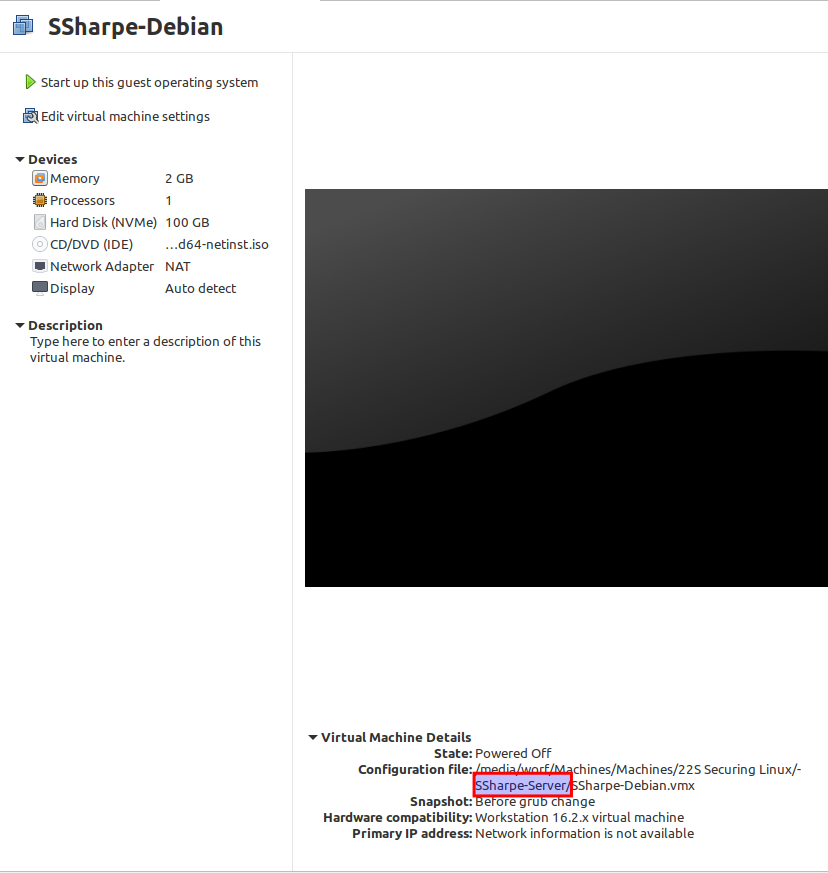

When you open the VM, the location should now be updated. It's completely fine that the **`.vmx`** still has the old filename.

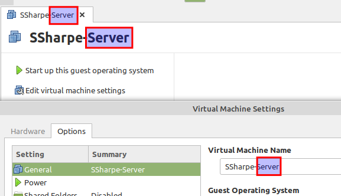

Go to the **Options** tab in the virtual machine settings and update the VM name from `Debian` to `Server`.

## Cloning

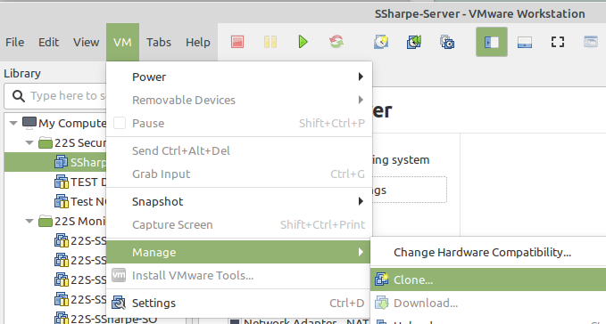

Select to clone by going **VM > Manage > Clone**.

When cloning, you can clone an existing snapshot that is powered off or the current state of the machine. In my example, I do not have any powered-off snapshots so I'll be selecting the **current state** of the virtual machine.

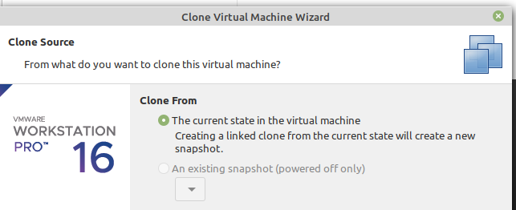

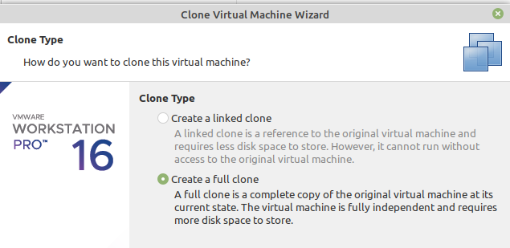

Linked Clones can save disk space; however, for simplicity, we'll be creating a **Full Clone**.

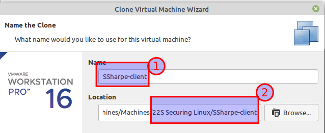

- **Step 1:** Set the correct name first.
- **Step 2:** Click **Browse** to the location where you store VMs for this course.

If you do it in this order, it will automatically populate the correct subdirectory for your new clone.

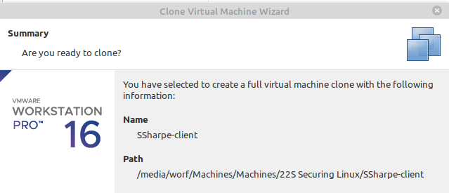

It will take a moment for your computer to copy the contents.  Once finished you should now have a new tab with the virtual machine's new name.

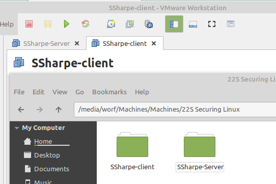

Verify that the directories are both where you expect them to be and that they are correct.

Cloning should always generate new MAC address but I have seen it miss the generation step. Verify that the two NICs have different MAC addresses.

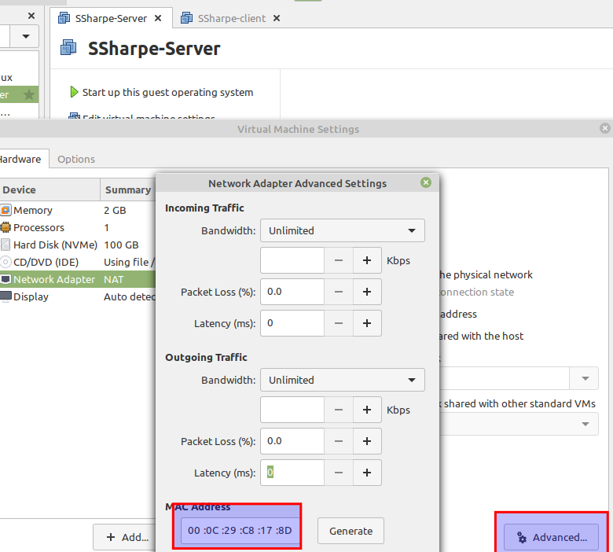

MAC address for my server is **00:0C:29:C8:17:8D**

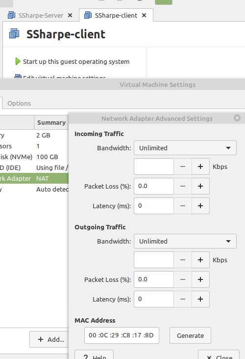

uh-oh! Both the server and client have the same MAC address.

Take a deep breath and** change nothing.**

Simply** start your client computer.**

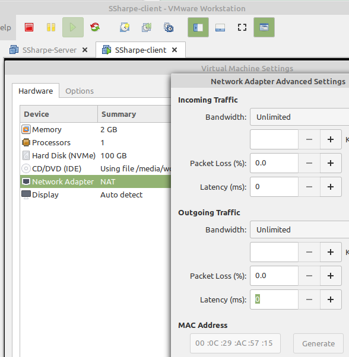

MAC address regenerated on start up.  This is because we requested a clone instead of copying the VM directory.  When you copy the directory you get a prompt that says: I moved it, or I copied it.  If you select I copied it the MAC address will get regenerated.

If however you're one the 1 in 9999 clones and your MAC address didn't change, then simply shutdown the VM again and click that generate button beside your MAC address.

---
[Prev](02_topology.md) | [Home](README.md) | [Next](04_renaming-linux-machines.md)
