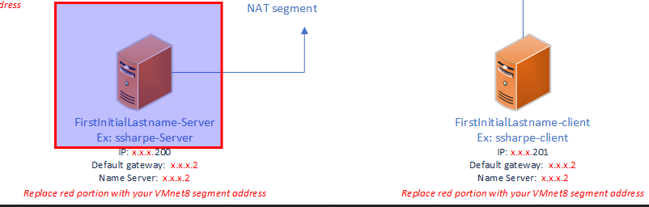
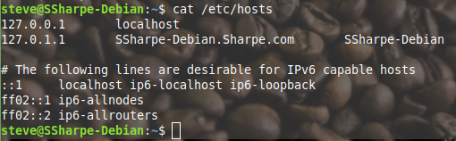
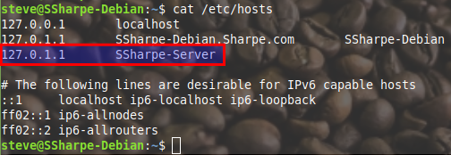
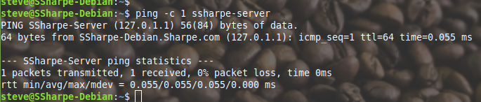
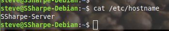
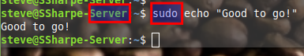
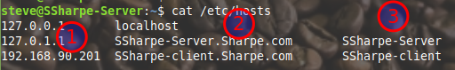
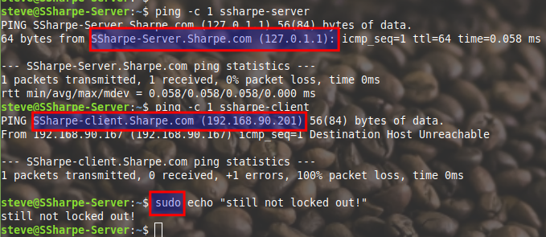

# Renaming Linux machines

Starting on the server computer:

### **`/etc/hosts`**

There are two main ways of completing a hostname to IP mapping:
- Name server (DNS)
- Local **`hosts`** file

There is an order of search, which is configurable in **`nsswitch`**, but by default, **`hosts`** comes first then DNS.

What you'll find by default is:
- `localhost` mapping to `127.0.0.1`
- Your own host mapping (both in IPv4)

Below you'll see `localhost` in IPv6 and two multicast addresses for IPv6 purposes.

> [!WARNING]
> You may **LOCK YOURSELF OUT** during this process. I suggest taking a snapshot before you begin.

To begin, add a line that maps the loopback IP to your new server hostname. The loopback is **`127.0.0.1`** and my hostname will be `ssharpe-server`.

Ping your new address.  You'll see the search went back to SSharpe-Debian.Sharpe.com, that is totally OK.  We cannot remove this yet because that is our current hostname. Doing so now would LOCK YOU OUT.

Next, open **`/etc/hostname`** and change `Debian` to `server`.

Reboot the VM.

## **Screenshot 1: Hostname Change Proof**
**Requirement:** Prove you were not locked out. Include the new hostname and make sure to use **`sudo`**. If you receive any errors with **`sudo`**, you are locked out and will need to revert to your snapshot.

You can now return to the **`hosts`** file and rename the line that says `Debian` to `server`.

Also add the client computer now so you can use the client hostname instead of an IP address later. The client address should have host `.201`; the network is whatever your NAT network is. My network is `192.168.90.0/24`, so my client will be `192.168.90.201`.

- **Step 1:** Make sure the client computer has the correct IP.
- **Step 2:** Ensure these are the FQDNs for the hosts (formatted as `hostname.LASTNAME.com`).
- **Step 3:** Include the hostname without the FQDN.

Once you've updated your **`hosts`** file, **reboot again** before the next screenshot.

## **Screenshot 2: Host File Verification**
**Requirement:** Proving the hosts have been configured correctly and you're still not locked out.

**Repeat these processes** on the client computer. For the **`hosts`** file on the client, ensure:
- When you call `FirstName-client`, the IP is **`127.0.0.1`**.
- You add the server computer with host `.200` (e.g., `192.168.90.200`).

---
[Prev](03_cloning.md) | [Home](README.md) | [Next](05_network-prep.md)
