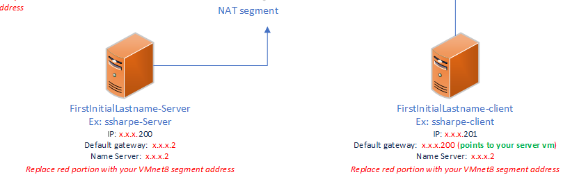
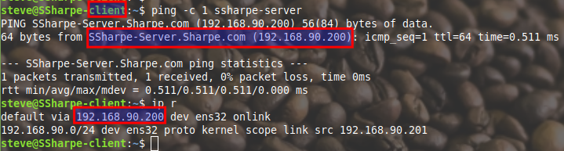

# Network prep

Using your networking knowledge, configure both computers to match this topology on the NAT network.

The computers should be able to ping each other. The client computer, once finished, should **NOT** be able to reach the internet anymore.

## **Screenshot 3: Topology Verification**
**Requirement:** Prove everything has been setup correctly. You must be able to ping the server by hostname, and the default route must point to the server.

---
[Prev](04_renaming-linux-machines.md) | [Home](README.md) | [Next](06_routing.md)
