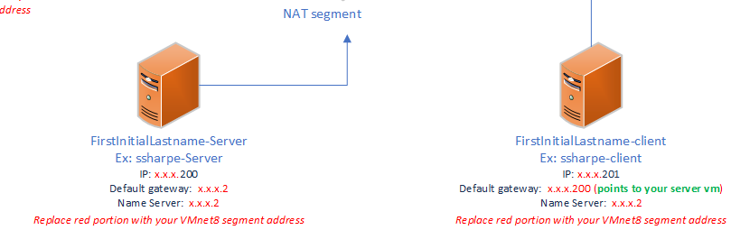
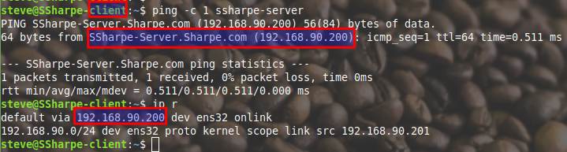

# Network prep

Configure both computers to match the topology diagram using static IP assignments. On Debian, you can configure persistent static IPs by editing **`/etc/network/interfaces`**. Alternatively, you can use the **`ip`** command, but remember that those changes are temporary and will not persist after a reboot.

Set the server interface to **`.200`** (e.g., **`192.168.90.200`**) and the client interface to **`.201`** (e.g., **`192.168.90.201`**) matching your specific NAT network.

For internet access to work, **the server must have a default gateway configured pointing to the NAT network gateway (e.g., `.2` such as `192.168.90.2`)**, and it also needs DNS configured. Set the client's default gateway to point to the server (**`.200`**).

The computers should be able to ping each other. The client computer, once finished, should **NOT** be able to reach the internet anymore.

## **Screenshot 3: Topology Verification**
**Requirement:** Prove everything has been setup correctly. You must be able to ping the server by hostname, and the default route must point to the server.

---
[Prev](04_renaming-linux-machines.md) | [Home](README.md) | [Next](06_routing.md)
