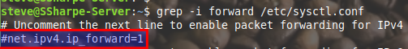
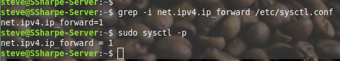
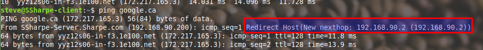
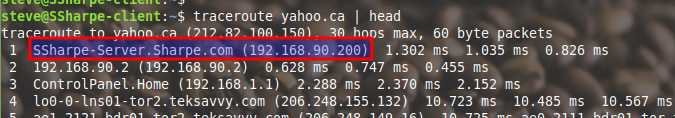

# Routing

By default, the routing engine is disabled. We have to tell the system to route packets that it encounters on an interface.

To do this, a configuration bit needs to be enabled. Uncomment **`net.ipv4.ip_forward=1`** by removing the **`#`** in front of it in **`/etc/sysctl.conf`**.

After you've done this, reload the system control configuration:
**`sudo sysctl -p`**

If you send a ping to Google now from your client, it should work; however, the routing engine might use ICMP to send a route update (Redirect). This happens because it is technically inefficient to use the server when the actual gateway is on the same network. This setup is for academic purposes; a more realistic example will be explored when we look at NAT.

To get the final screenshot, you need to "dodge" the ICMP redirect. If you sent a ping previously and received a redirection, you may need to restart the server and ensure you ping a different destination (e.g., if you pinged Google, try Yahoo). The screenshot must show that the traffic passed through **your server.**

## **Screenshot 4: Routing Proof**
**Requirement:** Clearly indicate that your client's web traffic passed through the server.

---
[Prev](05_network-prep.md) | [Home](README.md)
