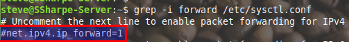
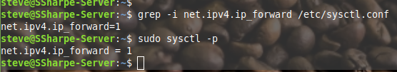
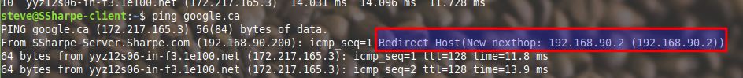
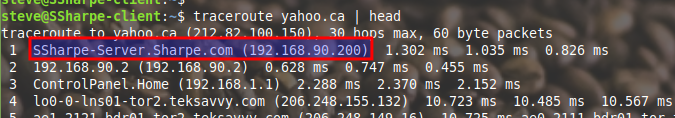

# Routing

By default, the routing engine is disabled. We have to tell the system to route packets that it encounters on an interface.

To do this, a configuration bit needs to be enabled. Uncomment **`net.ipv4.ip_forward=1`** by removing the **`#`** in front of it in **`/etc/sysctl.conf`**.



After you've done this, reload the system control configuration:

```bash
sudo sysctl -p
```





If you ping an external address like **`google.com`** from your client, it should work. However, notice the "Redirect Host" message in the screenshot above. The routing engine is sending an ICMP redirect to tell the client to use the actual NAT gateway (`192.168.90.2`) instead of your server. This happens because the client, server, and NAT gateway are all on the same subnet, making the server an inefficient "extra hop."

Because the screenshot above was taken *before* applying the proper fix, the author had to "dodge" the cached ICMP redirect. By targeting a completely different destination (e.g., **`yahoo.com`**) using **`traceroute`**, they bypassed the cached route to prove traffic was still hitting the server as the first hop.

**The Proper Fix**

While "dodging" works, the deterministic way to solve this is to disable ICMP redirects on your server. When disabled, the server will stop telling the client about the more efficient NAT gateway, forcing all traffic to stay routed through the server. You can disable it by adding this to **`/etc/sysctl.conf`** and reloading:

```bash
net.ipv4.conf.all.send_redirects = 0
net.ipv4.conf.default.send_redirects = 0
```

The screenshot must show that traffic passed through **your server** as the first hop.



## **Screenshot 4: Routing Proof**
**Requirement:** Clearly indicate that your client's web traffic passed through the server.

---
[Prev](05_network-prep.md) | [Home](README.md)
