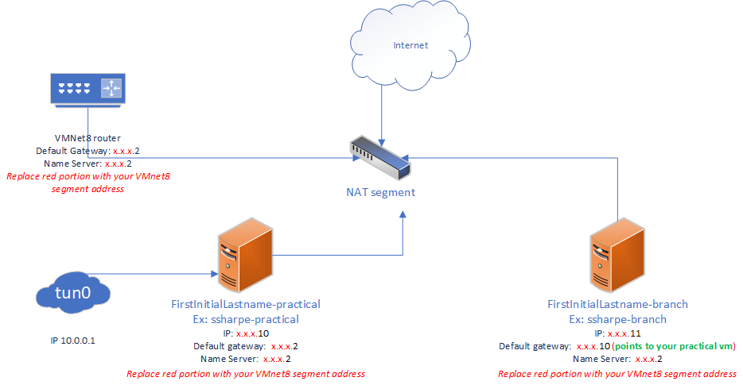
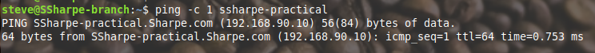
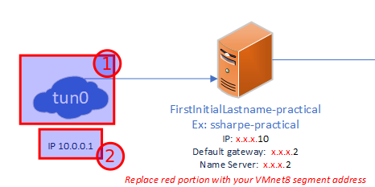
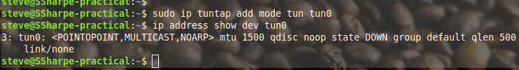
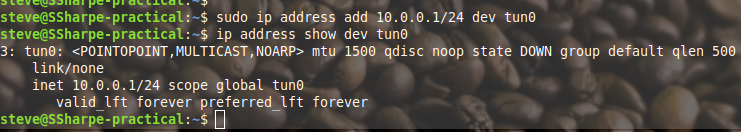
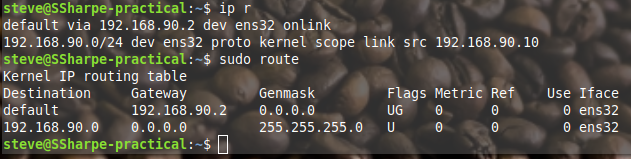
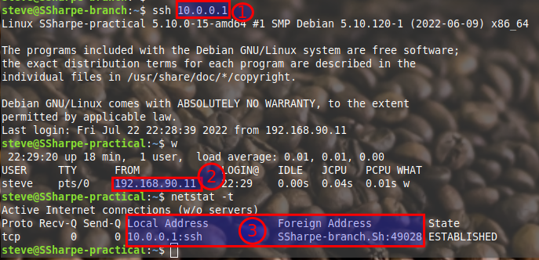

# Routing

## Cloning

Take the lab 1 virtual machine backup that you have prepared and create two virtual machines as per the topology above. 

Complete the following:
- Change their hostnames.
- Configure their networking as per the diagram.
- Make sure they can ping each other by hostname and resolve their FQDN.

## Virtual Adapter

We are going to use a feature that is part of **`iproute2`**: virtual adapters such as **tun** and **tap** adapters.

First, we need to create the virtual adapter:

In the figure above, create the virtual adapter:
**`sudo ip tuntap add mode tun tun0`**

Note that you now have a virtual adapter **without an IP address.** There are plenty of applications for virtual adapters without an address, but for our use case, we need it to be routable.

Assign an IP address to this adapter. It will not persist across reboots without further configuration, however persistence is not required for this practical.
**`sudo ip address add 10.0.0.1/24 dev tun0`**

The virtual adapter now has an IP address. Observe the routing table:

You'll see that it's not in the routing table. Which is odd, but it doesn't impact our use case and I assure you the routing engine knows about it.

## Routing

## **Screenshot 1: Tunneled SSH Connection**
**Requirement:** Capture all three points highlighted and clearly visible. Using the `branch` VM, connect to the `tun0` adapter (**`10.0.0.1`**) over SSH.

- **#1:** The adapter address.
- **#2:** The address from branch.
- **#3:** Confirms #1 & #2 from an **established** connection.

---
[Prev](02_walk-through-videos.md) | [Home](README.md) | [Next](04_partnered-routing.md)
