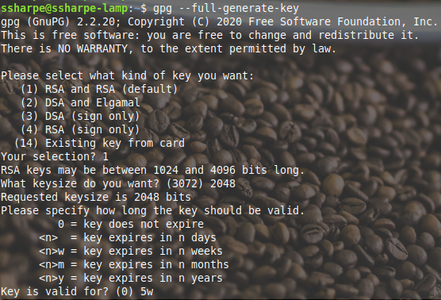
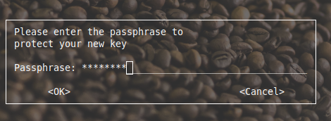
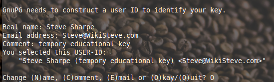
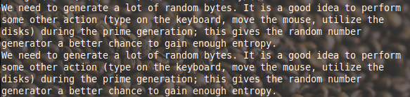
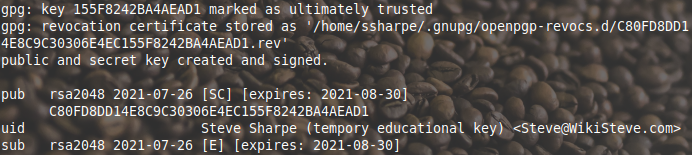
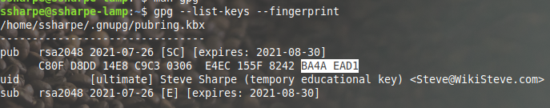
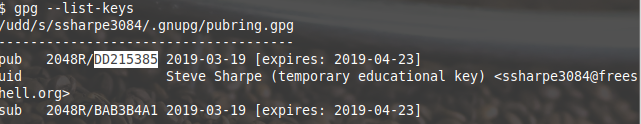
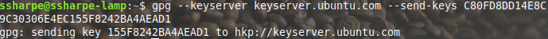
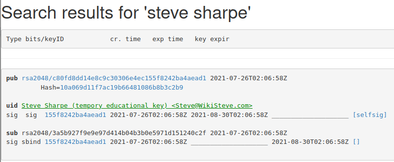

# Generate Your Key

Create your **2048 bit RSA** GPG key

To prevent [keyserver plaque](https://en.wikipedia.org/wiki/Key_server_(cryptographic)#Problems_with_keyservers), make sure the key **expires in 5 weeks**.

Enter a [passphrase](https://en.wikipedia.org/wiki/Passphrase) to protect the private key

Reminder of the importance of randomness in cryptography.

Summary

List the keys

Before proceeding, it’s vital that the expiry date is only 5 weeks ahead.

NOTE THE BELOW SCREENSHOT FROM 2019

Note the output of the fingerprint in 2019 was shorter than in 2021. [See this post about why the change.](https://unix.stackexchange.com/questions/613839/help-understanding-gpg-list-keys-output)

## Uploading Your Key to the Keyserver

Upload to the [public key server](https://pgp.surfnet.nl/plain.html). Note the term [hkp](https://en.wikipedia.org/wiki/Key_server_(cryptographic))

Try and find your key. There are various ways to do this. [I searched for my name.](https://keyserver.ubuntu.com/pks/lookup?search=steve+sharpe&fingerprint=on&op=index)

## **Screenshot 1: Show the key from the keyserver**

---

[Prev](01_setup-and-notes.md) | [Home](README.md) | [Next](03_signing-other-keys.md)
