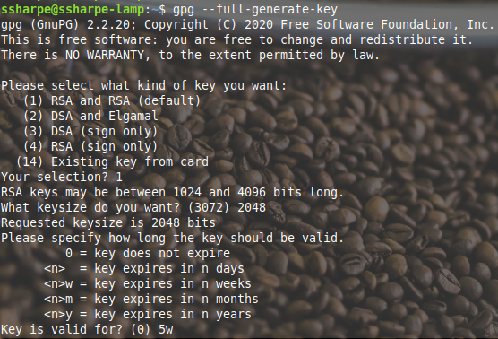
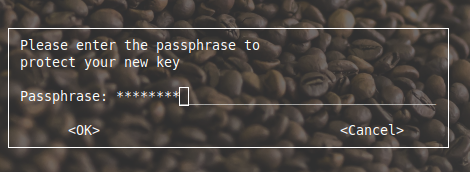
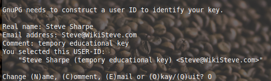
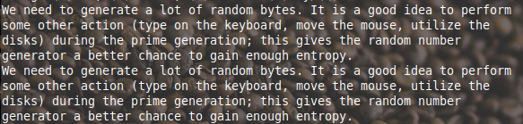
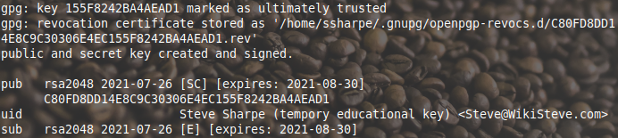
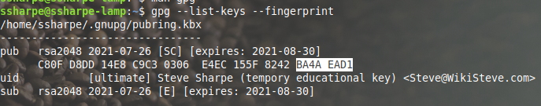
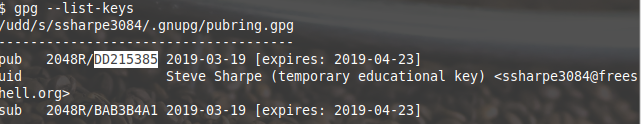
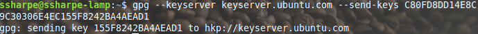
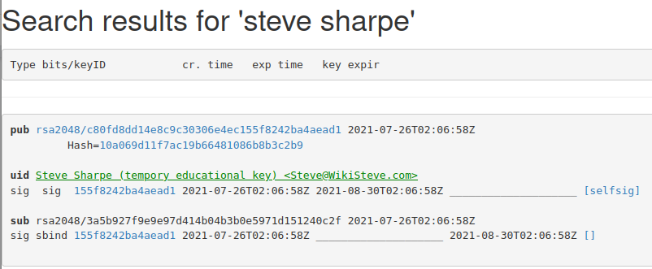

# Generate Your Key

Create your GPG key with `gpg --full-generate-key`.

Use these settings so your output matches the examples in this lab:

1. Choose **`(1) RSA and RSA`**
2. Enter **`2048`** for the key size
3. Enter **`5w`** for the expiry
4. Use your real name and NSCC email address

```bash
gpg --full-generate-key
```



To prevent [keyserver plaque](https://en.wikipedia.org/wiki/Key_server_(cryptographic)#Problems_with_keyservers), make sure the key **expires in 5 weeks**.



Enter a [passphrase](https://en.wikipedia.org/wiki/Passphrase) to protect the private key. Some systems show a GUI prompt like the screenshot above. Others show a terminal prompt. Either result is fine.



Reminder of the importance of randomness in cryptography.



Summary



List the keys.

```bash
gpg --list-keys --fingerprint
```



Before proceeding, confirm that the expiry date is only 5 weeks ahead.

The next screenshot is from 2019.



The fingerprint output in 2019 was shorter than the newer display format. [See this post about why the format changed.](https://unix.stackexchange.com/questions/613839/help-understanding-gpg-list-keys-output)

## Uploading Your Key to the Keyserver

Upload the key to the [Ubuntu keyserver](https://keyserver.ubuntu.com/). Replace `YOUR_KEY_ID` with the long key ID from your `gpg --list-keys --fingerprint` output.

```bash
gpg --keyserver hkps://keyserver.ubuntu.com --send-keys YOUR_KEY_ID
```



Find your key in the browser. Searching by your email address is usually cleaner than searching by name alone.



If the key does not appear immediately, wait 5 to 30 minutes and try again. Keyserver propagation is not always instant.

## **Screenshot 1: Your Public Key on the Keyserver**

**Requirement:** Show your public key on the Ubuntu keyserver with your name or email visible.

---

[Prev](02_walk-through-videos.md) | [Home](README.md) | [Next](04_signing-other-keys.md)
