# Signing Other Keys

## Gunnar Wolf Example

We will take a look at a Debian Maintainer Gunnar Wolf [gwolf@debian.org](mailto:gwolf@debian.org), he has several revoked keys, numerous subkeys and lots of other users that have signed his key.

There are two ways to search for keys:

1. Using the browser and searching for the user’s email.
2. Using the `gpg` command line.

> Web browser key search for Gunnar Wolf [gwolf@debian.org](mailto:gwolf@debian.org)
>
> 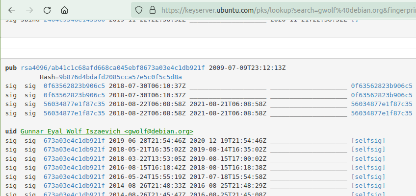

Command line using GPG

> 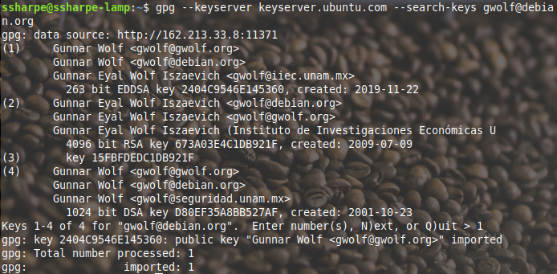
>
> I’ve selected the latest key created in 2019 by selecting #1

Check that the key has been successfully installed

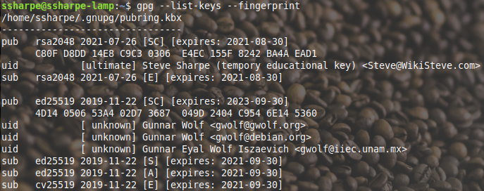

## **Screenshot 2: Gunnar Wolf’s key**

Once you’ve taken the screenshot, *delete Gunnar’s key.*

View Gunnar Wolf’s signatures using a mindmap

[https://people.debian.org/~gwolf/dc17_ksp/](https://people.debian.org/~gwolf/dc17_ksp/)

Find his name to view who he is connected to.

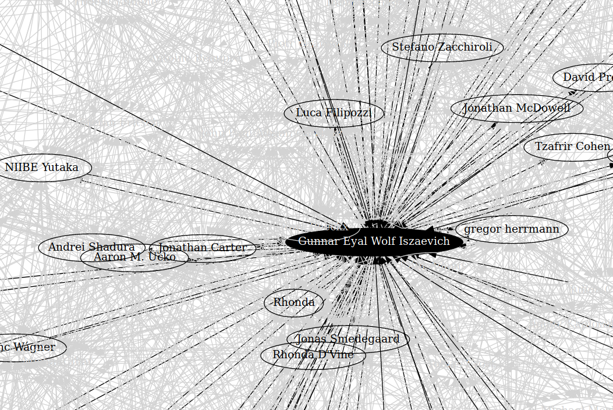

## Signing Colleague's Keys

Next we will be signing another colleague's key. For this example I have Donald Duck’s public key, which I will be signing. That signed public key will then be encrypted and returned to Donald Duck.

For this exercise the parties are

Steve Sharpe (Steve@WikiSteve.com): Replace with yourself

Donald Duck (dduck@WikiSteve.com): Replace with the signing partner’s information

Following this guide by Jeff Carouth [https://carouth.com/blog/2014/05/25/signing-pgp-keys/](https://carouth.com/blog/2014/05/25/signing-pgp-keys/)

I currently have Donald Duck’s public key, which I am going to sign.

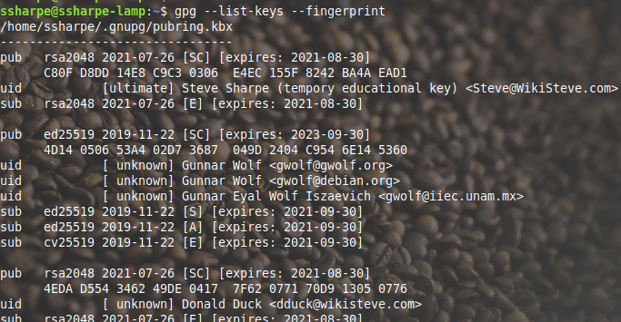

### Signing a Colleague's Key

Sign Donald Duck dduck@wikisteve.com

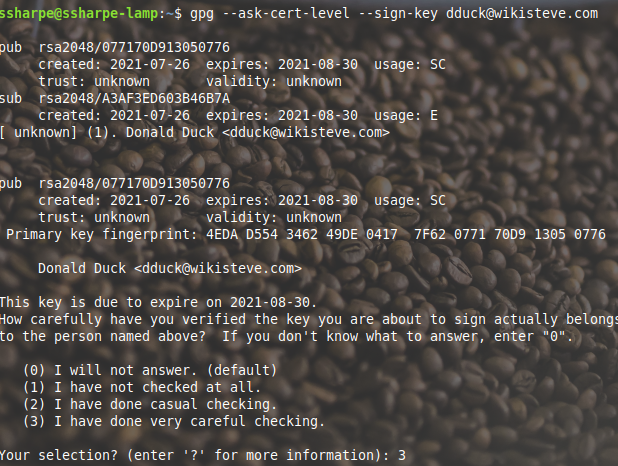

**Signed key visible**

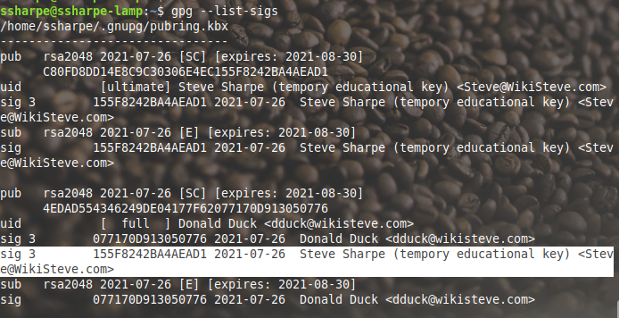

### Export Donald Duck’s Signed Public Key

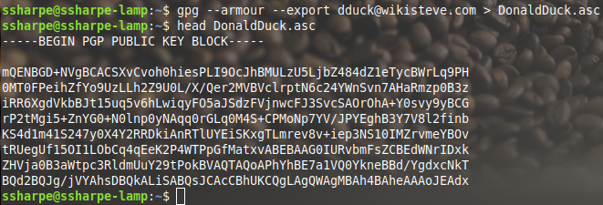

Short form:

- **`-s, --sign [file]`**: Make a signature.
- **`--clearsign [file]`**: Make a clear-text signature.
- **`-e, --encrypt`**: Encrypt data.
- **`-r, --recipient NAME`**: Encrypt for `NAME`.

### Encrypt a Colleague’s Signed Public Key 

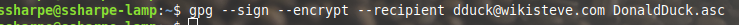

NOTE: Only prompted for your private key’s password because we opted to **sign**

There is now an encrypted gpg file, verify with the **file** command

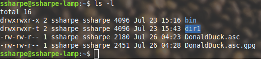

The new gpg file is showing as encrypted

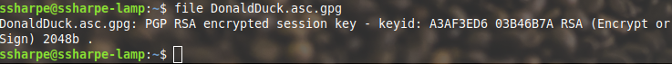

`xxd` also shows that the file is indeed binary.

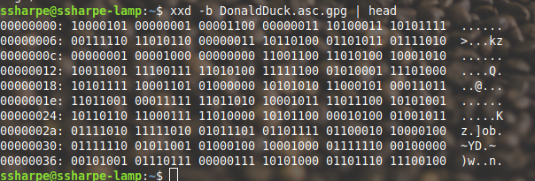

As an example, never output a binary to standard output with an ASCII application such as cat, head or tail. Output will be garbled like this

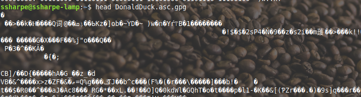

You’ll now need to extract the asc.gpg file from this virtual machine, send it to your peer. Your peer will then need to copy it into their VM before proceeding to the next step.

### Receive Back Your Signed Public Key

Do a long listing and the file should be there

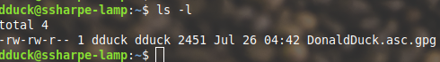

Verify that the person that signed your key is installed, if not download it. In my case I didn’t have Steve Sharpe steve@wikisteve.com so I downloaded the missing public key so the signature check wouldn’t fail.

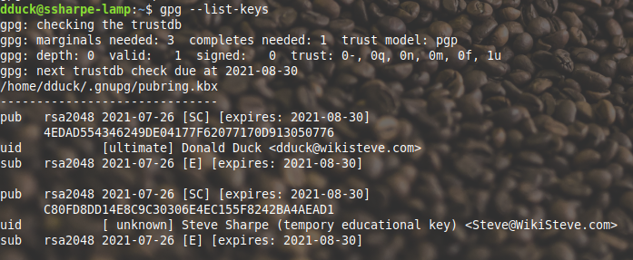

WARNING: If we do not use a redirect symbol > the output will go to standard output which is our terminal screen.

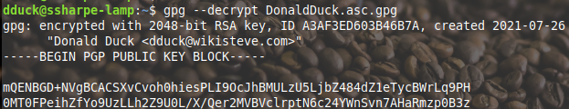

Let’s do that again but redirect the output to another file without the gpg extension.

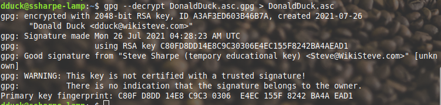

Note: We don’t have a mutual trusted person so the signature isn’t trusted by [steve@wikisteve.com](mailto:steve@wikisteve.com)

### Import the New Shiny, Certified Public Key

Now import the new signed public key

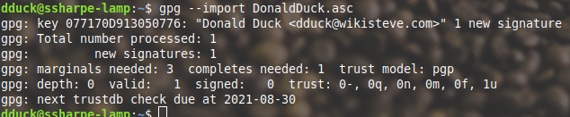

Donald Duck’s private key is now showing as signed by [steve@wikisteve.com](mailto:steve@wikisteve.com)

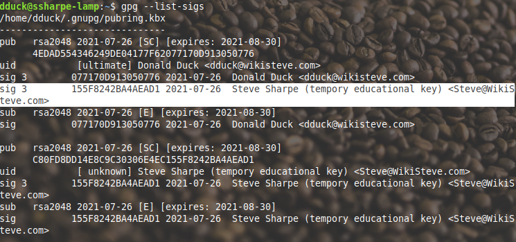

## **Screenshot 3: Highlight the new signature on your key**

### Upload the New Public Key Back to the Keyserver

Send the parent key with the two signatures back up to the key server

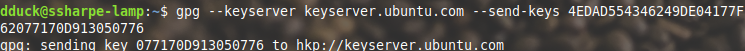

If you search the web portal again there should now be two signatures, one self signed by the owner and the second additional signee. Group of 2 will need one additional signature, group of 3 will need two additional signatures.

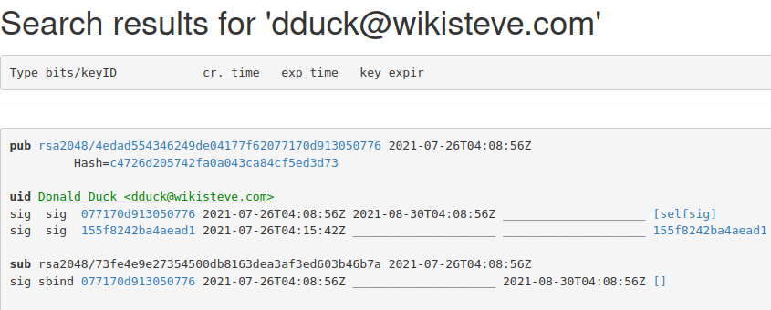

## **Screenshot 4: The additional key signer on the keyserver**

Group of 2 will have two signatures in this screenshot. Group of 3 will require three signatures, including the self-signature.

---

[Prev](02_generate-your-key.md) | [Home](README.md) | [Next](04_verify-firefox-installer.md)
