# Signing Other Keys

## Gunnar Wolf Example

Before signing a class partner's key, look at one public example of a key that is well connected in the web of trust. Gunnar Wolf is a good example because his key has many visible signatures and a public trust graph.

Use Gunnar Wolf [gwolf@debian.org](mailto:gwolf@debian.org) for this public example.

If the keyserver search shows multiple Gunnar Wolf keys, do **not** blindly choose `#1`. Use the maintained ED25519 key with fingerprint:

`4D14 0506 53A4 02D7 3687 049D 2404 C954 6E14 5360`

There are three useful ways to work with this key:

1. use the browser to inspect the keyserver result
2. use the older interactive search from the command line if you do not have browser access
3. import the exact key by fingerprint

> Web browser key search for Gunnar Wolf [gwolf@debian.org](mailto:gwolf@debian.org)
>
> 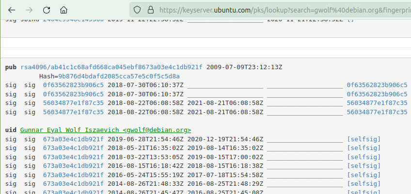

Recommended browser lookup:

- [https://keyserver.ubuntu.com/pks/lookup?search=gwolf@debian.org&fingerprint=on&op=index](https://keyserver.ubuntu.com/pks/lookup?search=gwolf@debian.org&fingerprint=on&op=index)

### Interactive Search: Works Sometimes, But Is Brittle

```bash
gpg --keyserver hkps://keyserver.ubuntu.com --search-keys gwolf@debian.org
```

This is the older interactive search. It asks you to choose a numbered result such as `1` or `2`.

Why it can fail or feel like it is hanging:

- it depends on an interactive terminal prompt
- it may try to read from the terminal device in a way that does not behave well over SSH or in some VM consoles
- if the keyserver is slow, it can sit there with no useful feedback
- even when it works, choosing `#1` is brittle if the order of results changes

Example of the older interactive search:

> 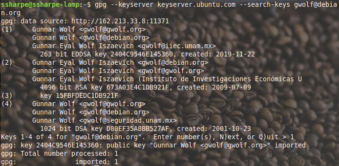
>
> Import the key that matches fingerprint ending `2404 C954 6E14 5360`.

### Best Import: Use the Exact Fingerprint

After you confirm the fingerprint, import the exact key:

```bash
gpg --keyserver hkps://keyserver.ubuntu.com --recv-keys 4D14050653A402D73687049D2404C9546E145360
```

This is the safest lab path because it does not depend on a numbered menu and it imports the exact key you intended.

Check that the key has been successfully installed.

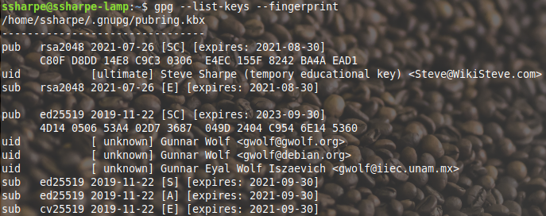

## **Screenshot 2: Gunnar Wolf’s Key and Fingerprint**

**Requirement:** Show Gunnar Wolf’s imported key with the fingerprint ending `2404 C954 6E14 5360`.

After the screenshot, you may delete Gunnar’s key if you want to keep your keyring tidy. That is optional.

View Gunnar Wolf’s signatures using a mindmap.

[https://people.debian.org/~gwolf/dc17_ksp/](https://people.debian.org/~gwolf/dc17_ksp/)

Find his name to see how the "web" is made of real signature relationships between people.

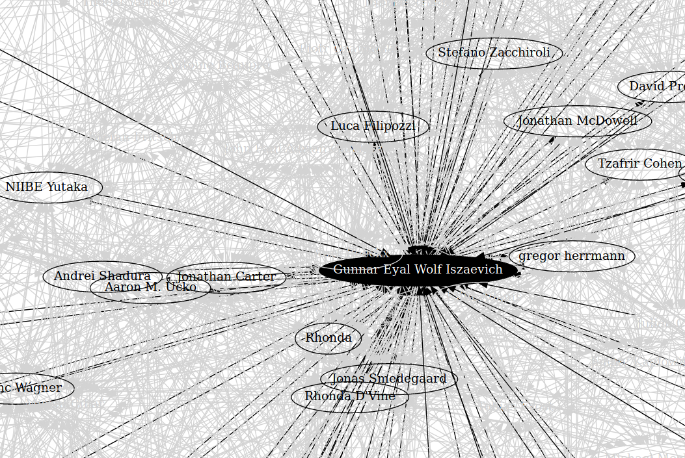

## Signing Colleague's Keys

Now switch to the graded part of the lab. You will sign a class partner’s public key, return the signed copy to them, and then import the signed copy that your partner returns to you.

The screenshots on this page use Steve Sharpe and Donald Duck as examples. Replace those names and email addresses with your real group members.

### Step 1: Exchange Public Keys with Your Partner

Export your public key to an armored text file:

```bash
gpg --armor --export your-email@example.com > your-public-key.asc
```

Transfer that file to your partner using a course-approved method such as `scp`, shared storage, or another direct file transfer method that your group can actually complete.

Import your partner’s public key after you receive it:

```bash
gpg --import partner-public-key.asc
gpg --list-keys --fingerprint partner@example.com
```

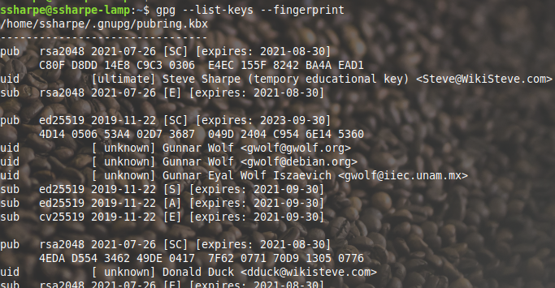

### Step 2: Verify the Fingerprint Before You Sign

Before signing, verify your partner’s fingerprint out of band. Read the full fingerprint from your partner’s screen, over voice, or over video chat. Do not rely only on the name or email address shown by the keyserver.

### Step 3: Sign Your Partner's Public Key

Sign your partner’s public key:

```bash
gpg --sign-key partner@example.com
```

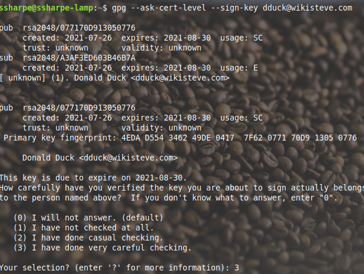

**Signed key visible**

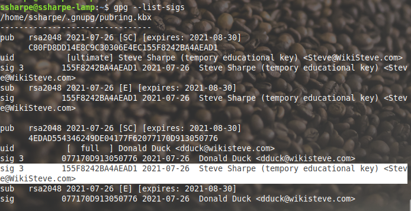

### Step 4: Export the Signed Public Key

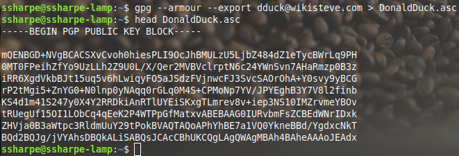

Use the same pattern for your partner:

```bash
gpg --armor --export partner@example.com > partner-signed.asc
```

Short reference:

- **`-s, --sign [file]`**: Make a signature.
- **`--clearsign [file]`**: Make a clear-text signature.
- **`-e, --encrypt`**: Encrypt data.
- **`-r, --recipient NAME`**: Encrypt for `NAME`.

### Step 5: Encrypt the Signed Key Before Sending It Back

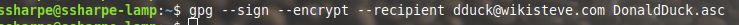

> [!NOTE]
> Encrypting the signed public key is not required in a real workflow because the signed key is still public data. This step is included anyway so you can practice encrypting and decrypting a real file with GPG.

For this lab, encrypt the signed public key for your partner before sending it back:

```bash
gpg --encrypt --recipient partner@example.com partner-signed.asc
```

The screenshot above shows an optional sign-and-encrypt example. For the required lab path, encryption by itself is enough.

If you also choose to sign the encrypted file, GPG will prompt for your own private key passphrase as well.

There is now an encrypted GPG file. Verify it with the **`file`** command.

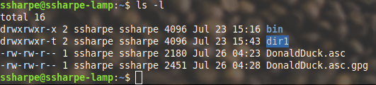

The new GPG file should show as encrypted.

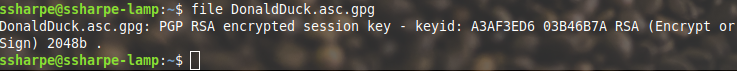

`xxd` also shows that the file is indeed binary.

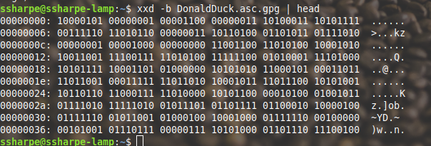

As an example, never output a binary to standard output with an ASCII application such as cat, head or tail. Output will be garbled like this

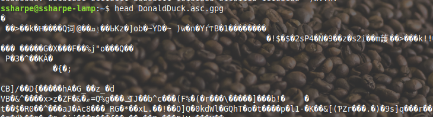

Now send `partner-signed.asc.gpg` back to your partner.

### Step 6: Receive Back Your Signed Public Key

Run a long listing and the file should be there:

```bash
ls -l
```

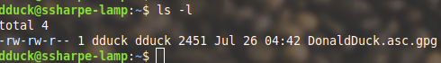

Before decrypting, make sure your partner's public key is already installed. You do not need that public key for the decryption itself, but you do need it if you want GPG to validate the signature on the returned file.

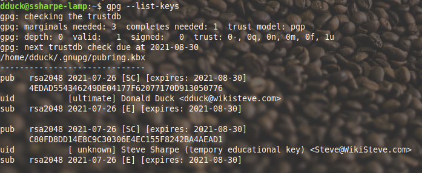

WARNING: If you do not use a redirect symbol `>`, the output goes to standard output, which means the terminal screen.

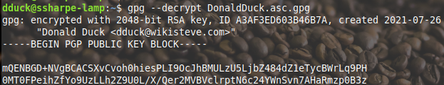

Run that again, but redirect the output to another file without the `.gpg` extension.

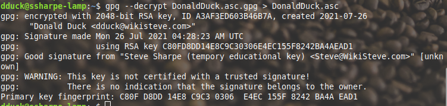

Use the same pattern for your own returned file:

```bash
gpg --output your-key-signed.asc --decrypt your-key-signed.asc.gpg
```

The trust warning is expected here if you do not already have a trust path to the signer.

### Step 7: Import the New Signed Copy of Your Public Key

Now import the new signed public key.

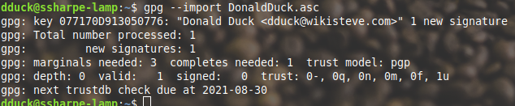

The returned public key should now show the additional signature from the partner who signed it.

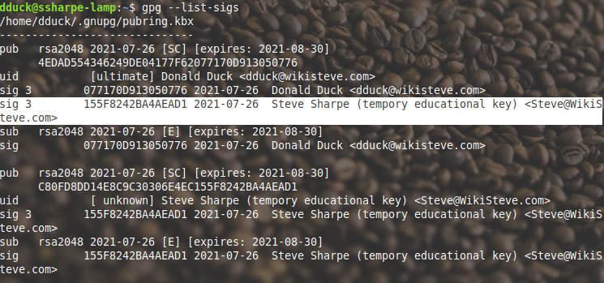

## **Screenshot 3: Your Key Showing the New Partner Signature**

**Requirement:** Show your public key with the additional signature from your partner visible in `gpg --list-sigs`.

### Step 8: Upload the Updated Public Key Back to the Keyserver

Send the updated public key with the new signature back up to the keyserver. Replace `YOUR_KEY_ID` with your own long key ID.

```bash
gpg --keyserver hkps://keyserver.ubuntu.com --send-keys YOUR_KEY_ID
```

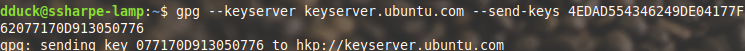

If you search the web portal again there should now be two signatures, one self-signed by the owner and one additional signer. A group of 2 should show one additional signer. A group of 3 should show two additional signers.

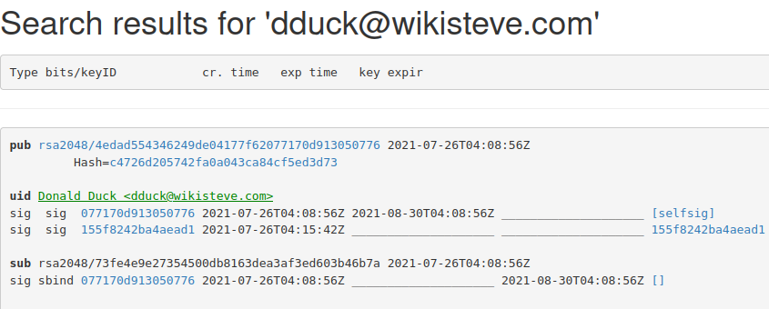

## **Screenshot 4: The additional key signer on the keyserver**

**Requirement:** Show your public key on the keyserver with the additional signer visible. Group of 2 should show two signatures total including the self-signature. Group of 3 should show three signatures total including the self-signature.

---

[Prev](03_generate-your-key.md) | [Home](README.md) | [Next](05_verify-firefox-installer.md)
