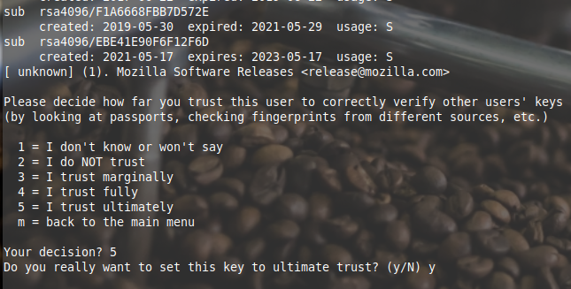

# Verify Mozilla Firefox Installer

## Download Required Files

Download two files from Mozilla’s mirror:

- [Firefox 99.0 archive](https://ftp.mozilla.org/pub/firefox/releases/99.0/linux-i686/en-CA/firefox-99.0.tar.bz2)
- [Firefox 99.0 signature file](https://ftp.mozilla.org/pub/firefox/releases/99.0/linux-i686/en-CA/firefox-99.0.tar.bz2.asc)

In a directory of your choice, download both files with **`wget`**.

## Verify the Files Are Authentic

The `.asc` file is a signature for the Firefox archive.

Let's try that to verify that the file really is from Mozilla or one of its developers.

Well it is in fact a signature but we’re missing Mozilla’s public key! They’ve given us the keyID above as 4360FE2109C49763186F8E21EBE41E90F6F12F6D

Let’s search for this key and see if we can find it.

Try the verification again

Verification was successful, however because we have no [mutual trusted keys](https://serverfault.com/questions/569911/how-to-verify-an-imported-gpg-key), we will change the trust setting for this key so the verification no longer reports trust warnings.

You’ll see we don’t trust this key at all.

> [!WARNING]
> This is a lab shortcut. In a real workflow, verify the key fingerprint from an official Mozilla source before assigning higher trust, and do not mark a key as ultimately trusted unless you control that key.

From the prompt let’s change the trust. Type **trust** at the prompt and answer `5` for **I trust ultimately**.

Lastly type **save** to exit.

Rerun the verification, there should now be **no errors.**

## **Screenshot 5: Show a successful verification**

---

[Prev](03_signing-other-keys.md) | [Home](README.md)
