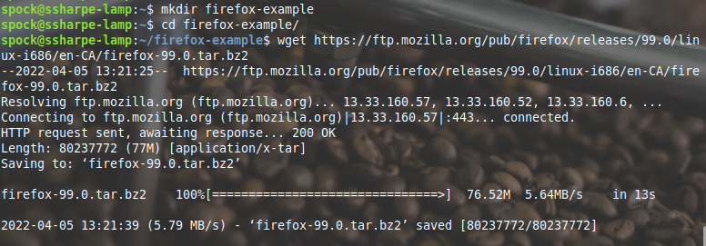
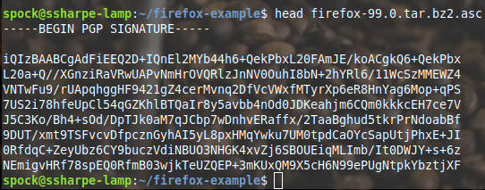
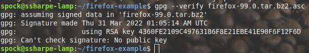
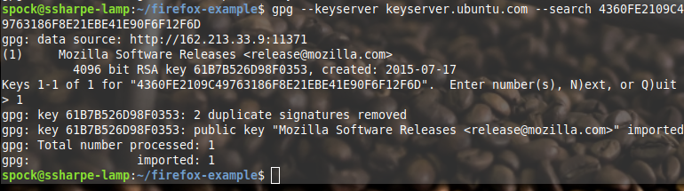
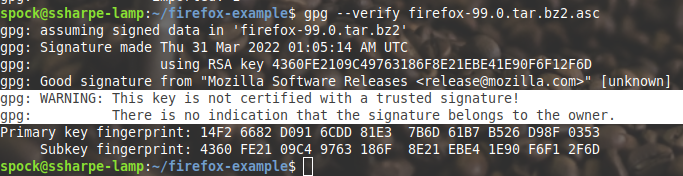
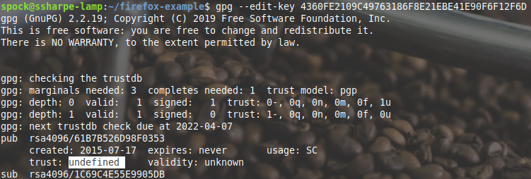
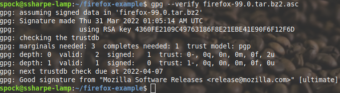

# Verify Mozilla Firefox Installer

## Download Required Files

Download two files from Mozilla’s mirror:

- [Firefox 99.0 archive](https://ftp.mozilla.org/pub/firefox/releases/99.0/linux-i686/en-CA/firefox-99.0.tar.bz2)
- [Firefox 99.0 signature file](https://ftp.mozilla.org/pub/firefox/releases/99.0/linux-i686/en-CA/firefox-99.0.tar.bz2.asc)

In a directory of your choice, download both files with **`wget`**.

## Verify the Files Are Authentic

The `.asc` file is a signature for the Firefox archive.

Let's try to verify that the file really is from Mozilla or one of its developers.

Well, it is in fact a signature, but we’re missing Mozilla’s public key. They’ve given us the keyID above as 4360FE2109C49763186F8E21EBE41E90F6F12F6D.

Let’s search for this key and see if we can find it.

Try the verification again

Verification was successful. However, because we do not have a [web-of-trust path](https://serverfault.com/questions/569911/how-to-verify-an-imported-gpg-key) to Mozilla’s key, GnuPG may still report trust warnings even when the signature itself is valid.

You’ll see we don’t trust this key at all.

> [!WARNING]
> In a real workflow, verify the key fingerprint from an official Mozilla source. Do not mark Mozilla’s key as ultimately trusted, because `ultimate` trust is reserved for keys you control.

For this lab, stop after confirming the fingerprint and the good signature. A trust warning can still appear because you have not established trust through your personal web of trust, and that is expected.

Rerun the verification and confirm that the signature is valid. A trust warning may still appear, but that does not invalidate the good signature.

## **Screenshot 5: Show a successful verification**

---

[Prev](04_signing-other-keys.md) | [Home](README.md)
