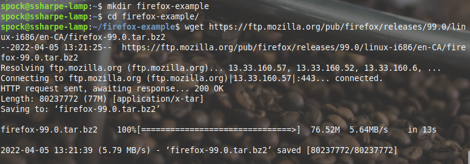
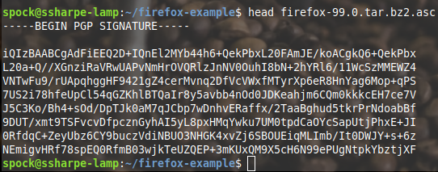
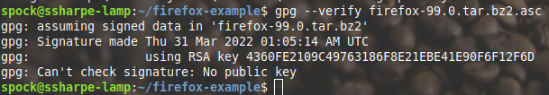
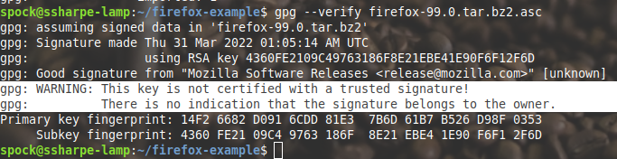

# Verify Mozilla Firefox Installer

## Download Required Files

The screenshots on this page use an older Firefox example. The current workflow is the same, but some screenshot filenames, archive names, and key-import details are older.

> [!IMPORTANT]
> **Instructor to-do:** Replace the Firefox verification screenshots on this page so they match the current ESR archive, detached signature, and `KEY`-file workflow. The commands and links below are current, but the embedded screenshots still show the older Firefox 99 example.

As of **March 24, 2026**, Firefox ESR `140.8.0esr` was a current stable ESR release, and Mozilla published the matching archive, detached signature, and public `KEY` file.

Download these three files from Mozilla:

- [Firefox ESR 140.8.0esr archive](https://ftp.mozilla.org/pub/firefox/releases/140.8.0esr/linux-x86_64/en-US/firefox-140.8.0esr.tar.xz)
- [Firefox ESR 140.8.0esr signature file](https://ftp.mozilla.org/pub/firefox/releases/140.8.0esr/linux-x86_64/en-US/firefox-140.8.0esr.tar.xz.asc)
- [Mozilla release signing key file](https://ftp.mozilla.org/pub/firefox/releases/140.8.0esr/KEY)

In a directory of your choice, download them with **`wget`**:

```bash
wget https://ftp.mozilla.org/pub/firefox/releases/140.8.0esr/linux-x86_64/en-US/firefox-140.8.0esr.tar.xz
wget https://ftp.mozilla.org/pub/firefox/releases/140.8.0esr/linux-x86_64/en-US/firefox-140.8.0esr.tar.xz.asc
wget https://ftp.mozilla.org/pub/firefox/releases/140.8.0esr/KEY
```



## Verify the Files Are Authentic

The `.asc` file is a signature for the Firefox archive.



Try to verify that the file really is from Mozilla or one of its developers.



That proves the `.asc` file is a detached signature, but verification fails because the public key is missing.

Instead of hunting through a keyserver, inspect Mozilla’s official `KEY` file directly and match the fingerprint:

```bash
gpg --show-keys --fingerprint KEY
```

Do not use a broad keyring lookup such as `gpg --fingerprint release@mozilla.com` here. If your keyring already contains other Mozilla-related keys, that kind of search can be confusing or return the wrong result.

The primary fingerprint you should see is:

`14F2 6682 D091 6CDD 81E3 7B6D 61B7 B526 D98F 0353`

If the fingerprint matches, import the key:

```bash
gpg --import KEY
```

The screenshots below still show the older Firefox 99 filenames. Your current workflow should use the ESR archive, detached signature, and `KEY` file listed above.

Try the verification again:

```bash
gpg --verify firefox-140.8.0esr.tar.xz.asc firefox-140.8.0esr.tar.xz
```



Verification was successful. However, because you do not have a [web-of-trust path](https://serverfault.com/questions/569911/how-to-verify-an-imported-gpg-key) to Mozilla’s key, GnuPG may still report trust warnings even when the signature itself is valid.

> [!WARNING]
> In a real workflow, verify the key fingerprint from an official Mozilla source. Do not mark Mozilla’s key as ultimately trusted, because `ultimate` trust is reserved for keys you control.

For this lab, stop after confirming the fingerprint and the good signature. A trust warning can still appear because you have not established trust through your personal web of trust, and that is expected.

## **Screenshot 5: Successful Firefox Signature Verification**

**Requirement:** Show a successful `gpg --verify` run with `Good signature from "Mozilla Software Releases <release@mozilla.com>"` visible. A trust warning may still appear, and that is acceptable.

---

[Prev](04_signing-other-keys.md) | [Home](README.md)
