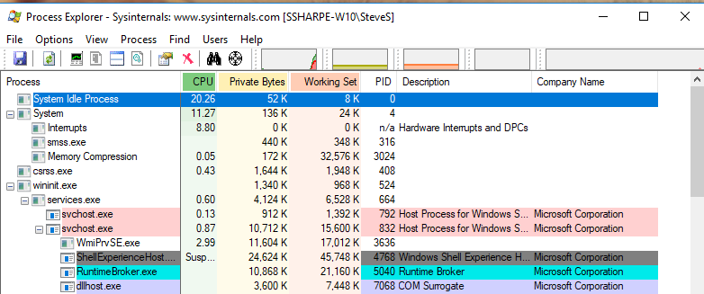
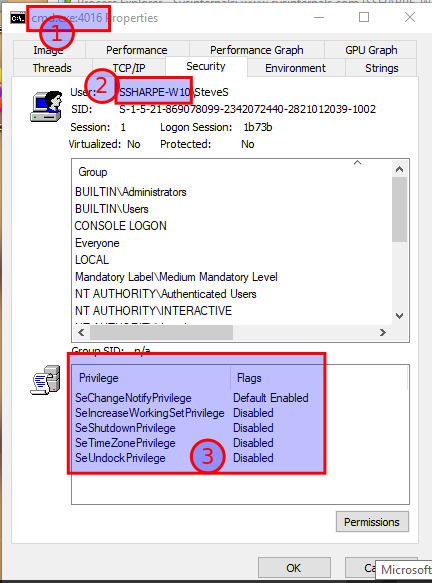
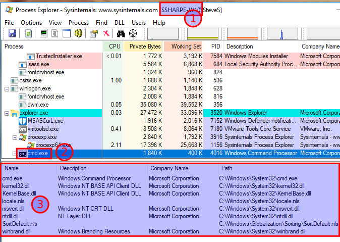
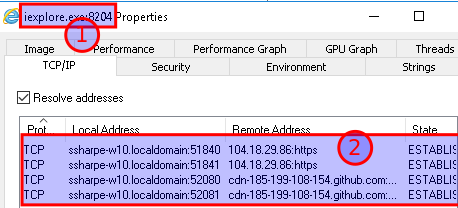
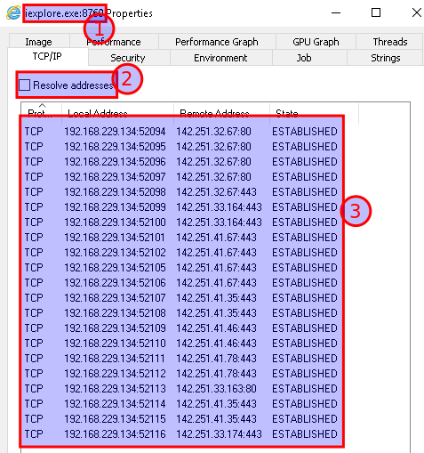

# Introduction Process Explorer

This activity will demonstrate how Process Explorer can be used to analyze Windows programs to detect malware.

Open the **Windows 10** VMware image. Make sure your VM computer name is personalized. 

Login with account name **User** password to **Windows1**

**NOTE: ***In the example screen shots I am logged in as SteveS.  You should be logged in as "user" till part 9 labelled "PID access" near the end of this lab.*

Set the network adapter to NAT mode (VMnet8)

In Network and Sharing Centre set the Adapter to obtain an address automatically

Process Explorer should be found on your Windows 10 image under: **C:\INFO1218\sysinternals\procexp.exe**.  You may have to accept the the license agreement first to open the program.

NOTE: ProcessExplorer can also be downloaded from Microsoft

https://docs.microsoft.com/en-us/sysinternals/downloads/process-explorer

Observe the main page

**Active** running processes are displayed in the left panel

The display shows the name for each process and CPU & RAM usage

## Examine a running Application

Scroll to bottom of the display

Note the **explorer.exe **process is parent to **vmtoolsd.exe** & **procexp.exe** (Process Explorer)

**Patch.exe** may also be running from a previous activity

Open a command prompt window

Note the **cmd.exe** process is now displayed as a child process of** explorer.exe**

Select **cmd.exe**

On the top menu bar select the **Properties** icon

In the **cmd.exe** properties window select **Security** tab

Note the **Privileges **assigned to the **cmd.exe **process

## **Screenshot 1 of the Security tab showing the Group & Privileges panels**

Next click on the **Permissions **button to view the permissions assigned to accounts to the cmd.exe file by

different users and groups

Click **OK** to close the Properties window

With cmd.exe selected find **View DLLs / View Handles** icon on the top menu bar

Toggle between the two views

Select the **View DLLs.** The DLLs accessed by this process are displayed in the lower panel

## **Screenshot 2 of the display showing the DLLs**

## Run the ping command

Position the command Prompt window above the Process Explorer window

In the Command Prompt window enter **ping www.fanshawec.ca**

Notice the PING process is displayed only for the **duration **of the execution of the command

## Open IE browser

In Windows 10, you'll need to click start > type **iexplore.exe** to launch classic Internet Explorer.  The E button will open Edge not Internet Explorer.

Note the process is now listed as** iexplore.exe** a child process of **explorer.exe**

Right click on** iexplore.exe** and select **Properties**

In the Properties window select the **Security** tab and review the privileges assigned to the process.

Next select the **TCP/IP** tab.

Note that no TCP connections have been established by the process

In the web browser connect to a default web site provided such as MSN Canada

Return to the Properties window and review the TCP/IP tab again.

Note the TCP connections that are now established.

Adjust the column **width** display for **Remote Address** and **State** to better view the information.

## **Screenshot 3 of the TCP/IP tab showing the established ports**

Open a second tab and connect to www.google.ca

In Process Explorer note a second** iexpore.exe** process has been started as a child process of iexplore.exe

View the Properties TCP/IP tab for this new process.

Uncheck the box **Resolve Address** to view the IP address of the established connections.

## **Screenshot 4 of the TCP/IP tab showing the IP addresses and ports established**

---
[Prev](01_evaluation.md) | [Home](README.md) | [Next](03_prep-malware.md)
