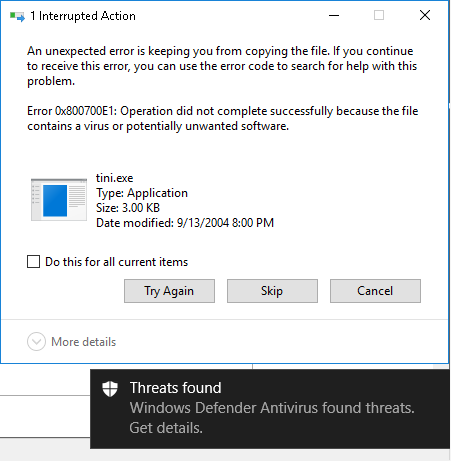
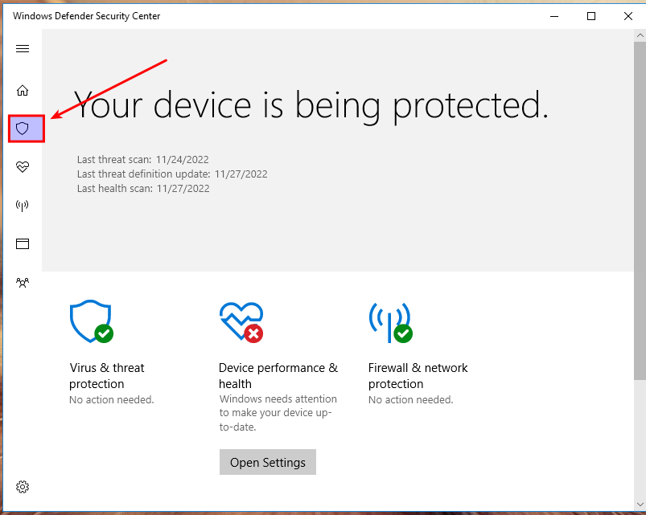
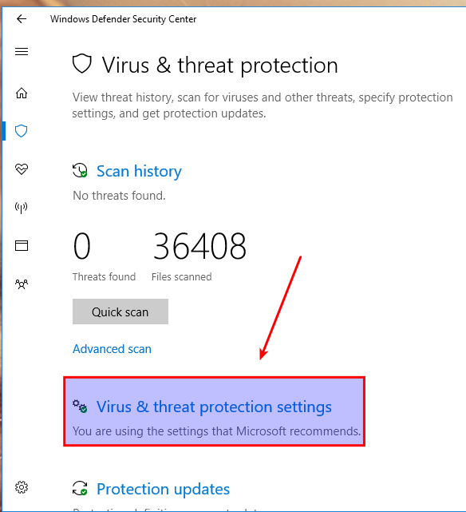
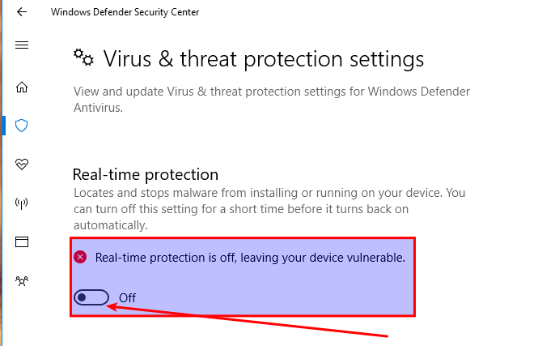
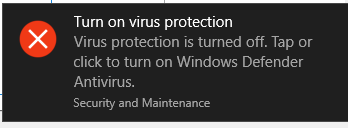
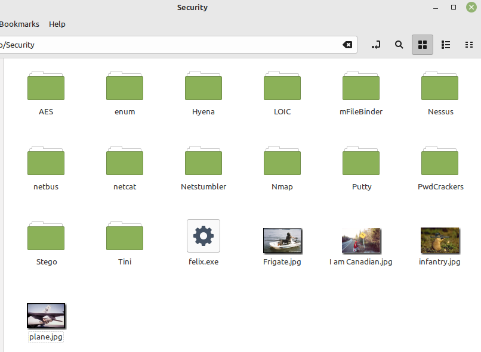

# Prep: Malware

The next steps will involve known malware. All systems with active antivirus software will quickly recognize and block these files. Depending on where you obtained your Windows 10 VM, you may have to do all of these prep steps, one of them, or none.

To get around this, the archive with the malware is encrypted with the password **Windows1** so AV software cannot scan the archive. In our Windows 10 virtual machine, the default AV software is Windows Defender, which must be disabled.

> [!WARNING]
> Perform these steps only inside an isolated lab VM. Re-enable Windows Defender after the lab is complete.

## Disable Windows Defender

Click Start, search for Windows Defender, then click the **shield icon** on the left.

Open Virus & threat protection settings

Turn OFF Real-time protection.

If you're successful you should have generated the following error.

## C:\Security directory

Next check whether you have a directory **C:\Security**. The contents should look like this. If you do, you may skip these steps.

Next download the ZIP file `Security.zip` and extract the contents to **C:\Security**. NOTE: You must have **disabled Windows Defender** prior to this step. Use any method you wish to transfer the file into your virtual machine. The password for the ZIP file is **Windows1**.

---
[Prev](02_introduction-process-explorer.md) | [Home](README.md) | [Next](04_malware-netbus.md)
