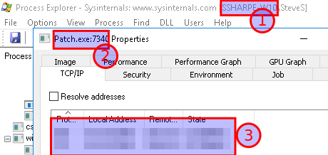
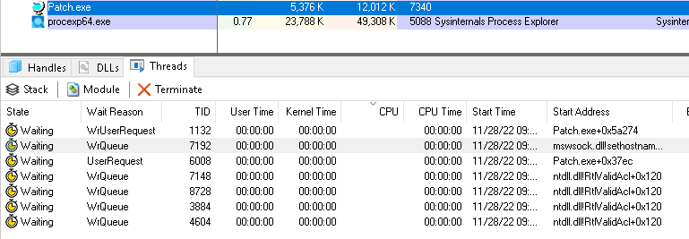
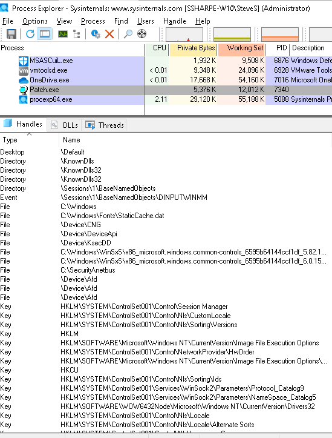
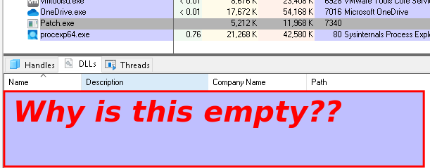

# Malware: Netbus

## Open patch.exe

Find the Netbus folder in the Security folder and double click on patch.exe to start the program

In Process Explorer, right click on **Patch.exe** and select **Properties**.

In the Properties window select the **Security** tab.

Note the Privileges assigned to the process

Click on the **TCP/IP** tab.

**Note the listening port numbers**

## **Screenshot 5 of the Properties TCP/IP display showing the port numbers**

Note: the next example screenshots are using the latest version of Process Explorer.

Click on the **Threads** tab and note that **mswsock.dll** is running.

**Microsoft win socket dll is required for TCP/IP communication**

On the menu bar select the **View DLLs** menu icon

The DLLs accessed by this process are displayed in the lower panel

Toggle the menu icon to display the **Handles** Note the Registry keys, Files and Threads being accessed by

patch.exe

---
### 🧠 Troubleshooting: Process Explorer

> [!NOTE]
> **Question:** No data displayed under DLLs, Handles and mswsock.dll is missing.
> 
> - [ ] **A.** Must right click process explorer > run as administrator
> - [ ] **B.** Must logout and login as Administrator
> - [ ] **C.** This only works in the latest version of Process Explorer
> - [ ] **D.** Due to being malware this information has been hidden.

👉 <b>Check your answer</b>

**Correct Option: A**

---

---
[Prev](03_prep-malware.md) | [Home](README.md) | [Next](05_malware-tini.md)
