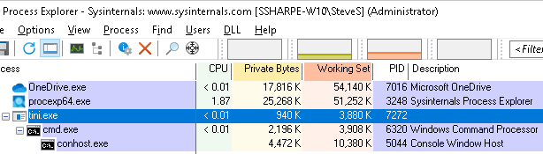
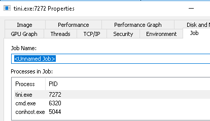
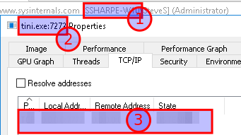
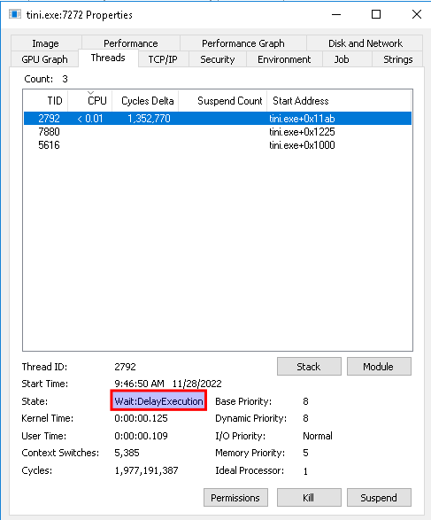
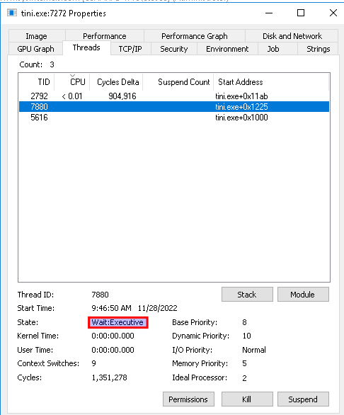
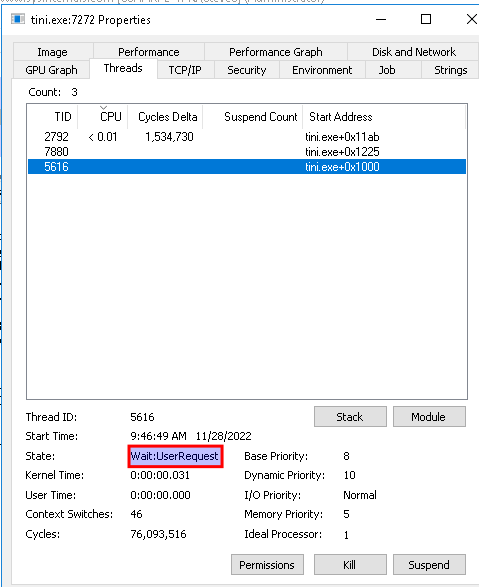
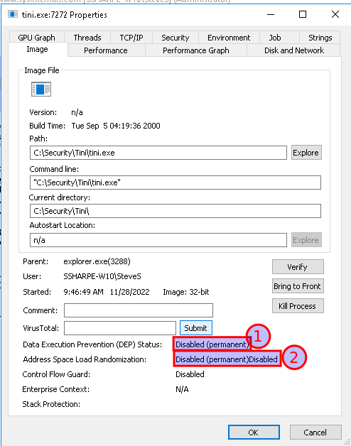
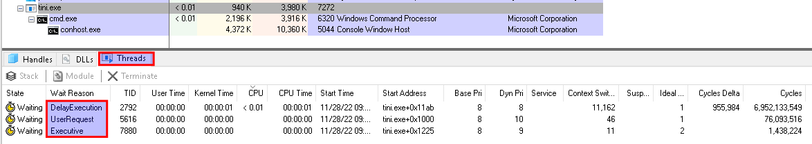
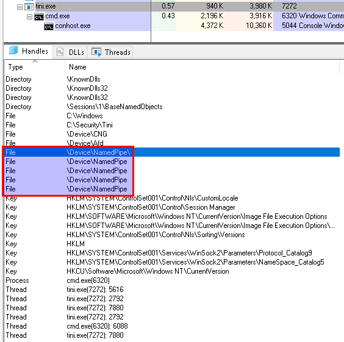

# Malware: Tini

## Open tini.exe

Note that **cmd.exe** is opened as a child process of **tini.exe**.

In the Properties window select **Jobs** tab

Note that two jobs are listed assigned to the process

Click on the **TCP/IP** tab

Note the listening port numbers

## **Screenshot 6 of the Properties TCP/IP display showing the port numbers**

Click on the **Threads** tab

**Note the 3 threads listed**

Each thread has a state listed in the bottom panel

Click on each thread to view the state

**States are Wait: DelayExecution, Wait: UserRequest, Wait: Executive**

Click on the **Image** tab.

Note the **Data Execution Prevention (DEP) Status: Disabled**

**Address Space Layout Randomization (ASLR) Status: Disabled**

Alternate way to view the threads

On the menu bar, find the **View DLLs / View Handles** menu icon.

Toggle the view between Handles & DLLs.

In the Handles view note that files are accessed by **NamedPipes** (data is written to files across a network connection to files opened by named pipes)

## Kill the tini.exe process

Right click on tini.exe and select **Kill Process** from the menu

Click OK

Note the cmd.exe child process is still running

**Kill cmd.exe**

---
[Prev](04_malware-netbus.md) | [Home](README.md) | [Next](06_services-svchost-exe.md)
