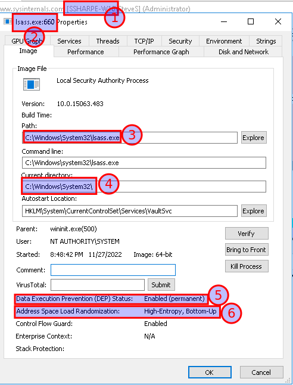

# Services: LSASS

## LSASS.EXE

The Local Security Authority Subsystem Service process **lsass.exe** enforces security policy on a Windows

operating system. The service runs from the **windows\system32** directory

Password changes, security tokens etc

This process runs as a child process of **services.exe**

Malware may be disguised with the name **lsass.exe** and be running from a different folder.

**Use Process Explorer to verify the location of a process**

Display the Properties for lsass.exe and select the **Image **tab.

Note the **Path** and **Current Directories** for the process

At the bottom of the tab note the Properties for

**Data Execution Prevention & Address Space Load Randomization**

## **Screenshot 8 of the Properties Image tab showing the information noted above**

---
[Prev](06_services-svchost-exe.md) | [Home](README.md) | [Next](08_is-it-malware.md)
