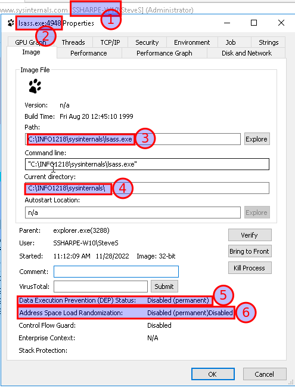

# Is it malware?

In the Security folder find the** felix.exe **file and copy to the Process Explorer folder

Rename felix.exe as lsass.exe

Double click the lsass.exe file to run the Felix program

In the **Process Explorer** window note a second process named** lsass.exe** is now running as a child process of explorer.exe

View the properties of this new lsass.exe process

Select the **Image **tab and view the **Path, Current Directory** and properties for **Data Execution Prevention & Address Space Load Randomization**

These properties are not as expected for lsass.exe

## **Screenshot 9 of the Properties Image tab showing the information noted above**

---
[Prev](07_services-lsass.md) | [Home](README.md) | [Next](09_pid-access.md)
