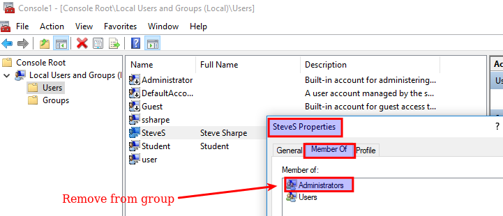
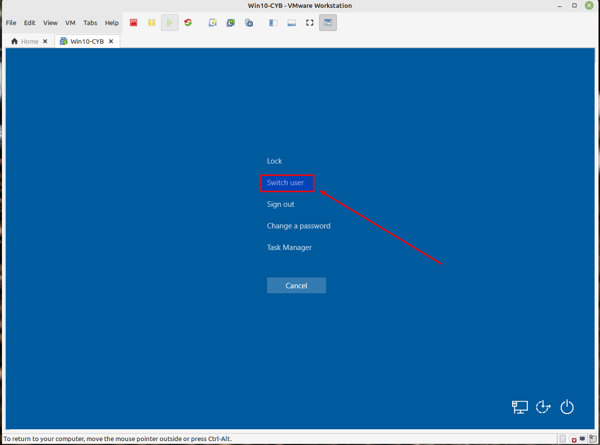
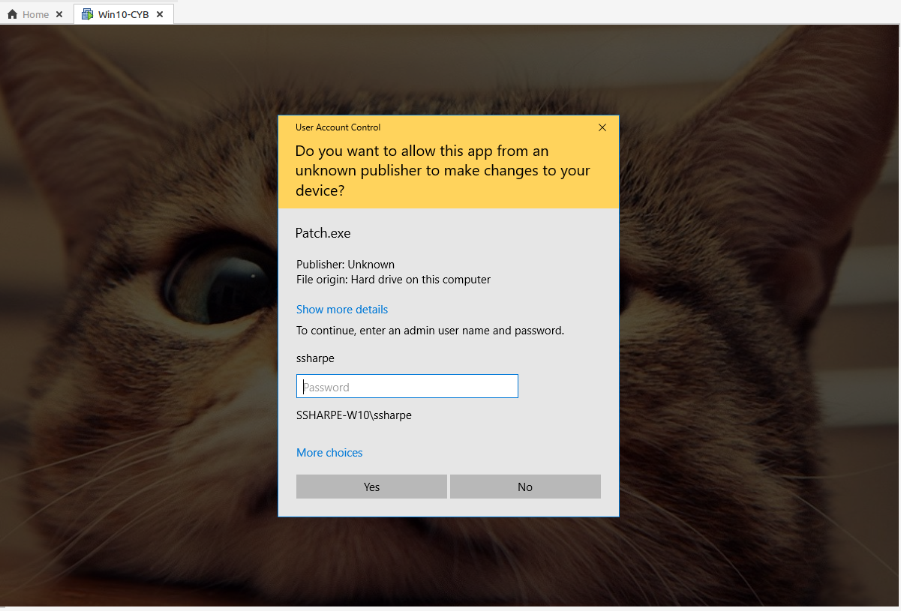
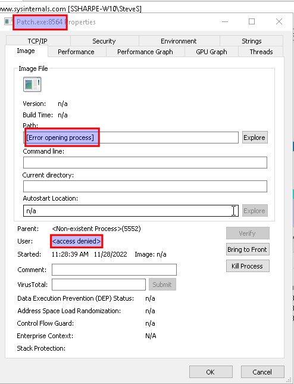
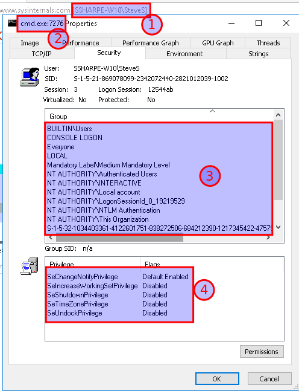

# PID access

Confirm your name user (First Name, Last initial) is not a member of the Administrators group.  Local Users and Groups can be accessed by running mmc.exe. File > Add/Remove Snap-in.  Find Local Users and Groups (local) and click the add button, then OK.

**Switch to the standard user with your name**

To switch users send CTRL+ALT+Delete through VMware.

Answer NO to this prompt.  We are not an administrator.

Open process explorer with this logged on user

Several processes such as patch.exe and ieexplore.exe started by the account User are still running

**Kill the patch.exe** process.

Access to kill the process will be denied

View the properties window. The limited account cannot read the process details, so the screenshot shows the blocked Image tab and an access denied message rather than useful security information.

No information is available to this limited account user

Since the current logged in account has no privileges to this process it cannot be killed

**Open a command prompt**

View the properties for the new **cmd.exe **process and click on the Security tab

Note the owner of the process

Note that fewer privileges have been assigned when compared to the Command prompt opened by the account User which is a member of the Administrators group

## **Screenshot 9 of the Security tab showing the Group & Privileges Window**

---
[Prev](08_is-it-malware.md) | [Home](README.md)
